# 2 Graphics

Whether it is ripping them or wanting to edit them the field of graphics hacking is, and has long been, a huge part of ROM hacking. Generally there is a line that can be drawn between 2d and 3d imagery as they tend to have different hardware underneath it all, however both can be used in conjunction to influence and augment the other; isometric imagery and sprites used to generate a first person “3d” view is nothing new but many are surprised to hear that New Super Mario Brothers on the DS used 3d models instead of sprites to make a fairly traditional 2D platformer. The 3d hardware of the DS gets used in various ways that might not be immediately in line with the general perception of 3d as well.

## Basic graphics concepts

In computer games, and most visual or other sensory media until you meet things like abstract works (note a somewhat different concept to abstraction as seen elsewhere in this document), there are two concepts that feed off each other at work. 1) is the suspension of disbelief and 2) is getting the audience to use their imagination. 2) is the subject of any good artistic tutorial but in the meantime think how a camera might pan away and use some audio cues rather than attempting to display violence or a good book will spend a lot of time setting a scene and describing things or otherwise describe situations compelling to humans. As it is very involved 2) is not really something that can be covered here other than to say it is well worth learning about, even if you are mainly a technical person, both in general and to help when you try to guess what methods will be used to achieve an effect. 1) however is much more of a scientific discipline, although to cover it in depth we would have to delve into various aspects of biology and psychology, so it gets covered. To make an image look real, assuming you want that sort of thing[3](romhacking20204.html#fn3x0) , it

1.  Has to replicate enough colours that the human eye can not tell (this is typically taken to be about 24 bit aka 16.7 million colours, although those that edit images like to go to 32 bit (4294967296 values) so as to have more information to edit with and avoid having colours jump from to the other) and although the GBA and DS screen is 16 bit it can do the job if you do it right.
2.  Has to have enough information, this typically means having a point and the point next to it not being distinguishable from one another (if you can see the points that make up the average image something has gone wrong). Now there are ways around this as the human eye is better at brightness (luminance) than colours and there is such a thing as empty magnification where you can blow things up/zoom in but no real new information will be gained, not to mention humans do not see ultraviolet so it tends not to be replicated in imagery. Indeed much of lossy compression is tasked with doing just this.

The alternative to actual pixels and having 3d ultimately rendering into pixels is so called vector imagery. Vector imagery is named for the mathematical/graphing term called vectors and defines images entirely mathematically (for instance “draw a square, line thickness 3 with a length of 4 at point 0,14” can be scaled to any size with simple multiplication). Fonts on computers have used it for years and consoles have recently got into it (newer fighting versions of Street Fighter being noted for it) but it is quite rare to see in the end result of a console game, much less a handheld title. Still if you want to there are programs like [Inkscape](http://inkscape.org/) that you can try out and attempting to render pixel art as vector imagery is quite a popular activity in certain circles.

### 2.0.1 Aliasing

Most screens in the world (and as far as games go it is mainly only the Vectrex that differed here) use a grid of pixels that can be individually set to various colours to display images. Rendering this out means a nice defined line can appear as a run of a couple of pixels and then appear to shift one pixel and then another run. The human eye is quite adept at picking this up, and, unlike certain other concepts in video and graphics, even when otherwise not trained to (see the example below) so techniques (known as anti aliasing) were developed to lessen the effect.

Example (might need to zoom in a bit)

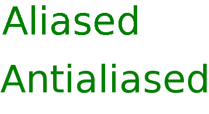

This is also a problem when you take an image that was made at one size and scale it up, or sometimes when you scale it down, to something that is not a simple half (or quarter or so on) size of the original, beyond that though scaling non vector imagery has several potential pitfalls so do it sparingly or even better do not do it at all.

### 2.0.2 Haloing

Related in some ways to aliasing above, aliasing and the techniques to dodge it can trouble things. Here when trying to select just the outline of an item on a complex background it might be hampered by the anti aliasing which has a habit of causing a slight merging/smoothing of colours and transitions, as a result a coloured outline can appear around it which looks not unlike a halo. This is one of the reasons why sprite sheets and similar things will often come as a selection of sprites on a hot pink or lime green background which lessen merging effects.

### 2.0.3 Bit depth

In general imagery it means one thing and that is how many bits are assigned to colours, something which was covered in the introduction to this section, but in 2d console imagery it means what number is assigned to represent each pixel with typical values being 4 and 8, though 1 and 2 are seen commonly enough on various systems, including the GBA and DS. Now this does not mean 4 and 8 bit colours but that you can select from a choice of colours from a premade selection which is composed of 16 bit colours. Later on a concept known as “sector addressing” is covered which works on a related principle.

## 2.1 Palettes and colours

Although the GBA and DS capable of 16 bit (well 15 bit) colours you usually do not have the ability to define any number of 16 bit colours to use in a given image (remember tiles are like paint by numbers and you might only have 4 bits aka 16 colours at once or 8 bits aka 256 colours at once).

### 2.1.1 GBA colours (15 bit)

There is an undocumented feature on the GBA (and GBA mode of the DS) that swaps the green and blue but that is not that commonly used.

The GBA is said to be a 16 bit screen but as there are three colours used to make others each 16 bit value is in fact 15 with the 16th bit wasted.

Bits 0 to 4 deal with Red

Bits 5 to 9 deal with Green

Bits 10 to 14 deal with Blue

This allows 32 intensities (consider it a 5 bit number and higher numbers are more intense with lower ones being closer to black[4](romhacking20205.html#fn4x0) ).

This also means that depending upon how you look at it the GBA/DS (and SNES) use BGR video instead of the standard RGB notation used almost everywhere else (naturally with printing using different primary colours to light it uses a different colour setup which is usually Cyan Magenta Yellow blacK hence your colour printer usually having four cartridges or ink level displays). The other method of note comes into play usually when video is involved and is known as yuv (which also leads to YV12) but that will be mentioned later and has no effect on any of the standard 2d and 2d imagery used on the GBA or DS.

In most operations the DS and GBA make a palette of various colours using the above method and the imagery refers to this to generate the colours. If you need to turn it into a 32 bit colour value, say for HTML colour notation, most of the time it is directly interpolated (multiply by 7.96875 which is 255 divided by 32) without correction, save maybe for a rounding (this can vary between implementations), and as most screens are not calibrated properly and the GBA/DS screens are not stellar to begin with it works well enough.

It should also be noted the DS has a master brightness section just before the image is displayed and optional capture hardware that change how an image ends up being displayed and this is in addition to some of the extra features afforded to the GBA and DS that will be covered later.

## 2.2 Tiles

Although you can draw an entire image on screen at once (many DS games are great fans of this and effectively make a tile 256 wide by 192 high necessitating a tile editor capable of handling it, a trick which many legacy ones are not able to) most 2d graphics are built from small building blocks known as tiles. Typically these tiles are 8 by 8 or 16 by 16 pixels although text fonts and 3d textures as well as the previously mentioned “full screen tiles” like to break from form here. The simple way to think about them is to think of them as very boring (thanks to the square pixels) versions of a paint by numbers picture with the numbers being looked up from a palette. Although most people never have to touch the graphics themselves with a hex editor an appreciation of how the hardware works is necessary to reverse engineer some of the more complex formats. Likewise to gain an appreciation for the animation/handling mechanisms learning about the methods by which tiles and palettes for them operate is all but mandatory.

### 2.2.1 1Bpp

Technically it is a compression method (the screen/video hardware itself does not display the mode in any real sense) but it is a special case as it is so simple that a basic tile editor can handle it and it can be edited in place without issue as indeed Crystaltile2 does, to that end it is here rather than later on when compression is discussed. The idea being if you have a black and white font or some other two colour image each four bits, the minimum length for a pixel the hardware accepts, will in fact be one or the other allowing you to compress the image down into 1 bit per pixel. Although it is not mandatory for developers to use it when dealing with 1bpp imagery the GBA and DS BIOS actually carry a “decompression” method in SWI10h that is known as BitUnPack.

### 2.2.2 4 Bpp

The workhorse of the GBA and a good chunk of the DS. Bringing back the icon from Yakuman DS. The “marching ants” selection is the section viewed in the hex editor which is as it is in the original ROM (certain hex editors can flip nibbles but it was not done here). As you can see each nibble looks up the value of a single colour (one of 16) which can be anything in the 15 bit format the GBA and DS can use. Equally there are 32 palettes each with the option for 16 colours which the game can swap between at runtime. Although not the only colour animation possible (the palette can also be edited at runtime) a developer can use these multiple palettes to change the appearance of items within the game and if you see the option to change at say the start of a battle (advance wars war room is good for this) or indeed at runtime then you are almost certainly looking at this.

Palette

As you can imagine the background is not pink in the real game and this is as the first colour in a palette is treated as though it was transparent regardless of what it is (although in practice is is fairly pointless with the way the screen works it allows for a full colour range without the loss of a single colour).

### 2.2.3 8Bpp

Although available and well used on the GBA it really started to be used on the DS.

Here each palette entry is 8 bits long and a two 256 colour palettes are available although only one for each mode (BG and OAM)

Here each hex digit is the lookup for the palette with the first being the row and the second being the column (although if you really wanted you could flip them and indeed the hardware probably does effectively just that but that is introducing completely unnecessary work for no real gain).

### 2.2.4 GBA3 Xbpp

There is another method that much like 1Bpp acts as a sort of compression meets hardware format method. Crystaltile2 is one of the few editors with support for this method and it is very rare indeed (the very occasional font being about the only thing that uses it).

It is a kind of 4 colour format (2 bits per pixel) but values are actually interleaved between two consecutive tiles.

Nibbles are “flipped” similar to the 4bpp GBA format. The order of the nibbles is then lower tile, upper tile, lower tile, upper tile......

A basic example of the interleaved format 8x8 tiles (larger tiles of this pretty much follows the same pattern but to spare confusion it will not be covered here).

Palette as defined in the image. Remember the nibbles are actually flipped but ignoring that for the moment

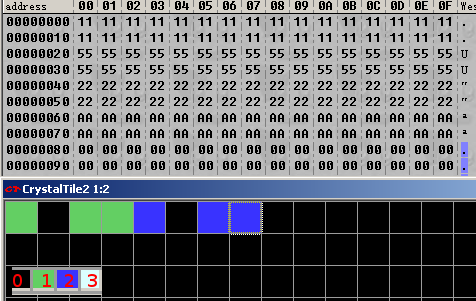

The first pair of tiles is one fully green (01 binary on the palette) and one fully black (00 binary)

The second pair of tiles is both fully green (01 binary on the palette)

All this being said it is 4 bits between the start of a pixel in a given tile and the start of the next pixel in the tile which gives rise to the numbers seen

1 hexadecimal is 0001 binary hence the 00 going to the second (lower) tile and 01 going to the first (upper) tile.

The second pair is both green and is represented by 5 hex

5 hex corresponds to 0101 binary

The pattern still holds for the single blue and single black tile

The dual blue tiles

A hex corresponds to 1010 binary.

A more complex example Most of this is going to be left as an exercise to the reader but as mentioned the nibbles are flipped in a similar manner to 4bpp and it is not immediately apparent in the above example.

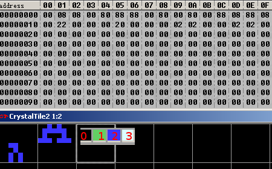

The leftmost (upper) tile is blank for 4 vertical pixels but the lower tile has data in it.

00 08 08 00 hex

0000 0000 0000 1000 0000 1000 0000 0000 binary

80 88 88 00 hex

1000 0000 1000 1000 1000 1000 0000 0000 binary

The first pixel is blank on both counts as is the second so the 00 holds.

The third is not blank yet it is still 00, the fourth is blank but it is 10 (10 binary = 3 remember). As mentioned the nibbles are flipped with respect to the pixels they represent.

The fifth pixel is blue but it is 00 and the sixth pixel is 10 (again flipped).

Going to the next line

Blank and then blue. Flipped again (10 and 00 being seen in the binary).

### 2.2.5 GBA2 4BPP

For the sake of completeness crystaltile2 has another format known as GBA2 4bpp that is in some ways slightly more complex than GBA3 XBPP. Very few games have ever been observed to use it either.

It is a 4bpp format and technically is not nibble flipped like the other sub 8 bit formats but in practice it is a kind of interpolated format (each pixel technically having a choice of four colours) and additionally the first pixel in the pair of them sets the colour range for the second one.

The range in question is value 0-3, 4-7, 8-B and C-F. They could up so 0 through 3 allows the first four pixels (selection 0), 4 through 7 allows the second four pixels (selection 1) and so on but some more background is needed before that makes sense.

The first nibble selects from the first four colours using the range (0 through 3 pixel 0, 4 through 7 pixel 1 and so on)

The second nibble selects from one of four colours also in a row but what four it can select from is determined by the value of the first nibble. Within the values although it might not matter for the first pixel the second one has the four pixels also in a range of four and those are selected by the actual value within first pixel.

Examples

Selection 0 value 2 (in practice it would be 2 hex for the first pixel) allows the third group of colours from the palette for the second pixel.

Selection 3 value 2 (in practice it would be E hex for the first pixel) allows the third group of colours from the palette for the second pixel.

Selection 0 value 0 (in practice it would be 0 hex for the first pixel) allows the first group of colours from the palette for the second pixel (0 through 3 in the standard numbering).

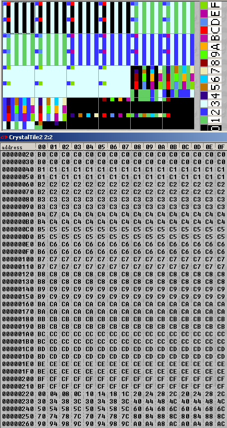

### 2.2.6 Bitmap

This will probably be better served after discussion of graphics modes and hardware but know this is not referring to the “bitmap” image format as seen in every basic image editor and most advanced ones, although some modes of it share a lot in common with said format.

The GBA has the ability to eschew tiles and just draw images line by line across the entire screen although it limits what can be done as to do it takes up most of the VRAM and it is not feasible to change it all every frame so extremely few games use it.

In the graphics it is known as modes 3, 4 and 5

3

is a 240x160 (aka the GBA resolution) 16 bit mode where colours are defined there and then (same BGR fashion as the rest of the hardware)

4

is a 240x160 8 bit mode where the full 256 colour palette is used (modes 3 and 5 do not allow transparent colours unlike this) and allows 2 frames to be defined in memory at once.

5

is a 160x128 (less than GBA resolution) mode using the same idea as mode 3 but the lowered size allows two frames to be stored in VRAM.

The DS has a kind of related tile mode where large tiles still composed or palette references like regular tiles can be used and it is quite popular but the DS has a slightly increased VRAM size to manage this better. It also has the ability to hold and manipulate images larger than the resolution in bitmap modes (it comes in handy for some end stage representation of 3d) although again this is better served for a discussion of hardware.

### 2.2.7 Known formats

Some games have been seen to use known/common formats like GIF, PNG and JPEG with the most prolific being that of the DS Opera browser. With it having to decode them as part of the general operation (what is the web without images after all) meant it could use such formats internally quite happily but other games have certainly been seen to do this as well. This becomes even more common on other more powerful consoles but the DS does have a few formats that Nintendo provides in the SDK that allow for some fairly extensive abilities, more on those in the layout/OAM section.

### 2.2.8 Crystaltile2 export and import.

Although Crystaltile2 usage is covered in depth later this is a basic operation and should be covered now. Most tile editors are just that and will allow you to edit an image but occasionally you are going to want to not be tied to a pixel by pixel editor and will want to use a more featured editor.

The act of exporting and importing images is easy enough. Although it is quite possible to do without a palette set properly it is best to have one in place else you will have to edit pixels accordingly in your proper image editor (red means blue and such) and much like hex mathematics you can fall foul of this when just making quick changes.

First select the tiles/area you want to edit. The either right click or click the edit pulldown menu

You can either copy the image out if you have a few small edits but most will instead opt to export it. Crystaltile2 has a few basic options but BMP works for most purposes. Here you can import it into your chosen editor

There is also the second option of a 1:1 export which splits things along the tile lines and allows a sort of regular expression to be formed.

Once in the editor you can edit it accordingly

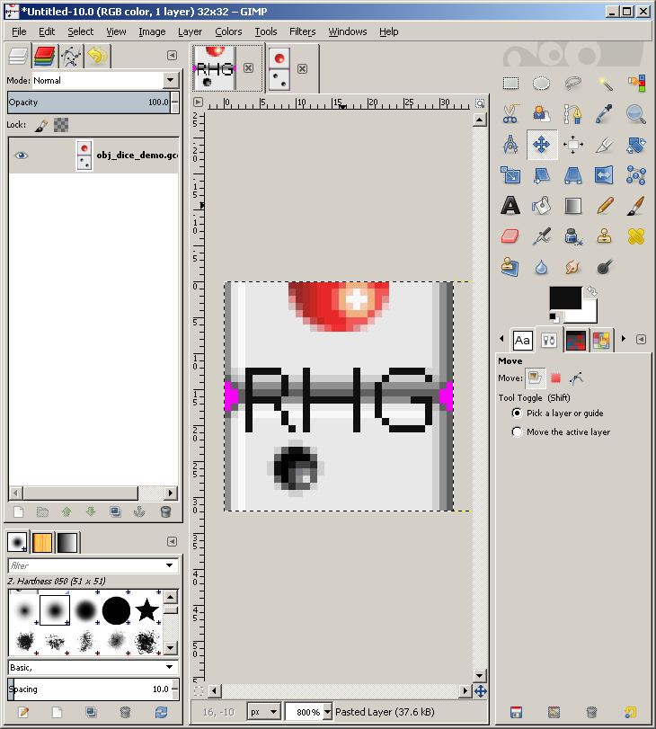

Right clicking or clicking the edit pulldown menu and pressing import will import the newly saved image back into the editor where you can move it (it will snap to gridlines). Again you can use the copy and paste if you prefer although do remember to merge layers if your editor supports it.

Move it accordingly and then double click the image to set the image

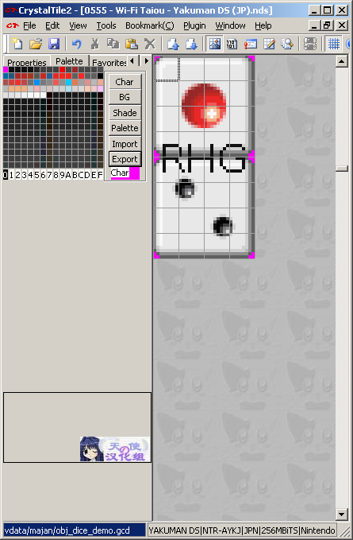

On palettes If the colour you want is in the image then the dropper is usually sufficient but most tile editors have the option to export palettes to the commonly supported windows palette format; crystaltile2 has it right there in the palette window and BMP has a palette built into the file format (technically optional but crystaltile2 includes it).

### 2.2.9 Avoiding gradients, AA, lossy compression, noise and such things.

The name of this says it all really and most pixel artists will know this already, however it needs to be mentioned to spare you the hassle of having to redo the whole palette which might not even be viable if the palette is used elsewhere, not to mention if you only have limited colours available it makes sense not to waste them unless you do truly have the option to do so. To this end you should avoid gradients (hopefully one already exists if you need one), anti aliasing options (quite often added in when adding text), resizing (the nearest neighbour algorithm is probably the worst general usage scaling method but it has the benefit of using the colours it had to begin with if you truly need one), noise functions and other things that will add random extra colours to your image (like saving as JPEG, even at “100%”). This means that unlike most image editing you might have done at other points in life you are limited here.

On a different note much like changing palettes can change things elsewhere in the ROM you also have layout to contend with, or worse you face limited memory, which might limit the tiles you can edit but that is the subject of the next section.

## 2.3 Layout, timing, OAM and special effects

The consoles do not magically know how to sort tiles out and indeed much of 3d and 2d imagery, as well as coding in general, revolves around reusing things to lessen the drain on resources; you surely have seen old RPGs where you would fight a giant rat, a plague rat which looks exactly like giant rat but with a green and dark blue/purple paint job and later fire rat which has a red, orange and yellow paint job but looks exactly like the earlier rats. To do this the GBA and DS have hardware they can employ to change things in addition to the palette although said hardware can also control what palette is used. Most of the images used thus far have been simply one tile after the other and aligned manually for the purposes of clarity but there arises the concept of tile reuse which breaks the one after the other pattern and compositing (sticking one image over another) to trouble this, both are very common techniques in 2d imagery.

### 2.3.1 Introduction to the OAM and BG modes.

The GBA and DS have two principle graphics types known as “BG” aka background and “OAM” aka object area memory aka sprites which work together to display games. Although you can use one to do the other, and games have done as such, for the most part the distinction is observed and backgrounds will be left to do backgrounds (a big exception on the DS is 3d which is rendered in the 3d hardware and moved to the background to display) and OAM which is left to handle the sprites and image overlays (give or take windowing). Text can be in either BG or OAM depending upon the game although BG is far more common and usually the suggested method for developers to use. Finding out what method something uses is usually best done by getting to the point in the game it is used and viewing the OAM, sprite and BG in a given emulator (VBA for the GBA and desmume both feature such abilities). Such viewers are also a fairly good ripping method.

The GBA and DS are much the same although the DS has two engines known as A and B which is ostensibly one for each screen although they are not tied to a given screen and can easily be swapped at runtime. The “A” engine has more memory, the ability to do full VRAM bitmaps as well as what mainly houses the results of the 3d (engine B can use the results of the 3d but it requires some thought) and has use of the “capture” hardware which can be used to create effects although the more general general effects/functions still work on engine B.

As with most other things on the handhelds the hardware itself has sections dedicated to running various aspects of the hardware with graphics forming a large chunk of it. DS 3d aside there are two main components that go into video

• The main handler known as “DISPCNT” is found at 4000000 hex on both the GBA and DS (although the DS only has it on the ARM9 memory mappings and has a second one for the B engine at 4001000 hex).

• The actual BG (4 16 bit sections) and OAM stuff that handles all the lower level things for each of the various modes.

### 2.3.2 Timing

The graphics hardware tends to act as a timer for much of the rest of the system as far as software is concerned with a very significant component of the checks, updates and similar things being started when a vblank (vertical blank) happens.

The general idea is the screen is redrawn a scanline (a horizontal line across the screen) at a time. However after each scanline is drawn there is a pause known as hblank (equivalent to time taken to draw 68 pixels on the GBA) and after all the scanlines are drawn there is another pause known as vblank (on the GBA it works out to be about the time to draw 68 lines or just shy of 84000 cycles and the 71 lines for the DS means it is more or less the same refresh rate there). As updating the locations of things could cause tearing on the screen if it were done mid refresh any updates to the screen and other things closely related to it are triggered at these times (indeed the hardware itself dedicates the first couple of bits in interrupts solely to vblank and co). Either way the refresh rate is ever so slightly less than 60Hz which is why most games will aim for a framerate of just below 60FPS or half that at 30FPS.

Although knowledge of how the hardware works in this regard is definitely worth knowing about it should really be said that unless you are doing low level programming or are hooking into the code using timers based off it most of ROM hacking is not too concerned with it and more focus is put on the OAM, display registers and memory handling. The assembly section will cover more on interrupts but in the meantime if you do want to read more the[Tonc video section](http://www.coranac.com/tonc/text/video.htm) has a nice worked example and [GBAtek](http://problemkaputt.de/gbatek.htm#lcddimensionsandtimings) has a lot of numbers.

Also as mentioned interrupts are a big thing so [GBAtek on interrupts](http://problemkaputt.de/gbatek.htm#gbainterruptcontrol).

### 2.3.3 GBA and DS OAM (sprites)

Sprites (occasionally known as OBJs) are probably the main workhorse of games (they are typically the things you move, the game moves and you spend most of the game focusing on) and being able to manipulate them is a useful feature. The GBA supports up to 128 of them at any one time and each is given a section of memory.

07000000 hex is the location of the OAM on the GBA with obj 0 at 07000000 hex, obj1 at 07000008 hex obj2 at 07000010 hex, obj3 at 07000018 hex and so forth.

The DS is much the same but it has a second bank at 7000400 hex that is also 1 Kbyte long for engine B.

It gets quite complex and as not much beyond a basic appreciation of the concepts is necessary for most hacking work (if you have an appreciation for how it works, can look it up and with the help of the documents decode the values found that is good enough for most things), still you are referred to [GBAtek](http://problemkaputt.de/gbatek.htm#lcdobjoamattributes) which has a full listing if you want it.

Three 16 bit values make up most of the useful things and packed into each of those 16 bits

Attribute 0 - First 16 bits - Y coordinates (bits 0 to 7 leading to 256 options)

Attribute 0 - Second 16 bits - X coordinates (bits 0 to 8 leading to 512 options)

Attribute 0 - Third 16 bits - name, priority and 4 bpp palette selection

Priority is for each obj relative to the backgrounds and the lower values of objs have a higher priority relative to each other.

The other bits are used for rotation, flip, size and scaling options with the remaining 16 bits in the range used for the payload of the rotation and scaling functions when they are employed.

Most of the time edits to them are done manually with just a few tweaks or handled at function level when dealing with assembly but if you do need to edit them there are tools. Equally there are formats in the case of the DS that handle initial values/setup of it for various files so editing those is often more useful.

OAM calculator for the DS [Filetrip download](http://filetrip.net/nds-downloads/utilities/download-oam-calculator-10-f29054.html)

If you need to edit OAM on the DS (it might also work for the GBA but be wary as a couple of things on the priority side of things are changed) or likewise decode a value you need not do it by hand thanks to this tool. Usage is fairly straightforward

Basic emulator view This just has a quick example of viewing the memory (editing is sometimes possible here but often refreshed every vblank). From here you would trace the thing that originally changed the OAM and change things in the original binary (the DS quite often has helper formats for the graphics and the GBA was fairly good about keeping the actual binary code and the OAM values separate). It is also an early preview of animation via the OAM as well.

GBA VBA. The sprite here is actually made up of multiple tiles.

DS Desmume.

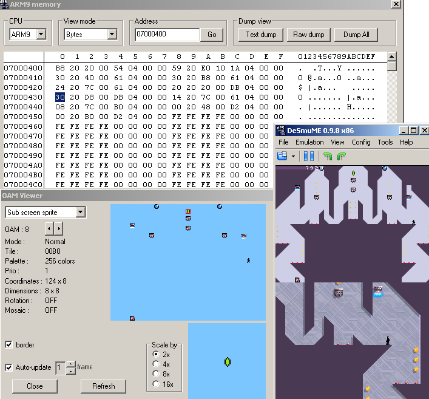

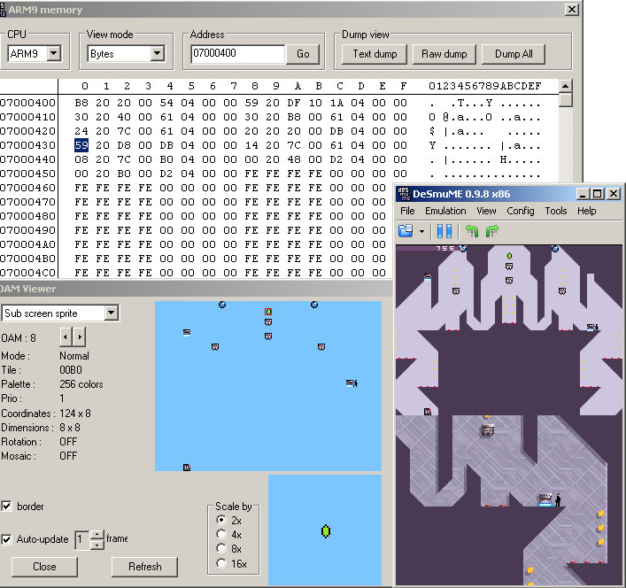

### 2.3.4 GBA and DS BG modes

The BG modes tend to be for backgrounds, text and some menus, as well as providing the end result of the 3d rendering on the DS. On both the GBA and DS there are 4 backgrounds given the name 0 through 3 (again the DS has a second set of BG modes for engine B).

On the GBA there are 4 BG layers (0 through 3) and 7 modes, although different layers are restricted in what they can run. BG layers can be a higher resolution than the screen if given the right options/conditions and such things can be used for animation and general game usage to save having to stream content.

How it works There are two main options here for developers to use in games.

1.  Use a bitmap image
2.  Generate a background from tiles

The second is superior in most cases owing to the ability to do animations more easily (as mentioned previously the hardware is incapable of refreshing an entire bitmap each screen update) and as such is used by the majority of games.

### Emulator shots

Most of the debugging emulators feature the ability to see the various layers that make a background. Typically this is called something like “view map”. Examples of the VBA ones are present in the next few examples of other methods and it is much the same for any emulator with the only differences being in how much the hardware supports.

Scrolling The BG can be placed behind something and scrolled as a type of animation (often combined with other sorts of animation) or just have a larger BG section to focus the rest of the window on (there are other methods by which to have bigger “rooms” than the screen so do not assume this is how a game does it).

Visible in many games but an especially nice example exists in Tetris worlds for the GBA. From the same BG image the impression of random stars is given as a background.

Another good example exists in the first advance wars which actually makes use of the wrapping ability (see the lack of a complete Yellow Comet flag/logo)

Layering effects The classic example of this feature being used is beds in RPG games where the character will have a head visible above the pillow but the rest is covered. To do this there will be at least two layers with one being assigned a higher priority than the sprite and the second being assigned a lower one.

After disabling BG1

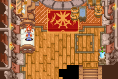

The second classic example which is slightly less involved is where trees or a structural beams will be placed over the game map allowing the sprites to move underneath them. Here many emulators will allow you to disable layers which can be useful when ripping maps to generate a game walkthrough.

Example of beams from Phantasy Star 2

### 2.3.5 Basic animation

As the OAM can control what is on screen and where things are it is the thing responsible for most animation. There are additional abilities in rotating, scaling and such but those will be covered later. Although it is fairly obvious when seen from static images it should be noted that seeing it in real time is better so if you have the chance then do so.

There are concepts to consider.

1.  Screen movement
2.  Sprite swapping

As you will see later in video if you swap the images displayed on a screen fast enough it will appear to the human eye as though they are moving. This means you can swap sprites out to the relevant places after a given number of frames (the screen gets updated every vblank which is both the conventional and suggested point at which this is done). Combine this with movement of the screen or background and you get the impression of movement. Now, as you might have seen in the imagery representation section, images tend to be composed of multiple tiles so you do not have to swap an entire sprite set if you can swap swap the top half of a body instead and have the character throw their arms up as a result though this technique can go much further.

Formats will be covered in a few sections from here but the DS SDK does provide developers a fairly seldom used animation format known as NANR but moving back to the hardware there are several good examples of this in the Ace Attorney (Phoenix Wright) series.

Dragon Quest Rocket Slime The game provides a great example of OAM animation in the pre title screen sequence. Again if you can see it in real time it is quite a lot clearer.

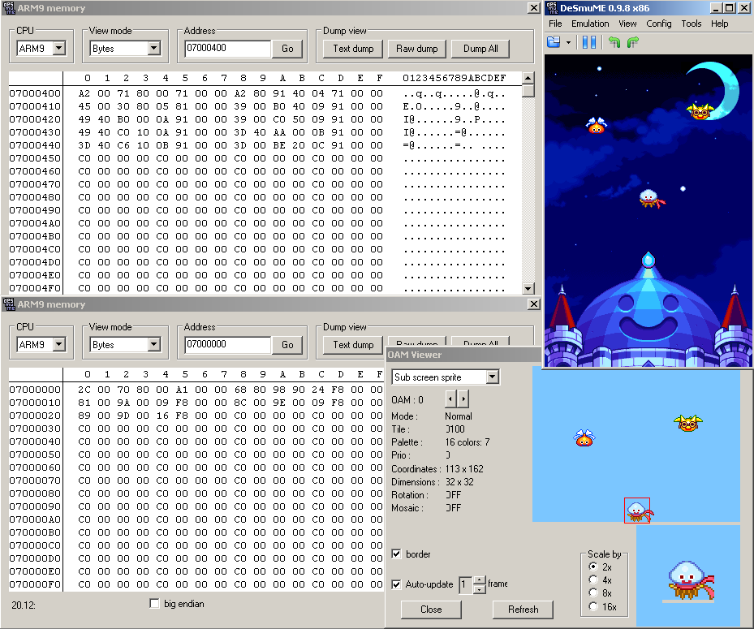

Original Phoenix Wright animation The above was plain animation via OAM but games occasionally get more interesting.

The first Phoenix Wright game had some fairly notable character animations but rather than redrawing each frame of the animation the characters themselves were actually split into components (usually face and hands) and those swapped out as necessary to create animation. The tile view is not quite how the internal formats do it (those usually being set up to take advantage of the hands and face being one visual concept).

Background animation The scrolling effect was mentioned already but if you are using a tiled background you can change the tiles the make up the background and create animation there. Animations with bitmap images has often been done on a programming basis but much of that is either very obvious or quite arcane and steeped in programming methods.

Another use of the scrolling effect is more commonly used as camera animation in 3d imagery but here if you rapidly move around the BG map a “camera shaking” effect is created and is well documented/entrenched in cinematography as something seen when a character or location is startled or hit.

Palette animation It has been mentioned briefly in the past but there is also the matter of palette animation aka dynamic palettes to consider as well. Here the game will change a colour or a handful of colours in the palette and this has a corresponding change in the main game.

From Summon Night Swordcraft Story 2 a quick sample of three stages of an animation. Changing parts of the palette have a black square added around them.

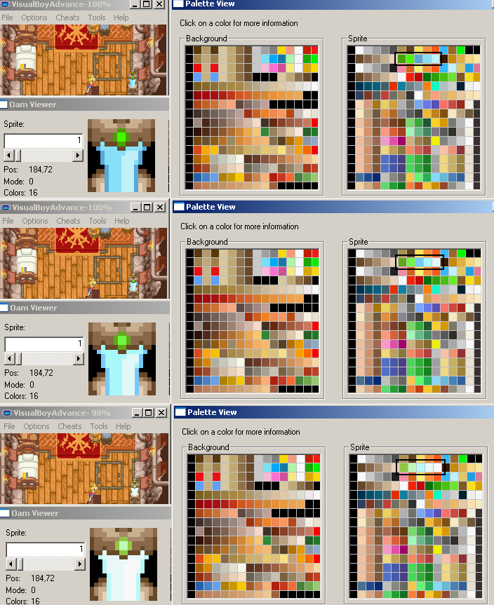

The game, unlike most on the GBA, also features a few different colour modes for the original GBA, GBA-SP, TV and the option to change brightness on a slider.

Developer tricks There is more on this in part III but some on 2d for now. The idea here is the developer will do things to make the demands on system resources less and in doing so allow them the potential for a larger amount of other things to be done which is always good.

For instance a character walking left is much the same as a character walking right so you only need to animate one direction and flip the sprites over. This might also trickle down into the sprite itself which will not be seen holding a weapon or something that will mark it as a flipped sprite.

If an area of a level is not being seen at present there is no need to animate it. The basement/smithy of the Summon Night Swordcraft Story 2 used in the palette animation section provides a great example. The 3d equivalent of this is backface culling and viewpoint rendering.

Another effect commonly seen in 3d animation but still useful in 2d, and seen in several games, is the addition of a single dark circle as a shadow.

### 2.3.6 Window feature

Although you can fill the whole screen the GBA and DS have abilities to pick and choose things to show and the technique is known as windowing. The basic idea is the mode is triggered which selects a region (you have two windows allowing for a four way split if you prefer) and you can change the display of BG and OBJs within it. Various things and games can employ it in the actual game but menus are a common usage.

[GBAtek windowing feature](http://problemkaputt.de/gbatek.htm#lcdiowindowfeature) explanation/description. The feature first has to be enabled in the DISPCNT register and then has the windows defined in other registers which can then have various BG or OBJ layers disabled as appropriate but do remember that transparency can be made to work for the BG so do not always expect windows to be used.

An animation technique can be done here and henke37 noted that things can be tweaked on hblank to create certain effects beyond the obvious classical or offset windows with [ghost trick (see around 5:20)](http://www.youtube.com/watch?v=1t8wWnI_I1I&feature=related) providing a nice example.

### 2.3.7 Special features (flipping, affine transformation, alpha and such)

Despite all the limited memory and quirks the GBA and DS or perhaps because of it both feature all sorts of methods that developers can employ to perform various alterations to the images seen.

In OAM transformation Mentioned briefly a few paragraphs back the OAM has options to flip sprites and individual tiles. and is quite often used to have characters walk to the left or walk to the right despite using a single set of sprites (you can see an example of it up in the GBA OAM viewing section). Double size is also available although intended use seems to be for working around affine transformation induced issues (preventing parts from being clipped off when rotated in most cases) rather than the immediately obvious (although that works as well).

Affine Many guides and documents will refer to this by the two most common things it does, which are the other two big transformations done to geometry known to most as rotation and scaling (the third one, translation, being fairly well taken care of by everything else). Strictly speaking though it does allow for shear transformation and some other things and so the term affine transformation is more fitting.

In the case of sprites/objs it is split across the first two attributes and the fourth hidden ones. The s in ones is not a typo as the normally unusual 4th attribute is in fact affine transformation data but it allows for 32 attributes (somewhat less than the 128 objects possible but that is not so bad as there is nothing stopping things from sharing a set of attributes) in all as the first four hidden attributes are used for a single transformation value and this is repeated.

Attribute 0 activates the mode

Attribute 1 selects the transformation grouping in bits 9 to 13.

The hidden attribute 3 is in fact split over four hidden attributes as mentioned and each carries one 16 bit value (signed 1 bit sign, 7 bits integer, 8 bits fraction format) corresponding to what are known as PA,PB,PC and PD which can be used to effect rotation, scale and shear transformation and all the same time if necessary (it does not quite work like it but if you imagine having control of every corner and how you can use that to scale things, shear things and rotate things at the same time) .

[Tonc](http://www.coranac.com/tonc/text/affine.htm) has a worked example of a lot of the maths involved (in many ways it is as complex as maths in ROM hacking gets outside of some very in depth assembly hacking), it also returns after a fashion for the 3d system. It will be returned to there in earnest as it underpins the entire 3d system.

For those used to the maths the reference point is the top left of the object rather than the screen and the rotation centre is set as the middle of the sprite. In some ways this is quite limiting as some interesting things can be accomplished with different origins and centres of rotation but it does serve to simplify things for basic transformations.

[GBAtek](http://problemkaputt.de/gbatek.htm#lcdobjoamattributes) has basic listings and [tonc](http://www.coranac.com/tonc/text/affobj.htm) has more worked examples.

BG affine transformation is slightly more involved but follows much of the same logic, [GBAtek](http://problemkaputt.de/gbatek.htm#lcdiobgrotationscaling) has more.

Mosaic Usually seen as the single corner pixel repeats for every unset pixel in the rest of the screen but it is available for smaller values. Has to be enabled in the individual control register and then set accordingly in 400004C hex but is available for all the BG layers as well as equivalents for sprites. [GBAtek mosaic](http://problemkaputt.de/gbatek.htm#lcdiomosaicfunction) section and [Tonc](http://www.coranac.com/tonc/text/gfx.htm#sec-blend) has some nice worked examples.

Alpha and brightness Alpha blending is a method by which two images can be merged together, the not entirely accurate but layman’s equivalent term being called transparency, and can be used to achieve a variety of effects. Note that the DS 3d system has a rather more complex setup for alpha depending upon textures used and more.

For the most part alpha is a flag and variable which is to say if it wants to be alpha blended there will be a flag to say so and somewhere else a variable to say by how much (this is also where the 3d differs slightly in some modes).

Brightness adjustment, which the DS has a special mode in the capture unit for, is also possible with it being available instead of alpha if you want it. Note that many developers instead chose to alter brightness at the palette level for the original GBA model hence the hacks to restore colours that looked rather washed out in later GBA models.

Three registers are used here with 04000050 hex aka BLDCNT being the main select this mode 4000052 hex aka BLDALPHA being the alpha modes and 4000054 hex aka BLDY doing for the brightness. Note that although sprites can be blended here the setting can be overridden to always blend in the OAM.

[GBAtek](http://problemkaputt.de/gbatek.htm#lcdiocolorspecialeffects) has more depth and full listings.

Mode 7 The SNES (which the GBA owes a lot to in terms of abilities and hardware design) was one of the first to allow for a perspective transformation of an image. Though now looking quite poor to those used to modern 3d imagery it was revolutionary at the time, so much so the hardware term from the SNES became shorthand for the technique. [Tonc](http://www.coranac.com/tonc/text/mode7.htm) has more.

### 2.3.8 Basic DS layout formats and mapping

Although games and indeed many games do use raw formats and declare what they should be rendered as/mapped to elsewhere (or just have a tile for every tile on the screen) the nitroSDK provides several formats for developers to use. They range from simple wrappers for a layout to full animation formats. Also worth noting is that if an image is composed of tiles some of those tiles might be reused as a kind of compression so you might have to edit those (this is very often the case in Japanese puzzle games where text is part of the image and the two kanji can afford to have a blank tile in the middle).

A basic demonstration of the compression/tile reuse concept

A few clicks later

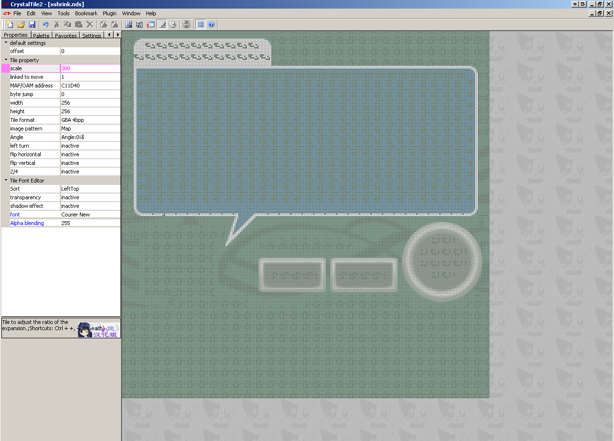

Palette formats

NCLR

Occasionally seen as RLCN it is a palette format. Most of the time a fairly pointless wrapper for the palette but other times does act as an archive format.

NTFP

Technically part of the NCLR format but seen quite often by itself and especially on earlier games.

.PAL

Not always a palette (it still being the shorthand for European and Australian TV standards and so versions of games aimed at there will sport that extension) but quite often palettes are seen with this extension.

Tile storage Tiles themselves need to be stored and various archive formats have been made for them

NCGR

A format that includes all the relevant data about the data stored (widths, heights, colour depths, whether it is tiles or not and more). Aimed more at sprites/objs but remember full screen images are possible and still used for BG type images.

NTFT

Another raw format that is technically part of another (in this case NCGR) but seen by itself on occasion.

NSCR

Aimed at background (BG) images and contains information on how to decode and set things up.

NTFS

Once more part of a bigger format (NSCR in this case)

Mapping Mapping merely involves arranging the OAM or BG into the proper order. It can be done in many ways but the nitroSDK provides a handful of methods although many are encompassed either by animation or by the storage methods themselves.

NCER

Aimed at sprites and provides initial OAM data among other things.

Animation

NANR

An infrequently used animation format.

NMCR

A format seen in pokemon to provide animations. In some ways it might be considered a wrapper to NANR.

Fonts It will be covered later in the text hacking section but there is a fairly complex font format many DS games use. Many other games use equally complex formats where others might use simple plain tiles (maybe in a slightly odd size).

NFTR

A font format the includes character widths/dimensions, line locations and various types of mapping available.

General observations Most DS editing programs will feature editing abilities for these formats and related ones and exporting and importing should not be a problem. However if you are after a more general image editor and have one that supports the Susie plugin format (a fairly popular plugin format seen in a lot of Japanese image editors) loveemu’s [nitroscrap](https://github.com/loveemu/nitroscrap/releases) heads down such a path.

Although they can and frequently are found by themselves they might be put into basic container formats like narc, custom ones as will be covered several times over during the course of this guide, occasionally stripped of components of (maps being ignored and such), be stripped down to the their basic components (basically a headerless file), have a single palette for an entire range of images (often this will be named accordingly but not always and either way it can confuse programs that expect the same name, which is most of them). This is especially true of animation which rarely uses the NANR format.

The formats have remained largely static over the course of things although pokemon has a habit of changing a few things, using rarely used features and reworking some others so tools built to earlier standards might not work properly with that franchise.

The names above are the extensions the files that carry them usually have but they are occasionally known by the magic stamp which is usually a reversed version of the extension (NCLR=RLCN and such).

In the absence of the formats at the end of the document

[Lowlines current specifications](http://llref.emutalk.net/docs/)

[Lowlines older specifications](http://www.romhacking.net/documents/469/)

[Tinke source code](https://github.com/pleonex/tinke/tree/master/Tinke) (trunk/ Tinke/ Imagen and trunk/ Plugins)

[Nintendo VieWer source code (python)](http://nvwr.googlecode.com/svn/trunk/libs/formats/)

They are largely aimed at programming with the latter two being source code to various programs.

### 2.3.9 Video memory handling and alignment

The GBA and DS video systems are quite in depth which serves both to work around issues of low power and to provide developers the options to do things they might otherwise have to spend a lot of time programming. One of the more interesting aspects of this is the memory handling as it is quite possible to run out and there are other quirks such as alignment.

2d memory management Games, especially on the GBA but the DS is no easy street, frequently push up against the limits of the memory and this means there is certainly not so much of it you can never run out and with certain graphics modes it is very easy to do. As ROM hacking so often wants to add things you will probably brush up against this eventually. The most common scenarios are you have a 2d overlay on a background and either the repeated tiles want to be edited or you want to extend the overlay a bit and run out of memory that way.

[pineight.com](http://pineight.com/gba/managing-sprite-vram.txt)details a streaming method homebrew programmers can use to hopefully never run out of ram. DS programmers are not quite so fortunate and will tend to have to fiddle with maps and tiles or accept a slightly lesser image.

Alignment In short the GBA VRAM will only accept writes to values aligned to 16 bits and this most commonly rears up when compression is being dealt with. It has had such an effect that it led to a whole class of methods being described as VRAM safe or otherwise WRAM safe if they do not work on VRAM. Unless you are physically managing the VRAM as part of a hack (and not say relying on a function to read so much from the cart into it) it is usually just a matter of making sure you select the “VRAM safe” compression function of whatever program you are using.

## 2.4 3d

Although some games on consoles are experimenting with vector images between tiles and 2d above and 3d covered in this section the vast majority of imagery use in games is covered. Note it is far from unheard of for games to use their 3d hardware to display 2d imagery and animation (several title screens on games have been seen to do this at various levels and even swapping out 3d for conventional 2d at points), it was already mentioned how several apparently 2d games have used 3d models in place of sprites (New Super Mario Brothers being noted for it) and others have augmented 2d imagery by doing things like having backgrounds rendered on the 3d hardware (various reasons but mainly that it really troubled the nascent DS emulation scene finds the first Castlevania game being noted for it).

For the most part this section will be very basic general concepts and DS specifics as the GBA lacks proper 3d hardware and anything there is likely to be prerendered and given to the 2d, a trick like isometric imagery or “mode 7” style techniques. This section will also assume a knowledge of GBA/DS 2d hardware and can be considered to follow on directly from it.

On computers and to a lesser extent consoles as well (although they use the hardware designed for it the software development kit developers will often still cook up their own programming methods for it) the two dominant methods for rendering 3d at time of writing, and for some time prior, are known as DirectX (a 3D technology from Microsoft and used in Windows and the xbox line of consoles) and OpenGL (a 3d technology of similar power and scope but as it is relatively open it is used in most other places as well as being available for use in Windows).

Lines are blurred between the hardware running things and the standards built on top of them; DirectX and OpenGL will put standards out which the hardware makers will build to and the hardware makers (and engine developers) will also have a say in what should go in the next versions of the DirectX and OpenGL standards with it only getting more blurred as those technologies also start to encompass general computing tasks (physics and such for games but owing to the way they are built they are also pretty good for aspects of high performance computing) with GPGPU being the term of choice to look up. Also in the case of DirectX the standard also defines input methods and helps with sound.

For the most part though the GBA and DS have all that 2d animation capabilities that consoles or 2d animation in general ever wanted (naturally support for larger amounts of sprites and such, being faster and operating at higher resolutions are desirable) the DS 3D systems are not that much like current 3d systems or even that much like past ones. Basically if you knew all that was to know about GBA 2d and underlying methods you could do 2d anything but knowing all there is to know about DS 3d and the underlying methods will leave a large gap in your knowledge (the idea of shaders, much of light reflection and some of the ideas that have led to shortcuts/approximations are at best going to be touched upon) although it should not do a disservice to any future intentions to learn 3d imagery. Learning 3d imagery is quite possible thanks to the internet and [The Guerrilla CG Project](http://www.youtube.com/playlist?list=PL6A7DF3D7866EB076&feature=plpp) put out a nice series that covers a lot of the basic concepts.

### 2.4.1 Basic 3d (bones, coordinates, keyframes)

You can do 3d imagery in a lot of different ways and for the most part 3d and the way 3d is animated is not really possible to separate. In practice it comes down to keyframes which have quite a lot in common with their 2d counterparts, morphing which is a hybrid of keyframes and the following and bones which as the name implies a bunch of jointed (often imaginary) lines running through a character that can be moved to provide animation (lesser systems using fewer bones and joints and winding up with things like hands always in a “pistol” grip).

Coordinates. For the most part the X, Y, Z coordinate (Cartesian) system appears once more although with two main refinements either in hardware or when doing maths on them.

1.  The ability to define a line with an angle and a length
2.  The ability to have a coordinate system within a coordinate system (helps when you have a complex shape and do not want to have to worry about recalculating a lot of points despite them not changing relative to each other).

Angles and lengths are quite useful as they can be manipulated somewhat more easily in some ways (the general idea is a line is defined at the origin with an angle to the given axes and a length and then maybe translated which gives the same information as a set of coordinates but allows easier rotation and more). Strictly speaking it is not used in the hardware but it often feeds into the multiple coordinate systems.

Multiple coordinate systems are extremely useful once you get past basic 3d for as mentioned they allow you to rotate an entire shape and not have to worry about recalculating all the components within it and deal with odd angles not to mention it allows for independent animation. For instance consider your hand when curling your arm it is at the end of your wrist but if you curl your arm leaving the hand in the starting position and then try to map the coordinates your hand just passed through it gets horribly complex despite your hand not changing position relative to your wrist.

In most games made points are defined which then become the corners, or more accurately vertices, of a model and lines drawn between them to make the image and those points moved accordingly (usually via the bones technique) although the latest techniques at time of writing are experimenting with a technology known as geometry shaders where new lines can be generated after an explosion or something. Back on topic most of the time this line is straight although some more advanced systems can define a type of line to make for a curved image (other times you see this it can be textures though) which usually falls under the remit of subdivision although there is a lighting trick known as Gouraud shading that achieves a similar effect.

Another type of imagery seen mainly in 3d scanning (medicine and parts of reverse engineering devices) and certain types of computer modelling (usually scientific in nature) is known as point cloud data where individual points are used and expanded from there. As you might imagine this can be very costly in terms of resources which for more real time use leads to voxels where a image is composed of small boxes or if you prefer the points themselves expanded so as to meet their neighbours and can be seen in [voxelstein3d](http://voxelstein3d.sourceforge.net/) among other things.

Optional maths lecture on arrays/matrices Arrays are a concept that arises early in discussions of 3d and programming in general and as they have some very useful functions they never really go away. With one though you can effectively define in a few numbers a primitive anything really; a 3 x 3 array stores 9 values which works quite well when you have an X, Y and Z value and three sets of those can define a triangle (the building block of most 3d images) and more although the DS favours 4x4 for a lot of things (even if it turns those 4x4 into 3x3 by setting all the but the bottom right coordinate to 0 and the bottom right one to 1.0) and does not use them for defining vertices per se but the model format might well store things in one. The underlying maths is not hard it is just not as most people that have previously spent time doing algebra immediately expect. For some of the more in depth 2d affine transformations the same maths and many of the same concepts will arise.

Both [GBAtek](http://problemkaputt.de/gbatek.htm#ds3dmatrixexamplesmathsbasics) and [Tonc](http://www.coranac.com/tonc/text/matrix.htm) have more on this with the latter aimed at the GBA 2d.

Still there are a few select concepts worth knowing

* Dot product
* Cross product
* Scalar multiplication

Depending upon your point of view scalars are either regular numbers or a 1x1 matrix.

\[To finish\]

The decimal point Floating point was covered back in the introduction and it is surely not hard to see what the ability to represent numbers after the decimal point is useful in 3d modelling. Combined with the need to do operations on lots of data all at once (a problem “solved” by the introduction of Single Instruction Multiple Data/ SIMD instructions) this is why 3d tends to have a piece of dedicated hardware inside the system and systems will have their performance measured in FLOPS (floating point operations per second). The DS specifically tends to eschew floating point in favour of fixed point using a variety of different formats for fixed point depending upon the operation.

A couple of different fixed point methods are used depending where you are

1bit sign, 3bit integer, 12bit fraction for a lot of the vectors (usually involving light and view)

1 bit sign + 3 bit integer + 6bit fractional for the 32 bit vertex set command (X,Y and Z in the same command each with 10 bits)

1bit sign + 9bit fractional part for the 64 bit vertex set command (X and Y in one 32 bit command, Z and wasted space in the next) and the commands that be used when reusing a previous coordinate (set X and Y but use the same Z or the other permutations of that concept).

### 2.4.2 Viewpoints

As well as lighting (covered elsewhere in this section) the idea of the viewpoint/camera is important where in 2d both those are something of an abstract concept at best. As the name implies it is the thing that ultimately decides what is rendered (3d learned early on you only need to render what the camera(s) can see) and more importantly can be used for animation (although in practice bugs in the DS hardware sometimes mean the camera is not animated but the world instead).

Additionally the DS supports a cutoff value so items beyond a certain distance will not be rendered (this helps the hardware by having less to do and likely the resulting image by having things that are only visible as single pixels not be rendered.

This is where matrices are most prevalent with the principle example being that of achieving a perspective view. The DS hardware supports either orthogonal rendering which is useful for 2d games like New Super Mario Brothers or games which use it for basic animations (certain RPG battle sequences) or rendering with perspective which is useful for first and third person type games where the camera is behind the player.

### 2.4.3 Textures and material colours

The earliest 3d just defined the points at corners (vertices) and lines (quite often green or grey) in a process known as wireframe; this is not used much any more with it tending to be reserved for cheat modes/bonus content, testing out the game itself and those creating the 3d content in the first place so in place of that there is material colours and textures. This being said many systems including the DS will still allow the “wireframe” to be coloured differently.

Further down the line there are also concepts like bump mapping where the illusion of surface roughness can be created by assuming another light source on the object, some systems will have hardware support for this but the DS does not and any you see will be the result of those responsible for 3d models and textures calculating such things ahead of time (if you plan to do any work with DS 3d the idea of precalculation is one that will appear again and again).

Material colours are just what they sound like and the 3d object will be coloured in according to a given value somewhere, with lighting and shadows it can look different and with each vertex in the case of the DS being able to be assigned a colour basic coloured models can be made however it tends to look a bit plain which brought in the idea of textures.

Textures are more or less 2d images placed over the 3d models or parts thereof which is more demanding than simple material colours. Unlike palettes in 2d you can map a texture to a part of a model and then between light/shadows, certain graphics modes, angles to the camera and fog a final image might be generated that is nothing like the texture colours. To this end with the pixels that make up a texture not being quite what it will be in the final image they are known as texels instead. Also available is alpha blending with the material colours so the texture and the material colours combine to create an image.

w8_bridge.nsbmd is a nice example here.

First image is what it looks like, second is without the texture.

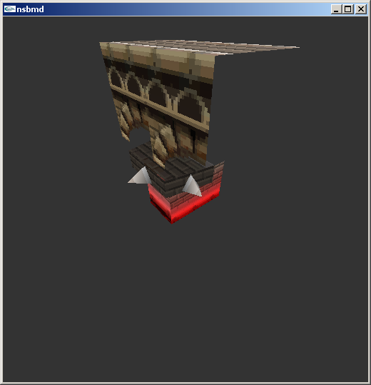

Also worth noting is 3d has seen several titles allow the player to create their own textures with Mario Kart being on the more notable ones and other common ones include clothing games and games like the sims. There has been a bit of this in 2d as well but not half as much although for the most part textures will tend to manifest as 2d images anyway (certainly some editing has been done with 2d tile editors where necessary).

This brings a secondary issue up that developers and hackers alike have long had to think about when attempting to map a 2d image to a 3d object. Doing as such tends to make for some distortion so models will tend to be painted in 3d with a program and then converted to a 2d texture for storage; for more on that subject “Texture unwrapping” and “UV Mapping” are good search terms.

DS textures When being editing many will resemble custom size 2d formats. Equally much like 2d there are additional options and textures can be repeated, flipped and more.

[GBAtek](http://problemkaputt.de/gbatek.htm#ds3dtextureattributes) has more on the various methods and although at times they resemble things seen in the 2d palette/tile world other times see something quite custom in comparison.

### 2.4.4 Models

Basic constructions

There is the idea of a 3d primitive although this takes two forms with the likes of the DS and truly low level hardware and more general 3d modelling.

The DS hardware uses four concepts

* Triangle (three points defined anticlockwise)
* Quadrilateral (four points defined anticlockwise)
* Triangle strips (three points defined anticlockwise to start with and then either up down or if you prefer clockwise anticlockwise)
* Quadrilateral strips (four points defined “up and then down”)

Straight lines (line segments) are usually made by setting two of the points in a triangles to the same value. Equally although there is little in the way of support for or need for subdivision on the DS quite a few models eschewed the reliance on triangles that marks most game consoles apart from conventional 3d modelling which opts for quadrilaterals instead.

Although more conventional 3d modelling recognises those types as primitives (and if they are not primitives they are certainly fundamentals) on top of this and when dealing with slightly higher level ideas there are three other primitives

* Spheres
* Cylinders
* Cuboids

Either way when reverse engineering a model should developers have been kind enough to leave a selection of these primitives and when reverse engineering a format seeking these out and/or creating them is a useful step but more on that later.

Parent and child This is often where the idea of multiple coordinate systems comes into play.

The basic idea is there is a primary set of coordinates known as the world (although do note some call the entire level the world and it is a separate concept) and from here several extra coordinate systems can be defined and known as children; children can have further children but are each tied to the parent going right back to the world.

It becomes useful as having a large level and defining it only to want to move an item within it or worse it relative to another item it touches can get to be a nightmare very fast and even more so when there are say 300 points defining that item which all have to be accounted for possibly using a coordinate system with an origin several hundred of a given unit from the location of the model at the time.

### 2.4.5 Lighting/shadows

Where 2d is inherently assumed to be lit, indeed the whole colour scheme is designed around differences in brightness of the component colours, lighting and shadows as an extra concept do not really exist but most 3d systems will allow the phenomenon to me modelled and so lighting and shadows needs to be discussed.

Theory There are three types of light reflection known as specular, diffuse and emissive and the DS supports all three in hardware. Where light is blocked it makes shadows and where it is partially blocked it changes the colour of the light coming in but the DS has very limited support for both of these concepts.

Light There are the three sources and they all combine to make for images humans are used to seeing. Although the DS supports them most of it is precalculated/nice approximation. Approximation however is common in much of 3d regardless of where it is at.

Specular

This is the traditional concept of reflection where a single beam, provided it is below the critical angle for a material, will be reflected out.

Diffuse

This is the “scattered” light as often seen in crystalline structures but many materials will have a measure of diffuse reflection.

Emissive

As the name implies this is light generated by an object.

There are also three types of light source and although it is key to most light modelling which are a spherical source (light in every direction and dropping in intensity with distance), a conical source (light expanding as a cone with distance and also dropping with intensity) and a tube/parallel source (think laser beam where a single set of parallel light beams and not dropping in intensity with distance). They are not quite so key here as only the parallel sources are available to the DS although there can be multiple ones coming from various locations and are reflected accordingly. GBAtek also notes that the DS diffuse light engine is bugged and does not reflect properly if the camera is turned so in those cases diffuse is not used or the entire world is rotated instead.

Shadows If there is light there must be shadows to go with it. The DS lighting engine provides only light to the camera but it does have the ability to generate shadows as separate entities too. As mentioned in 2d the lack of shadows is fairly notable to the human eye but it can be placated by adding a simple circle shadow a lot of the time.

DS basics The DS supports light in the three forms although it is only reflected to the camera and not to other objects. As mentioned it does however provide the option to make shadows using a polygon so developers can precalculate shadows and add them to images and they often choose to also add a basic shadow (no shadow is quite noticeable but even a basic blob/circle shadow will help believability).

### 2.4.6 3d smoke and fog

Although in real life the fog and smoke are roughly treated as similar concepts as far as physics modelling is concerned in games the differences are quite extreme although developers have often been known to make one stand in for another.

Fog is most commonly associated with draw distance and indeed is usually there to make up for the hardware being unable to draw far enough ahead in real time although games like Silent Hill used it as part of the gameplay. It should be noted though that developers will also do things like make winding corridors, use a skybox, make things have trees/buildings either side of the level itself and use low light conditions to mask the inability to draw at long distances to say nothing of things like mip mapping and 2d overlays but more on that in animations and developer tricks in part 3.

Back on topic the DS hardware has a fog option as do most other 3d hardware/engines that aspire to be useful; it provides the ability to define fog colour (including alpha), location and density (typically to allow for things to fade out but not restricted to it).

Smoke Assuming it is not the result of the fog engine being used most smoke is a simple 2d animation maybe as a texture to an item with an animated texture or as conventional 2d imagery. On other computers there have been several smoke generation algorithms that are considerably less demanding but they are usually well out of reach of the DS and certainly not supported in hardware.

### 2.4.7 Animations

Basic animation was alluded to elsewhere but it takes three main forms.

Bones animation The traditional transformation types of rotation, scaling and translation return and provide most of the ideas here.

Texture animation Textures can be added, removed, have their level of alpha changed, combined with other textures (the result of an explosion say), have mirroring and expansion/scaling turned off and on more advanced systems which does include the DS the texture origin can be changed creating a similar effect to the scrolling BG from 2d animation. Also why go to the effort of uncoupling the wheel from a car and making it move when you can just rotate the texture of the wheel (or indeed just have a white shiny line move up and down or flicker).

Camera animation Much like real life although you can rotate the entire world to have something appear upside down it is usually easier to change turn the thing viewing it upside down and similarly for the other types of transformations. The do remember the bug with rotation on the DS and diffuse reflection (if a camera does a Dutch angle then it is probably the world that rotated instead).

Clipping Yet another area worthy of a section to itself. 3d by itself is just an imagery method and the camera itself can go anywhere within the space provided without restriction. Naturally this is not desirable for games so clipping comes into play and it can take many forms with some hardware and game engines even providing a measure of support for it. Sometimes clipping can be detected by using the 3d hardware itself similar to some level systems that use OAM for 2d but on the DS much of the time it is another file that will mirror the level (as a developer it is not terribly hard to generate one if you have the level sitting in front of you) will be made instead with a nice example being the KCL format used in many first party Nintendo games like the Mario Kart series.

2d overlays Although things can be done in 3d all proper 3d systems will work with the 2d hardware as well ranging from things as simple as skyboxes where the horizon is visible but rather than being a single colour there will be a 2d image placed on it of what the horizon would look like (or the sky above it) and as it is incredibly far away at this point. Some 2d engines go a step further than this and will replace actual objects in the distance with 2d representations and swap them out for 3d as the distance to them becomes less.

Others rather than creating a full model of a plant (traditionally quite a hard thing to do and demanding once it is done) will instead make a very thin box, make it transparent save for the plant and display that. An example of the idea can be seen in the map_point.nsbmd from New Super Mario Brothers on the DS.

In fact it is the little marker for the levels that have been done from the world map show as it is in the game, as wireframe and as it is without a texture. Note also the potential for a specular highlight which in in this case is done in textures.

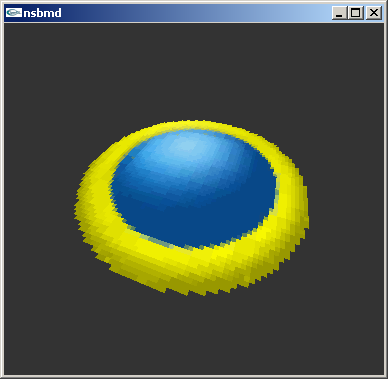

Animations can also happen here and smoke or sparks can be simple 2d animations set to a given point.

Basically regardless of what is done 2d imagery plays a serious role in creating 3d worlds. Speaking of that it ends up as 2d in the case of the DS.

### 2.4.8 DS 3D hardware

[GBAtek](http://problemkaputt.de/gbatek.htm#ds3dvideocontains)a lot of detail on the subject but the basics behind the 3d hardware are worth knowing about.

The general idea is that there is a geometry engine and a rendering engine. The geometry engine is what the DS communicates with and it calculates the changes required before passing it to the rendering engine (a process triggered by a Swap Buffers command) which puts everything together and makes a picture out of the result or would but rather than an entire rendered frame (otherwise known as using a framebuffer) only 48 lines are rendered at a time and put into a cache.

Communication is typically done via write only registers starting at 4000330 hex and ending at 40006A4 hex, the display control register for 3d (DISP3DCNT) is however found at 4000060 hex and controls what modes are selected. Buried within the 3d IO range is the geometry command range which is either accessed directly or send a series of commands via the GXFIFO arrangement where geometry commands can be called by type instead.

Although some maths can be done it is a fairly low level arrangement and there is little in the way of high level constructs compared to say programming for a modern PC or console targeted 3d game engine where models themselves are essentially data types.

Matrices The DS emulators desmume and no$gba dev version will allow you to view the matrices.

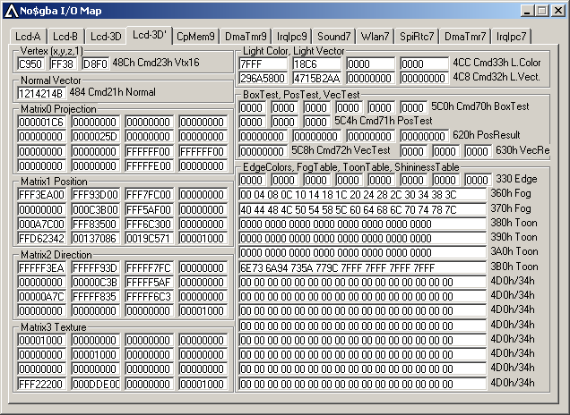

Although there is a matrix stack which allows things to be swapped out in very short order there are four main ones that are useful at any one point in time. Once you know the Direction matrix refers to the light direction most are fairly self explanatory and if you recall affine transformation and mode7 from the 2d side of things most of it drops into place.

Still

Projection

handles the change between orthogonal and perspective view and although those are the main two it can handle everything in between.

Position

handles the ultimate locations of vertices

Direction

used for light and the testing vectors (light is the most commonly handled).

Texture

handles the texture mapping using the texture modes the hardware supports.

They are set by selecting the mode by writing to 4000440 hex aka the MTX_MODE register aka command 10h after which there are write matrix commands, read commands (for clipping), various multiplication and read as well as stack handling commands.

[GBAtek](http://problemkaputt.de/gbatek.htm#ds3dmatrixloadmultiply) covers the basics here.

### 2.4.9 The shift of the 3D to DS 2d

As mentioned the 3d hardware is not addressable directly in memory and it is not really tied to the screen rendering so the resulting frames from 3d rendering are turned over to the BG0 layer of engine A where it can have the usually selection of overlays and sprites done to it (many games will also render a 3d background to put behind the game). This being said the BG0 can be further transferred (with a speed penalty) and used elsewhere with the typical destination either being engine B or the capture hardware. By shifting layer priorities this is how a lot of ostensibly 2d games (like Castlevania) could use the 3d hardware to render a 3d background and have a conventional 2d game run on top of that.

### 2.4.10 NSBMD

NSBMD is the standard SDK 3D format and format used by a lot of games, that said some appeared before NSBMD became finalised and others like some Yu Gi Oh games have their own custom format. It has also been seen a couple of times with the textures mapped to a simple square in title screens and as mentioned elsewhere some ostensibly 2d platformers like New Super Mario Brothers used the 3d systems to in place of 2d sprites; note this is not Rare’s SNES Donkey Kong or Resident Evil style prerendering but actual 3d movement restricted to a 2d world. It also led to the introduction of “2.5D” but that is a different discussion.

The basic idea is that NSBMD is a 3d coordinate driven format with support for materials colours, textures, points to hook in for animations and not a lot else. It is sometimes flanked by the formats NSBTX (optional textures) and NSBCA (animations) where necessary and you should probably also remember the BMD or BMD0 is the actual model contained within (it shares a stamp with 3d formats for the gamecube and wii in this regard). Much like most things on the DS it is quite close to the hardware it ends up on in many ways.

Tools and specifications

* [nsbmd tool](http://filetrip.net/nds-downloads/utilities/download-nsbmd-tool-10-f28230.html)
* [kiwi.DS NSBMD specs](http://kiwi.ds.googlepages.com/nsbmd.html)
* [lowlines specs](http://llref.emutalk.net/docs/?file=xml/bmd0.xml#xml-doc) (also [NSBTX](http://llref.emutalk.net/docs/?file=xml/btx0.xml#xml-doc) and [NSBCA](http://llref.emutalk.net/docs/?file=xml/bca0.xml#xml-doc))
* [lowlines’s the console tool](http://llref.emutalk.net/projects/ctool/)
* [tinke](https://github.com/pleonex/tinke)
* [mkds course modifier](http://gbatemp.net/topic/299444-mkds-course-modifier/)
* [NSBTXExtractor](http://filetrip.net/nds-downloads/utilities/download-nsbtxextractor-10-f29535.html)

Nsbmdtool is the tool created from the first attempts at reverse engineering the NSBMD format and although it lacks the ability to render quite a lot of imagery since discovered it has the ability to parse 3d models and give locations of the models, textures and similar ideas contained within the format which means it is still invaluable for editing models be they from new or old titles.

lowlines’ console tool is a newer attempt at reverse engineering the specifications and did better than nsbmdtool in a lot of cases.

Tinke includes a texture viewer and later versions include a model viewer as well as a great human readable version of the events.

MKDS course extractor includes NSMBD viewing features and some manipulation ability.

NSBTXExtractor is mainly aimed at texture extraction but it works on a lot of things and simply being able to extract textures helps in a lot of cases.

There are additional tools but they are usually game specific save editors and the like (mario kart emblem editors, Animal crossing texture editors in saves and such).

### Basic NSBMD hacks

There are four main hacks done here although many of them translate to the other 3d formats as well.

* Filesystem hacks
* Texture modding hacks
* Scale and minor tweaks
* Full injection/modding hacks

Filesystem hacks are many and varied but were seen early on in the likes of the Mario Kart course hacks (it was mentioned elsewhere but Mario Kart used a KCL format for the track layout so unlike many games on more powerful machines simply editing the model does not do much) and several hacks since. Note that animations and textures can often be tied to a given model and odd things can happen if they are changed with some good examples being seen in some of the Super Smash Brothers hacks for the Wii. Occasionally injection from other games was attempted although it usually works better when it is for a similar franchise.

Texture modding hacks are not that common but equally they are not that hard. Generally a combination of something like nsbmdtool, tinke and looking at the specifications will allow you to direct a tile editor to the appropriate location, get the required dimensions (they are usually a simple multiple of 8 for each dimension but not always) and get the appropriate palette sorted which allows for conventional 2d editing. By similar logic palettes and any offsets for the textures can also be edited.

Scale and minor hacks. With 3d models being tied directly to the points that created them minor hacks are quite possible if the would be hacker can get a handle on the layout of the layout of the model in the file.

Full injection uses various techniques ranging from using leaked parts of the nitroSDK (parts were leaked and that included plugins for older versions of several industry standard 3d modelling programs such as 3ds max, maya and Softimage 3D/XSI which exported files to an intermediate format and conversion software for that intermediate) where others have done things like export images into a human readable format and between viewers and hex editing managed to change models enough to count as a full injection hack. At time of writing there is nothing resembling a high level editor of models themselves either standalone or via plugins.

### Example of minor hack

The following is a quick example of a minor model tweak. “map_point.nsbmd” from New Super Mario Brothers will be returned to as it only being four vertices means less chance in being bogged down with a complex model. The model could be worked up from the specification but Tinke provides a nice human readable output

polygon0 is the item of choice and following it should be the commands. Note that as it is a flat square and thus shares some coordinates from point to point the smaller 3d hardware commands can be used to generate it, should the points be different on all three coordinates then longer commands will need be used.

Might as well change a single vertex to begin with so 01D9 was changed to 80

Wireframe of the modded version and the original version

With textures

### Basic texture viewing hack

Textures are usually just stored as 2d images of some format, although do remember it might not be a colour format commonly seen in regular 2d editing (see the hardware notes for DS 3d textures). This is not usually so bad for much like editing without the proper palette by using a somewhat abstract method (if you know this green corresponds to that red in the image it is still possible to edit) a tile editor is little more than a hex editor that shows coloured pixels instead of letters and can arrange it in a few more orders, just make sure you have all unique colours if you do this or you risk getting quite confused. You could try exporting the texture in something to a bitmap format and importing the palette from that as well.

Game is Fire Emblem - Shin Monshou no Nazo Hikari to Kage no Eiyuu. It used (as did most DS fire emblem titles) 3d textures to help with 2d images.

File is title_logo.md (the series has the curious habit of using only the last two letters from the SDK extensions) from title12 directory.

NSBMDtool output

Nsbmdtool, despite being old and not working on a lot of NSBMD files, can provide some useful output.

Tinke output

Tinke provides two windows with useful output information.

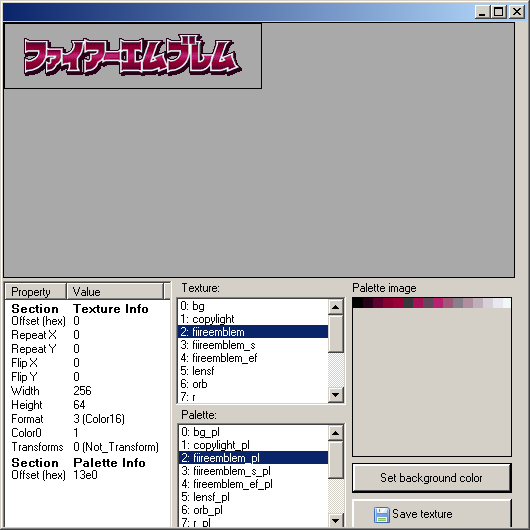

Palette finding Plenty of information was given but no direct address of the palette in question.

The palette offset is given at 38 hex in the TEX0 section.

TEX0 starts at 1E30

Palette set to 0001 AA68 (within the tex0 section)

This gives 0001 C898 as the start of the palette section. It is not however the first palette in the palette section (it is the third although numbering starts at 0 so 2 is the actual number if using internal logic)

Tinke says 13E0 which needs a shift/divide by 2 to get 09F0. Adding that on gives

0001D288 hex

Crystaltile2 filtering Setting the appropriate locations as given in tinke and the nsbmdtool output.

The offset was given by nsbmdtool and tinke. 16 colours aka 4bpp.

Setting the palette.

From here it is so much basic image editing although do note the gradient. It looks like there is a periodicity in the X direction after a fashion (there is odd shading within the characters on the shorter widths) but vertical give or take shorter widths that trouble the X direction and the marks above the second and third from the right could be made to have a constant. Certainly though it would be quite possible to make a layer mask after recreating a more basic version of the gradient.

### Command decoding aside

Returning to map_point.nsbmd from New Super Mario Brothers and some of the commands decoded as a quick example. Once again Tinke provides a nice human readable output

Being a single quadrilateral it is defined anticlockwise with the first command being point 0.

Point 0 Cmd 24 hex aka VTX_10 sets the vertex coordinate with 3 ten bit (signed bit, 3 bits, 6 bits fraction) with the upper 2 bits ignored.

19028270 hex

0001 1001 0000 0010 1000 0010 0111 0000 binary

Splitting it up

– (the two skipped bits)

0 110 010000 = + 6.25

0 010 100000 = + 2.5

1 001 110000 = - 1.75

Z

Y

X

Point 1 Command 25 hex aka VTX_XY is just two points with the Z point taken to be the same as the previous.

Full bits used (0 to 15 being X, 16 to 32 being Y)

signed, 12 bits given over to the fractional part

28006400 hex

Splitting it up

0010 1000 0000 0000 0110 0100 0000 0000 binary

0 010 1000 0000 0000 = + 2.5

0 110 0100 0000 0000 = + 6.25

Y

X

Point 2 Command 26 hex aka VTX_XZ assumes the Y point is the same as the previous and sets the X and Z. Same bit breakdown as the other two point commands.

9C006400 hex

1001 1100 0000 0000 0110 0100 0000 0000 binary

Splitting it up

1 001 1100 0000 0000 = - 1.75

0 110 0100 0000 0000 = + 6.25

Z

X

Point 3 Command 25 hex aka VTX_XY returns

28009c00 hex

0010 1000 0000 0000 1001 1100 0000 0000 hex

Splitting it up

0 010 1000 0000 0000 = + 2.5

1 001 1100 0000 0000 = - 1.75

Y

X

### 2.4.11 Non NSBMD

Although NSBMD is a pretty good format developers have attempted to make their own for various reasons including additional features the NSBMD format might well lack, what has been seen says most of the SDK for it requires the use of certain expensive (although industry standard) modelling packages, ports from other platforms (although no conventional high level formats of any form have been seen thus far and any that are seen are more likely to be a developer left extra) or that NSBMD was not finalised at this point (Metriod Prime Hunters being a good example of this and also one of the earlier tools for it in [DSGraph](http://filetrip.net/nds-downloads/utilities/download-dsgraph-10-f29517.html)).

As has been mentioned a few times and will be a few more before this is done the formats the end product will use in embedded systems will try to stay reasonably close to the hardware that will eventually use them (see things like custom audio formats on the DS tending to be wrappers for PCM or ADPCM audio which is what the DS hardware supports) which is why the hardware itself was covered and NSBMD given a section rather than it being the main focus of 3d hacking. It did not use standard 3d formats but [model swapping](http://gbatemp.net/topic/109587-model-swapping-in-soma-bringer/) was still able to be done.

Yu Gi Oh WC 2011 [An attempt to rip](http://gbatemp.net/topic/322715-yu-gi-oh-world-championship-2011-model-ripping/) the models from Yu-Gi-Oh World Championship 2011 soon revealed the game be one that did not use the NSBMD formats and what was there did not [look especially like](http://www.youtube.com/watch?&v=ccqzbFvC3Vg) the sort of thing NSBMD is usually brought in to handle.

After breaking through the wrapper formats to reveal NARC and after extracting that many files were obtained with an example being

m8970_matanm.bin

m8970_mdl.bin

m8970_mdlanm.bin

m8970_texanm.bin

Most groups were just mdl and mdlanm files with the occasion extras having texanm and matanm which a quick playthrough of the game makes sense as not all creatures have complex animations. mdl presumably expanded to model and the others were likely model animation, texture animation and material animation. There was also a single visanm file. A strings search on the smallest file and other mdl files yielded some interesting results

m7091_mdl.bin was the smallest file and it had strings like pSphere and pCylinder inside it where others were named things like arm and wing as well as a lot of romanised Japanese names for similar things and 3d concepts (Blinn (phong) and Lambert among other things).

The smallest file and names pointed directly at developer left extras (circle and primitives) and where trying to figure out mappings that might be rotated, scaled and assigned assorted parent/child relationships and coordinates could be tricky knowing how a basic set of primitives worked could prove useful for further reverse engineering.

The format header was further reverse engineered.

\[To finish\]

## 2.5 Notes and further reading

Games usually account for it but so as to be able to deal with it should the need arise the “bezel” between the top and bottom DS screens is taken to be 90 pixels.

[GBAtek DS video block diagram](http://problemkaputt.de/gbatek.htm#dsvideodisplaysystemblockdiagram)

Worth studying a bit for although it can slow things down to use anything other than the shortest method to output sending it round the capture a time or two can create some interesting effects.

A collection of a few hardware and software coding links

[Cowbite GBA video](http://www.cs.rit.edu/~tjh8300/CowBite/CowBiteSpec.htm#Graphics%20Hardware%20Overview). Cowbite was at one time a document linked alongside GBAtek for GBA hardware discussion.

[GBAtek DS video](http://problemkaputt.de/gbatek.htm#dsvideo). For the most part it is similar to the GBA but that covers what differences there are.

[TONC on GBA video](http://www.coranac.com/tonc/text/video.htm). A nice worked example of how a lot of the GBA video hardware works and it is not that different for the DS.

[TONC](http://www.coranac.com/tonc/text/toc.htm). A GBA programming tutorial but covers a lot of the concepts underpinning things.

[pineight.com VRAM streaming technique](http://pineight.com/gba/managing-sprite-vram.txt). Covers methods by which the limitations in the GBA VRAM size can be overcome.

General graphics programming

[gamedev.net](http://www.gamedev.net/page/resources/_/technical/graphics-programming-and-theory/graphics-programming-black-book-r1698) has a nice guide to a lot of graphics editing although it gets a bit low level at times.

[The Guerrilla CG Project](http://www.youtube.com/playlist?list=PL6A7DF3D7866EB076&feature=plpp) has a series of fairly short videos that cover the basics of 3d. There is also another video covering UV mapping for textures.
