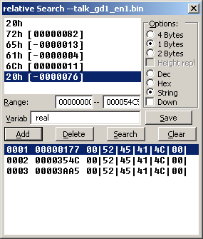
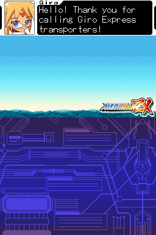

# 3 Text

Games can and have stored their text as simple graphics but developers learned quickly that for longer games this is not very helpful at various levels so games have long featured text decoding and display engines. Said engines are very often highly custom things with various abilities and restrictions that people hacking them have to figure out and are second only to the game level files and assembly in terms of how custom things can get. Games still have text in the images they might display, very often for low text games like puzzle games but not always and anything highly stylised is probably graphics, and conversely some early hackers altered the encoding of characters to have them appear as others in certain places (often messing up the text in the rest of the game).

Never the less text engines are very much a part of games now and as such aspiring ROM hackers have to know how to deal with them. Know that games can and do often enough use multiple versions of the following concepts within the same game and even on the same screen at once.

## 3.1 Tables

More recently there have been efforts to turn tables into a higher level concept ( [Table file format proposal](http://transcorp.parodius.com/scratchpad/Table%20File%20Format.txt) ) which is good as it allows for easier hacks in the end but classically speaking tables are just simple text files containing a long list of hexadecimal numbers of various lengths and what they represent in readable text. One of the other reasons for the proposed standard above is there are several types of table file format with varying abilities.

There is nothing to stop one character from being encoded multiple times (indeed it is often done as a cheap way of doing bold, small, italic or otherwise stylised text), encoding multiple characters in a single entry (a process known as dual or multiple tile encoding) and or even mixing 8 bit and 16 bit encodings/character sets together (this troubles a lot of simpler text readers/decoders as they expect everything to be of one length and maybe even alignment).

Normally they would all be on separate lines but for the sake of readability here is a sample of encoding used by Golden Sun Dark Dawn’s “kiaro1212” font

Most conventional hex editors will not really support tables/custom encodings in a manner useful to ROM hacking (that is to say easy to load a single file with a full custom encoding, several will support changing the odd character though) so we have ROM hacking specific hex editors with the main ones being Transhlextion and WindHex32 although they lack some of the features of a more general hex editor like Hex Workshop. Crystaltile2 and some of the related tools do have a measure of table support as well.

### Table creation and figuring out custom encodings

There are several methods used to figure out the text encoding for a game. The first step for anything like it though is to check to see if it uses or uses enough of a known encoding to start getting things done.

As far as ROM hackers are concerned this branches into three types

1.  Known conventional encodings - things like [ASCII](http://www.asciitable.com/), [shiftJIS](http://www.rikai.com/library/kanjitables/kanji_codes.sjis.shtml), [euc-JP](http://www.rikai.com/library/kanjitables/kanji_codes.euc.shtml), [UTF 16 unicode](http://unicode.org/charts/) and [UTF-8](http://www.utf8-chartable.de/)
2.  Known game and game company encodings - Capcom have a table used in several of their games and games with Japanese tables often using fragments of existing encodings (be it from other games or conventional encodings).
3.  In the case of the DS the NFTR font carries the encoding information for the font inside it and other formats doing similar things have been seen as well. In many cases you can pull a table from it but other times you will have to manually create one using the encodings (or use OCR)

Although it is rarely seen any more games can do a type of compression where if the first hex character/byte is repeated in a 16 bit value the game can take one 16 bit value and assume all the following ones are also to be decoded with the first hex character/byte until told otherwise (for instance in shiftJIS the entire Roman alphabet, Hiragana and katakana will have the first byte as 82 or 83 even though it allows for a 16 bit encoding). A second interesting concept that is also rarely seen these days is games can swap out encodings at will by signalling as such but do not get hung up on this as it is very rare indeed (it is far more likely to be something else).

A note on Unicode. [Joel on Software’s unicode post](http://www.joelonsoftware.com/articles/Unicode.html) details a lot that is good to know about the encoding standard known as Unicode. Now unlike the fairly simplistic encoding that most games use Unicode is actually quite far reaching and not necessarily hard to implement but not a simple translation of a set length of hex to a known character most of ROM hacking is concerned with (any fancy extras usually being a set option that the coding team gets the call to deal with). There is however a simplified version of Unicode that forms the basis of a few encodings in ROM hacking known as UTF16 Unicode (sometimes u16 Unicode) that is always 16 bits (no flags or other such things) that is definitely worth knowing about as games tend to use it; in short it eschews the abilities like right to left text and variable length characters in favour of set 16 bit lengths and as far as most games are concerned no extras. Still if you want a nice tool to help with it have a look at [The unisearcher](http://www.isthisthingon.org/unicode/index.phtml).

Assuming it is not a known encoding or a known encoding only accounts for part of it after this you have to actually figure out what is going on.

There are several ways of doing this ranging from simple and not unreliable but not universal (especially as far as Japanese goes) to complex but will figure anything out. Combining methods here is not only a good idea it is suggested and encouraged. There is quite a bit of overlap between finding the text in the ROM itself and finding out how it is encoded with various methods if not doing both at once then seriously aiding the other.

### 3.1.1 Relative searching

Going back to the Golden Sun table and looking at the Roman character side of things

41=A

42=B

43=C

44=D

45=E

46=F

47=G

48=H

49=I

4A=J

The word BAD would be encoded as 424144

If you then searched the ROM of better yet a file you suspect of being text (assuming you had no compression or had dealt with it) for any strings with one value and the next one lower and the new two higher than the original you will quite often get the text you want. Most relative searching tools are 8 bit but you can get 16, 24 and even 32 bit relative searching tools.

There are several tricks and things you can do to make you more likely to get what you need.

* If you suspect a variable (value of something in a shop, character name if you are allowed to customise it, amount of HP and so forth) or you see some effect being applied to the text (even if it is just bold or italic text as games will not render fonts as standard computers do but have multiple characters) try somewhere else as it will likely be something else entirely in the text (see markup and placeholders a few sections later for more).
* If you see something that might be dual tile encoded (character names often are even if you can not change them) or is a symbol (™ for example and games will quite often encode their yes/no selection as a single tile) try something else.
* Longer (to a point) is better, three characters as in the example above is pushing it and finding two characters is at best going to leave you with a lot of stuff to wade through to find the good stuff.
* If the text looks to be split across two sections avoid it or shorten the search.
* On a more positive front you can live dangerously and search for a common phrase (the word “the” with a space either side of it is very likely to appear in English text) or a game specific one (moogle in Final Fantasy for example).
* Japanese does not feature ordering in Kanji and kana only have a weak ordering (to say nothing of odd things games do for Handakuten and Dakuten) but you can get some things done if you suspect an ordering (font order and encoding order are quite often the same).

Many ROM hacking text grade hex editors tools feature relative search but for the purposes of this guide there are two main tools you will want to look at

Monkey Moore [Monkey Moore github page](https://github.com/rjricken/monkey-moore)

[Monkey Moore filetrip downloads](http://filetrip.net/pc-downloads/applications/download-monkey-moore-05-f29133.html)

A standalone relative search tool and one geared towards this sort of thing (where others are often very much simple implementations of the theory/search technique this has a few more options and works better with language).

Crystaltile2 [Filetrip download](http://filetrip.net/f23649-CrystalTile2-2010-09-06.html)

In some ways not as polished as Monkey Moore (you can have a fairly well realised table from Monkey Moore inside 30 seconds where you would struggle to do that with this) but it does feature a nice 16 and 32 bit relative search you can use.

Examples of relative search The game of choice here is Megaman ZX, although the table has actually been seen in several Capcom games. By chance the lower case letters in the table line up with the ASCII upper case equivalents which means relative search is probably not that useful, give or take a minor shortcut in table making. However it is a bit less abstract than some other tables so it makes a good example for this.

In monkey moore

A search using a wildcard in an older version

Later versions included kana support using the Gojuon order (although you will probably want to do wildcards between characters to allow for 16 bit entries). It is not always viable thanks to the Handakuten and Dakuten (extra marks added to Kana to indicate pronunciation) but it is one of the few occasions relative searches might work in a reasonable/non esoteric manner with Japanese.

Crystaltile2 relative search

Available in the hex editor window from the tools pulldown menu.

Usage is fairly self explanatory and you can double click results to set location in the hex window. It will save those results to a text file similar to the results page which allows you to direct a more conventional table creator.

You can enter Japanese characters as well although unicode as opposed to shiftJIS is the standard method

It also has a slightly more functional value search than even the later versions of monkey moore. Usage is set the options how you need them in terms of length and entry type and add characters one at a time before pressing search.

Note also the second to last visible result and consider it a reason for wanting longer search terms.

The Monkey Moore search was used to create a table and it was then imported into crystaltile2

It is not yet complete owing to the missing punctuation but that is where the other methods come in. Here it is fairly obvious that 07 hex represents the apostrophe character and 00 represents space leading to

Having a look at the font for the game there is a lot more to it than that so other methods will have to be employed

Regarding the buttons seen in the font the Japanese font is a 16 x 16 array so the game probably accounts for this somewhere (complex font formats with individual characters being assigned a size[5](romhacking20206.html#fn5x0) are quite possible on the DS) but there have been instances of half a character being encoded in two “separate” characters to be assembled at runtime. Note this is not the same as dual/multiple tile encoding (covered later) where multiple characters or indeed a run of them is encoded in the same space as a regular character.

### 3.1.2 Corruption and alteration

Corruption is a general purpose technique where you corrupt sections of the ROM before running it and seeing what breaks. If you find a text file by this or some other method you can then change things and either by seeing the surrounding text you can see what the text either side of it is encoded as.

On the less crude side of things comes alteration where you can do things like put a run of a single character in the file and then when you encounter a long run of them you know what that character is (which might well leave you in the position to have the rest of the encoding) or you can put a section counting up so if you encounter text that now reads say fghijklm you might well know a few things (this can be further refined by putting things in a non repeating pattern of some form to allow you to easily align things, something like ABBCCCDDDDEEEEE...... for instance).

This process can be troubled as text engines can be quite picky about their content and if you mess up section markers and other would be formatting things can start going very wrong but if you do not corrupt enough of the game finding what went wrong is harder.

Once you have some characters though you can start changing things and noting what you change before matching it up and gaining the complete encoding. Indeed this is often one of the better ways to figure out what different symbols and punctuation type things are encoded as. In encryption attacks like this often fall under the remit of known plaintext and chosen plaintext but more on those later.

Megaman ZX again

This game was loaded and the text that loads within a few seconds of the game loading was sourced. It also makes a good case study why variable width fonts and line handling are good but fonts in a couple of sections time.

The text in a hex editor

Say the interest is finding out what goes past z (5A=z from the table earlier)

Original and modified

z was started with to give a reference point which means {|} are 5B, 5C and 5D

The 01 was left as it could have been something the game relies on, apparently it was a exclamation mark so add that to the list.

Then a space was left and it starts again with tilde, middle dot or maybe a bullet symbol, Euro symbol and it carries on.

Either way this is more information than might ever have been gathered with basic static analysis; not many occasions in text use a two dot leader and what could well be a triple prime/triple quotes (whether the game would use the triple in place of double quotes and a single quote for a quote within a quote as a workaround for the fixed width font is left for others to debate).

### 3.1.3 Memory viewing and corruption

By the time you see the text on the screen it has probably been in the memory for several seconds and will tend not to be refreshed from memory once it is there (VRAM yes, actual memory not so much) so editing it there is usually of little use, with the possible minor exception of a game that allows you to scroll back through the last few lines of text. The big exception to this though is name entry screens which are often updated in real time. Equally the saves files they make can also yield information as they will tend to be encoded in the same manner which allows similar things to the corruption and alteration techniques above.

If you manage to catch the data in memory before it gets turned into graphics you might be able to do something though. Equally memory viewing/editing can be quite useful if you are otherwise having to deal with a custom compression type you have not yet managed to figure out (or written a compression tool to recompress), here you would snatch the uncompressed/unencrypted text from the RAM (remember when working in a group that once the translation/text editor side of things has the text they can get going and the ROM hacking specifics can be ironed out later).

Example from Mr Driller 2 on the GBA. Cheat finding methods were used to narrow down what memory locations changed as a character was entered and by increasing the character by one value each time it was noticed a particular value increased by 1 each time.

Pointing the memory window at it. There were a lot of changes noted here but 02001CDC displayed interesting changes and perhaps more interestingly the blank character at the bottom right was quite far in value from the smiley face before it. In this case relative search actually worked on the ROM and it turned out it was quite different (upper and lower case available and decoded as a different set of values- 0A=A and 24=a) but the potential of the method is quite clear to see.

### 3.1.4 Frequency analysis

The most common character in a section of text is usually the space character and in most languages words rarely make it past the 12 letter mark so if the most common character is on average less than 12 characters apart and rarely has two together you probably have the space character; from here you can use other methods or try filling in the blanks if you have some text from the screen in front of you. Space might not be that useful to search for so consider instead that e is the most common character in English.

Do remember to restrict any frequency analysis to just the text section or you might end up with 00 if it is used to pad out parts of the header. Also remember that it does not have to be exact as there are things the game might miss or include that are not strictly part of the script but are contained within the script section never the less.

Example using the MegamanZX file from earlier (limited to a portion of the text)

00 which is known to be space is the most common

69 which translates a lower case e (remember the upper case ASCII lined up with the lower case in this custom encoding).

The next few characters are largely composed of the lowest scoring letters in scrabble (1 point characters being E, A, I, O, N, R, T, L, S, U).

The FC value will probably want to be investigated further.

Doing a search for 00 gives a good indication that it is indeed the space character.

### 3.1.5 Language analysis

Not everything has to be programming related and knowledge of how words are constructed in a language and how punctuation is used can be just as powerful as any technique originating from a programming point of view. For instance in English the letter u almost always follows a q character and every word has a vowel in it bar some words which tend to have a y instead (try, fly, rhythm, by, sky....). As mentioned before many sentences and almost certainly larger sections of text will feature the word “the”. Capitals start the first letter of every sentence, sentences are are ended with a full stop or some small selection of punctuation (typically ! or ?), and repeated characters will tend to be one of a few selections as opposed to any character with any frequency. That is just a few things that work for English and most languages have traits that can be seen like this, indeed a truly random language as far as word creation and grammar goes would probably not take off.

Equally in the Megaman ZX example mentioned in the relative search had pieces of punctuation that were obvious as well as capitals often being obvious from basic knowledge of the language as well and if you are editing a game in French and you see things like Fran?ais you can be fairly certain the word is Fran�ais.

### 3.1.6 Pointer and encoding/hex analysis

You have some language tricks, you have some encoding tricks, you have some computing tricks but you can also combine them and do things with the raw hex by itself and the pointers it uses.

Pointer analysis is twofold depending upon what you are doing. On the GBA if you do a search for 08 (the start of the most commonly used address type) your results might well be large in number and for the most part 8 bytes or slightly further apart but preferably still a set distance (you do not have to put pointers end to end and 08080808 is a valid address and aligned for that matter as well) you have probably found a bunch of pointers. Now it might be for sound or graphics but a lot of them are usually worth following to see what goes. Equally (and this would be the second part of the twofold thing) if you have a list of what are probably pointers and you suspect the operate at the sentence or paragraph level they are probably not going to be several hundred bytes apart.

Furigana, markup, links and such. As mentioned elsewhere things like commas, spaces, full stops and more can give away lots of information but that is not the whole story as Japanese has a concept named Furigana (in practice game makers and others often use it to hold little hints, notes and other such things), most languages will allow for text to be changed to emphasize something (making it bold, italic and such), you might have a mini encyclopedia that links to other entries in the text and more. Unlike relative searching if you suspect one of these follow up on it and it might give away a lot of the encoding and even part of the text engine itself.

Compression searching Alongside conventional hex analysis various compression searching tools exist (some worked examples of compression can be seen later but standard compression methods have quite distinct fingerprints which can be searched for) and conventional compression tends not to be used on sound and video so by searching for compressed items and combining it with other methods you can often quite quickly locate and decode text.

### 3.1.7 Assembly tracing

Much like tracing a file involves finding it in memory and working backwards this involves finding the text in memory and watching how it decodes it into characters or finding the characters and working backwards from there. Second to this if you have a proper scripting engine you can observe how it works from on an assembly level.

### 3.1.8 Font viewing

A game will often have the encoding in the same order as the font (it certainly appears that way in the Megaman ZX example). Done properly this can even allow a relative search to happen when there is no relative encoding in the game (the relative search tools do support number driven searches or you can go abstract) or you can use it to form the basis of an alteration attempt to decode the encoding. Do note that although they might be following each other in the font the actual hex values that represent them might have large gaps between them for various reasons as even in ASCII the upper and lower case is 20 hex apart despite not needing to be (it allows for simple conversion which is another sort of thing to look out for).

### 3.1.9 Language comparing

If you have a game or versions of it with six or so languages embedded within you can compare things between them and figure things out that way. Do note though that games frequently use different fonts between languages and in the case of Japanese to Roman languages may even have changed from a 16 bit encoding to an 8 bit one. Although there are some language level things that can be done the main idea here is to figure out file formats and rough ideas of encoding ranges rather than anything specific but knowing pointers and basic things about the encodings can reveal quite a bit as demonstrated elsewhere in this section.

### 3.1.10 Table creation tools

So after employing techniques that would make early codebreakers proud you have found out how the game has encoded the text, however you do not have the patience to sit there and handmake the table, especially not for Japanese if you have to enter several hundred Kanji you might not recognise/know how to type. This is OK for although tables are largely just text files it can be useful to add large tracts of data at once. Various tools are available for use here but the de facto standard for those that need it is TaBuLar, although others do like table manager and tblmaker. Crystaltile2 has some abilities here although the tables it makes sometimes deviate from the “standard” table format if you are not careful, it happily uses its own format and usually the differences are in encoding or how many spaces the file ends with.

Here was the table as seen at the end of the relative searching exercise. Much like a spreadsheet it is read row column with the numbers being the hexadecimal they represent.

If you hold over the part you want to edit you get a tooltip with the hex decoding and the decimal one.

So far only slightly nicer a text editor for making these but the real abilities come in the options

Block ops allow copy and pasting of blocks which is nice when your table has repeated versions of the same value (sometimes it is used for different fonts and somethings it seems to be just to be awkward but it happens none the less). Block lock and unlock (it causes the greyed out things) prevents editing but more importantly allows insertion of larger sections without having to overwrite things.

The 16 bit entries option from the edit pulldown menu

Import from file and add series are quite useful.

Oriton [Homepage](http://www.magicteam.net/index.php?page=programs&show=Oriton)

[Filetrip download](http://filetrip.net/pc-downloads/applications/latest-oriton-f29376.html)

In the spirit of providing alternative programs where possible we have Oriton. Oriton has had a lot of development done on it more recently than most alternatives. It lacks the ability to add long lengths of known orders beyond those of a basic codepage (right click on the start cell to add it) but the regular expression style addition options and 16 bit support (and greater if necessary) more than make up for it. It also plays reasonably well with the text insertion program Kruptar 7 which will be covered later.

## 3.2 Pointers

Granted these are not only a text engine feature (if you have been reading through you have probably seen several thus far) and are pretty essential for packing/file formats but text editing is where people first tend to encounter pointers in earnest so they are here.

Three principle types

1.  Standard. Start counting from the start of the file. Sometimes known as linear pointers although the term does technically encompass the second type.
2.  Offset. Start counting from some point in the file (quite often the start of the proper data/end of the header).
3.  Relative. Start counting from where the actual pointer is at (if the pointer reads 30h and is located at 20h the data in question is likely at 50h).

Games can use mixtures of these and even in the same file and you can get a hybrid of relative and offset although more likely you have a wrapper around your text if this happens or you are reverse engineering a compression format in the LZ family. Pointers can also apply to various sections and have things like offset pointers with one offset value dealing with section but the next section might use a different offset.

Also worth noting is on larger formats which are not usually seen on the DS you can use sector or block based addressing where instead of pointing at the byte address you call a given number of bytes a sector or a block (strictly speaking a sector is a point on a disc and a block is the proper term but most people will understand when you speak of sector based addressing) and point to that instead. This is usually done to make up a limitation in the number of bits available for your address. For an example 32 bits allows for 4 gigabytes or so but if you instead say assign 8 bytes per 32 bit address all of a sudden you can deal with 32 gigabytes at the cost of either having a complex addressing system (sector 37, bytes 2 through 6[6](romhacking20207.html#fn6x0) ) or having to lose out on so many bytes if you do not use them all in a sector (if you have a modern version of Windows the properties option on right click will often have “size” and “size on disc” and this is the reason behind it). Addresses in this case will typically appear as a multiple of the pointer value but occasionally formats have been seen to use pointers that are proper calculations based on data held in the pointer table.

A related concept that might be better for the section below is sometimes lengths can be used instead of addresses so you get to calculate the location by adding up the lengths (and maybe accounting for a bit of alignment/boundaries) from the files before it.

Speaking of alignment and boundaries it will usually be fairly obvious but not always and this means simply adding up the file lengths will be that good to do when recalculating the locations of the new files (remember unless you can demonstrate otherwise then match the format of the original ROM) or indeed just using the length values to calculate things if you are building a tool.

Pointers themselves can be found everywhere in a file but usually the start of the file, a file with a similar name (it is easier to open/store a small file in memory and refer to that rather than opening a large archive) or the end of the file are the locations where pointers can be found. Less commonly pointers can be seen in between each section or indeed at the start of each section (the scripting example in the scripting section dealing with The Wizard of Oz - Beyond the Yellow Brick Road providing a good example of this).

### 3.2.1 Special cases and non pointer concepts

Pointers are very useful in the long run but there are alternatives. The obvious method used on more powerful systems and some games is to simply have a flag/value that signifies the end of a section and calculated at run time. Doubly nice is most of the games that use such techniques will usually use plain text or files very close to it as their text (Zombie daisuki seen later has a nice example).

You can also do away with pointers entirely and just use a fixed length of text and you quite often see this in menus, fixed length entries for in game dictionaries, bestiaries, item lists and such as well as on older systems. It is one of the reasons older RPGs originating from Japan like Final Fantasy and Phantasy Star have odd/short names for their spells compared to later entries in their franchises or their Japanese counterparts. You can try hacking the game to support a longer value but this can be tricky (if nothing else you might have a box bounding the text and will then have to edit that) and you might also face memory issues so another workaround is related to the early font editing and dual tile encoding where you might combine a few characters (or fragments of them) onto a single tile.

Most pointers are kept apart from the rest of the data they concern (either by being at the start or end of a section of a different file entirely) but sometimes games will have each section with a length and there was a truly special case in Riz-Zoawd/The Wizard of Oz - Beyond the Yellow Brick Road where the text at points was a sort of scripting language and each section had a type, a length of the whole section and the actual data/payload, if any, it contained. Also depending upon how you want to look at it many DS formats can be seen as a nest of pointers (in the case of the SDAT sound format the whole file has a length, the subsection has a length, the sound file might have a length and then the actual sound generation section will have a length).

Pointers being part of the header might also house extra data, the DS format NARC for instance uses the highest bit in a pointer to indicate a subdirectory.

Pointer compression “fire megafire ultramegafire”

A poor example of a spell name progression perhaps but the last version contains the previous two spell names. Even on older systems it was uncommon but games have been seen to just encode ultramegafire and point to the appropriate fragments when necessary.

File format pointers and flags File formats can see several sorts of pointers in their main table (which is usually found at the start of the file and is usually thought of as part of the header) although the three most common are file location and file length (sometimes all three, two of them or sometimes just the one) with further ones including number of files contained within, header length, flags for compression, both compressed and uncompressed sizes, intended locations in memory, files linked to the file in question (SDAT SBNK and SSEQ).

A nice example can be found in El Tigre- make my mule. A basic example of the system as shown back in the introduction section but it will be returned to shortly with an eye towards reverse engineering it properly.

### 3.2.2 Example reverse engineering of pointers

Returning to the “talk\_gd1\_en1.bin” from megaman ZX. The start of the file is something that is not text by the looks of things

Pasting that into a new file, it fairly obviously needs to be flipped though

Still not immediately obvious as the text does not start until the late 0110 hex range. Equally the first two values are odd until you consider the length of the file is 54C6 and if you ignore the first two values (offset pointers) the rest of the pointers appear to finish there with some odd values where (steadily increasing and then something else entirely)

Location (hex) readout (hex) and decode in ASCII from the export

0100 4E16 N.

0102 4E6A Nj

0104 4EDB N.

0106 4F9D O.

0108 5096 P.

010A 5118 Q.

010C 5258 RX

010E 529F R.

0110 52BE R.

0112 532B S+

0114 01F2 ..

0116 02F2 ..

0118 26F3 &.

011A 1AF8 ..

So 0110 hex long pointer section followed by something else and then the text.

There is still the problem of the first pointers being 0000 and 0093 though

Looking at the text again it looks like FE appears at the end of most sections (FEF2 in most of those but the last one which is FEFF) and there are repeated sections after those but that is left for markup covered next.

Still it is not meaning much so spreadsheet time. It is best to label your columns for although you can probably work it out some 3 seconds reading names versus half an hour just to get back on form if you come back to them at the end of a three month translation period is far nicer.

The column A is the address in the pointer section and B is the value from it

The column C is the location of the FE values and their decimal equivalents

Next (column D) comes the interesting parts where the decimal values have how much they differ from the previous value (E)

Next (F) is the decimal of the pointer value column and the difference each has from the previous

Notice a pattern between that the the one three up? The last column was just a test to make sure the pattern held (it did in this case but there have been games that offset pointers each section).

The best part is now you know the trick to ending a line in the game if you do not want to code something to do it you can use the very same spreadsheet with a few minor tweaks to recalculate your pointers as you just need to find the new locations of FE and drop those in instead (redoing pointers by hand is a very tedious and very error prone process so definitely automate it if you can).

Still just to check here, by cutting the file off at the end of the “proper” pointers but still leaving the odd stuff

It seems the pointers are 1 after the FE but that is fine and to be expected really. The main things left to determine now are what the stuff after FE means, a good guess would be character names.

## 3.3 Markup, control codes and placeholders

Even if you are not much of a web developer or coder you will probably have a rough understanding of variables and markup (you have probably posted on a forum before if nothing else). Text engines are rarely at the level of a modest scripting language and almost never Turing complete but they can and do have markup options and placeholders. It was noted in the past but if by looking at the text in the game you suspect some form of markup or placeholder it is best not to use it for the basis of a relative search.

Back on topic the markup and placeholders can take many forms ranging from simple square bracketed plain text, hexadecimal flags in the text (we see numbered sections do this often enough and plain hex used to signify a new line or end of section all the time), XML style markup right through to things contained in with the pointers (think back to the various file packing formats that might have a flag to indicate compression for an example of a similar idea).

Control codes are a similar concept even though they are usually treated as part of the encoding and do things like signify a new line, a tab or some such. At what point in the reverse engineering of a text engine you want to try figuring them out is up to you though.

### 3.3.1 Worked example

Continuing with the Megaman ZX game on the DS. The file has been changed to talk\_m01\_en1.bin purely as it appears at the start of the game. It does however appear that the FE example might not hold entirely true (there are ones that line up with FE but there now others with FD in some cases being a potential) but that sort of thing is what makes hacking non trivial.

Looking at the text there is a FC value in the text on occasion. Running the game it would seem these correspond to line breaks; sometimes pointers do this, sometimes it is automatic and sometimes it is in the text.

More interesting than that though is the F202 F9E9 03F3 0DF8 03 that the text starts with.

At the next section

FD F202 F9EA 03F3 0DF8 03

FD is one thing and can be ignored for the time being (that it does not appear in the first value would appear to mean that it is not strictly part of it) leaving

F202 F9EA 03F3 0DF8 03

The original

F202 F9E9 03F3 0DF8 03

E9 = 11101001

EA = 11101010

Probably not a bit level flag which is nice. Equally is is probably not a length value as the first section is 38 hex long and the second is 20 hex[7](romhacking20208.html#fn7x0) .

What is the same about those first two sections is they are being spoken by the same person (Giro). It is however unlikely that there need to be 72 bits just to represent a character name so there is probably more to it than that.

F202 F9EB 03F3 02F8 00 is the next one and that is spoken by someone different (???? and no picture/“sound only” at this point)

This goes back and forth for a while with the next character (Vent) having a picture appear on the right hand side of the screen

F203 F9F4 03F3 05F8 01

Next screen has the Giro character at the bottom of the screen. Worryingly there appears to be two extra bytes.

F201 F202 F9F5 03F3 0DF8 03

Vent at the bottom of the screen

F201 F203 F9F7 03F3 07F8 01

Before dealing with that getting the first bunch in a line

F202 F9E9 03F3 0DF8 03

F202 F9EA 03F3 0DF8 03

F202 F9EB 03F3 02F8 00

F202 F9EC 03F3 0DF8 03

F202 F9ED 03F3 02F8 00

The third byte appears to be counting upwards which is quite common in text systems (it is effectively numbered paragraphs). You will probably want to keep it intact as the game might trigger animations from a counter using it (if nothing else it is good form to change as little as is necessary) although you could test if you wanted.

Speaking of testing static analysis might get somewhere and is proving quite useful thus far but why analyse something statically when you have a machine capable of running the example and giving you results.

There are three schools of thought at this juncture

1.  Copy and paste another string
2.  Minor edit to the value
3.  Assembly

Assembly is always an option regardless of what you are doing seen as it is the lowest level that gets manipulated and it can be combined with the other two methods. It could be a simple value that loads directly (or via a simple instruction like a multiplication) to the OAM, it could be the input value to a nightmare function or indeed something in between. However although a highly respectable method most of ROM hacking and computing general is about getting away from assembly if you can so the other two are employed.

There are presumably some working values so one school of thought would be to replace a working one with another working one and seeing what happens. The other is a minor, hopefully educated, guess and then seeing what happens. Either could lead to a crash but it takes but a few seconds to check.

For the first go around the entire ???? pre text section was used to replace the one from the opening text sectionThere were actually two copies of the file in the ROM so both were replaced for the sake of this example leading to the following (hacked game and original game)

Only the first section was done and it reverted to the original character right afterwards but perhaps more interestingly the little sliding animation that it does between characters was done between the hacked ???? and the Giro character.

Next up was editing a single value, the original replacement was left for this and it continued to display the picture.

The value chosen was the very last one (the final 8 bits before the actual text, values in hex)

04 appeared to put Prairie

09 appeared to put Model L

10 appeared to put Hivalt

FF caused screen corruption that stuck around for quite a while (the broken background eventually got replaced after a swap out for a scene but the text pictures stayed broken and there was additional text corruption for several screens after).

Were it not in the markup this would probably count as multiple tile encoding and it certainly appears the same way when it happens in regular text (a single byte/character or a couple being used and the game generating a whole name).

This does however leave 64 other bits (save for the counting section) doing something.

F202 F9E9 03F3 0DF8 03 = origin

F202 F9EA 03F3 0DF8 03 = second

F202 F9EB 03F3 02F8 00 = ???? and picture to match

Replacing the 0DF8 with 0AF8 gave

Replacing the F8 with F9 cut off the first letter. Replacing with FA jumped the text ahead for a line before coming back and stuck things on odd lines and changed the name to “????” where F7 appeared to do nothing at all other than change the name. Relegated to magic number/constant/find out later.

Vent has a box with the name on the right hand side although still at the top

F203 F9F4 03F3 05F8 01

“F203” as opposed to F202

Sticking 03 in there did indeed put the portrait on the right at the top and it also mirrored it.

Not long into the conversation there is a short with the portrait on the left but at the bottom of the top screen. Pulling the command from it

F201 F202 F9F5 03F3 0DF8 03 = bottom left

xxxx F202 F9E9 03F3 0DF8 03 = first command of the game.

xxxx was added to line things up but could it be a variable length command system?

Before debating that though 01 was tried and it stuck it on the bottom with the portrait at the left. 04 and FF appeared to do nothing though.

Some more experimentation could be done but the rest is just filling in the blanks and most of the interesting stuff appears to have happened already.

## 3.4 Fonts

If you have not read the graphics section then it might be best to cover some of the basics there or be able to reference back to it.

When it comes to computers the handling of fonts is a whole game unto itself and it requires fairly extensive knowledge to implement a font handling system. Despite some exceptions with newer/more powerful consoles the older consoles are all bitmap fonts and have no vector graphics to allow for any size characters. If a game does have multiple font sizes then it is probably another font in the game, further encodings in the game or some combo of the two. Fonts, more than any other type of graphics format, like to stray from the power of 2 tile size even if they are otherwise largely fixed width, sport no fancy extras like tails or plain. It cuts the other way too and any characters with diphthongs, diacritic marks and other such devices will tend to be extra characters within a font as opposed to generated extras. For the most part they are largely single colours or only feature minor shading and any animations/real time effects you see usually being done at a graphics level with markup to trigger it. That is not to say fonts are all simple formats as the DS features a quite complex font format known as NFTR that many games use. NFTR is variable width by nature but in general if it looks like word art or sometime you would have to bust out an image editor for (title and introduction screens especially) you are probably looking at a picture. Although NFTR is popular perhaps just as many use simple 2d graphics or something truly custom.

Additionally much like music there is a whole raft of [field specific terms and concepts](http://www.fontshop.com/glossary/) that come into play and as such font design/construction has long been a highly specialised field/skill. Equally the concepts have largely fallen out of favour in recent years but 16 bit “flags” similar to scripting have been seen in games. Such things were used to allow a given number of 8 bit commands to follow (if you look at the shiftJIS encoding every Hiragana entry will start with 82 and every katakana will start with 83, this means 8 bits is quite viable if you script it in), the game to enter 8 bit decoding mode, and some games will have a command to switch out the table/font switching to use Dakuten and Handakuten or punctuation or custom characters (this is not to be confused with games just having multiple fonts and tables to match as that is annoying but nothing uncommon).

Dual/multi tile encoding Perhaps more commonly known by the initialisms DTE or MTE the idea is selections of multiple tiles/characters are encoded in the length of space one character would normally occupy (no technical reason beyond space saving for using the length of a “single” character space but it usually is the case). Very strictly speaking DTE, which is a special case of MTE, refers to when a single value has a result encoded across dual (two) or multiple (the M in MTE wouldn’t you know) tiles, however nowadays many use it as a catch all term for dealing with values that see something other than a single character encoded on a single tile (two characters on tile, a character split horizontally across multiple tiles, an entire phrase split across tiles, an encoding that generates a phrase from a single value but uses the tiles normally....). Naturally this can really frustrate a relative searching session.

If your characters/glyphs are split vertically across tiles you probably just have to set the height value with the three main exceptions to this rule being

1.  GBA3 XBpp, which as discussed in graphics is a 4 bpp “compression” format that interleaves the tiles between the values
2.  Graphics level font compression where the half of a character (think d and b bottom half, j and i top half, R and B top half and so on) is used to generate things
3.  If the tiles themselves are scattered across the file/section (this is usually just a matter of lining up one row with the next though). The GBA saw quite a few instances of this.

### 3.4.1 NFTR

The NFTR font format was previously mentioned and it is a fairly complete font format featuring variable width abilities, and in some cases with later versions you also have line handling abilities. It carries the encoding for the font with it so if you find a NFTR font you have the encoding/mapping right there, do note it still could be custom or feature custom characters so you might have to match things up by hand or go with OCR. There was a revision later on in the DS lifetme to the format so some older tools might fall short here but otherwise there are a variety of tools that can do things with the format (although many will not be in English as the format was first reverse engineered in Chinese language hacking circles).

Three tools will be focused on here.

Crystaltile2 [Filetrip download](http://filetrip.net/f23649-CrystalTile2-2010-09-06.html)

Crystaltile2 features NFTR parsing and decoding support including the ability to run a basic OCR (optical character recognition) on the font to help with deciphering the encoding.

It has a limited ability to generate new NFTR fonts from custom encodings (or a selection of standard ones) using fonts from your computer too. For the most part it should not matter but the files it generates are not strictly compliant and it struggles to make smaller sized fonts although that is usually more a factor of the fonts on your computer with the general rule of thumb being the “size” of the font add two is the minimum pixel dimensions.

Equally useful is once you can view the font you can type directly and your chosen font will replace the characters typed (this goes for any point in the tile viewer/editor)

Editing the font just by typing. Right click also allows a complete insertion of a font using a table file.

The main NFTR dialog which is available from the tools pulldown menu in every section of Crystaltile2.

It pulls double duty as the information window (after clicking the triangle to expand options click the Nftr button to open a font) although most of it is fairly self explanatory.

The other interesting tool is OCR which is available in the tools menu when in the graphics editing window. Note it need not only be restricted to NFTR fonts and will operate on any text you can give it.

It is not a good OCR tool by any stretch of the imagination and any you have used for ripping subtitles from DVDs is probably a lot better, however it gets some things right and even does some Japanese which is quite rare. If you can get rid of any shadows that will probably help and if the font is complex then by all means try but do not expect much.

Usage is

* Set the font up so it is viewable in single tiles
* Open the tool (tools pulldown menu when in the graphics editing window).
* Select the approximate size (it only has shiftJIS options unfortunately) of your font and press “Recognise” to have it guess what it is.
* You can also try “Recognise Whole Page” which will attempt to decode every character in the viewable window.
* In the likely event it is wrong enter the correct character (be very careful as you may be looking at it guessing a Greek, Japanese or Cyrillic character) in the space next to the learn button and press the learn button.

Once you are happy with the results press save and it will transfer them to the left box accordingly, the selections allow for just the list of characters, to pair them up with their encodings for the currently selected codepage, to start numbering in order from the box provided (numbers in hexadecimal) or in the case of index two save it as 16 bit (little endian) starting at the number provided. Copy and paste this as your table file.

Tinke [Github page](https://github.com/pleonex/tinke)

Although the self contained tools focused on thus far has more or less been limited to Crystaltile2 with a few mentions of the others Tinke does feature a good amount of support for it and is one of the few tools that will try to add a character to NFTR which is often not such an easy task owing to the more complex nature of the format.

NFTRedit [Filetrip download](http://filetrip.net/nds-downloads/utilities/download-nftredit-19-f29196.html)

Although Crystaltile2 has some very nice abilities this is the go to tool for most needing to do something with the NFTR font format.

### Adding characters to NFTR

Simple editing is able to be done in most programs but adding things, assuming you do not want to just generate a new font, is a slightly more tricky prospect.

The NFTR format is actually quite complex even before the second known version appeared in that there are [three classes](http://gbatemp.net/topic/105060-nftr-editor/page__view__findpost__p__1455382) of encoding method.

Tinke is the suggested method for this.

The “add char” button is your first port of call. Doing this will add a character to the end of the bitmap readout but it will not be mapped to anything at first. Add your character now and press apply changes to see it added in.

The “Change Map char” button is next

This is where the real trick is for the NFTR font allows for a variety of methods of encoding ranging from fairly simple defining of a start point to code by code. It also allows for multiple sections of code (each section being known as CMAP depending upon the documents you read) which can be defined or restricted as desired. Image number aka Char number on the left and char codes in decimal here on the right.

Press accept (and then save new font)

Testing it in another editor

### 3.4.2 Common hacks

Pulling back from NFTR there are a group of fairly common things to do when hacking game fonts. How easy any one might be varies from game to game.

Variable width font hack (VFW) Along with the 16 bit to 8 bit font conversion mentioned later this is considered one of the hardest things to do as far as fonts go. Japanese fonts are all fixed width where Roman character set using languages are very much not when it comes to characters and especially punctuation. Alas “add 16 pixels to horizontal location” is considerably easier to program than “read value from table and position item accordingly, repeat for every character, maybe also handling line breaks” and as it would be unnecessary for Japanese games the programmers will tend not to add it to the game, although it is getting better as time goes on, development gets forced to have to have to consider the international versions and people start using standard libraries/text handling engines.

As the previous sentence intimated the object here is to find the text drawing routine and get it to determine a value for the width of the text (a premade table usually being the best choice of method) before using that value to set locations accordingly and handle any troubles with line wrapping; it might be set to break and jump when something equals some set value which is quite possible with a fixed character size (16 + 16 + 16 will always pass through 160), with variable though it is far from a certainty. Almost invariably needing to do all this means assembly level hacking, creation of new functions and subverting old ones, hence it being dubbed one of the harder hacks to do. The main exception to this would be NFTR and similar formats that might well have a fixed width character set coming out of Japan but the format itself (and presumably the libraries used to decode it) supports VFW which reduces the hack to image editing and adjusting values.

A nice worked example of the assembly side of things for the GBA exists thanks to KaioShin which can get on [Romhacking.net](http://www.romhacking.net/documents/337/).

Font handling hack This comes in two forms

1.  Line handling
2.  Skinny font/font size change

Line handling (for characters like pqfgjy that do not sit within the lines, unlike Japanese which always does) reads quite similar to the variable width font hack, though with the added fun of having to deal with the vertical spacing as well.

Skinny font/size change is perhaps the more common font related hack that is not simply colour change, character/glyph modding or character addition. Japanese characters tend to be contained within a square box where Roman characters can be contained, and indeed more often are contained, in a rectangle with the lengthier side being the vertical. To this end making it so the game places characters closer together can not only allow you to fit more on the screen but make it look better if done properly.

This is a bit simpler than a true variable width font for all you have to do is find the value that adds a given amount for each character and change the payload to something lower (or perhaps something wider if you are improving a already narrow font).

On top of this you might wish to use a sort of dual tile encoding and split wide characters like w and m over two characters if you head down this path and encode one half of each on a tile to itself. Speaking of tiles containing something other than just a single character

Pseudo variable width font hack In practice this adds a kind of dual tile encoding to a font and all sorts of things can be done with it. A basic example would be to add two lower case l (as in lemur) to a single tile. Returning to megaman ZX the font_bin.pal file was decoded (it is a NDS 1BPP 8 by 16 pixel straight decode) and changed accordingly to change the game from the original to the one next to it which should hopefully look a bit nicer.

Here the 5B character from earlier was replaced with two l characters and the occasions where double l happened had the two single l characters replaced with a single 5B hex value (for the sake of the example the spacing was also accounted for). In practice most games with a fixed width font will add serifs and such to the thin characters to try to flesh them out a bit which works for some smaller fonts but does not scale well.

For an example of the serifs idea the ll was left but the font was replaced with a font from the Courier family (remember Crystaltile2 allows you to add characters directly to images just by typing), look at the i (as in India) characters.

Making fonts nicer is certainly a common improvement hack and changing a font when translating a game is too, however one of the more useful things you can do with this pseudo variable width font concept is should you encounter a fixed width/fixed length menu (older Japanese RPGs are especially fond of this and the problem is magnified by Japanese having Kanji which can say a great deal in a few characters) and are faced with the choice of butchering the language/name, possibly doing a 16 to 8 bit conversion (although that might not help screen real estate issues) or hacking the game to support longer sections (both in code and in the screen real estate department). As menus are made up of set and commonly used text it is then quite often beneficial to encode multiple characters across tiles (no need to fit only whole characters on tiles unless the game spaces things) thus allowing you a few more characters if you do it right.

Encoding change Replacing a single character with another has largely already been covered so it will be left out of this discussion.

You might want to change how the game encodes characters at some point with the the classic hack being the 16 bit to 8 bit conversion. It does not tend to happen much today save for where there are memory restrictions but is definitely a skill worth having. You may also wish to change the game so where it might have decoded 33 hex as the character 3 it will now decode 23 hex as the character 3.

Back on topic the 16 to 8 bit conversion and the standard encoding tweak stem from the same concept and that is how are the encodings determined in the first place. Methods are many and varied so some examples

1.  A variation on table files where the encoding and the tile are matched up, this can be somewhat formal or just pointers in a binary table that do the same job. It will still usually be in order rather than a full blown database style lookup though.
2.  A start point is set in the tiles and the encoding counts from there. There may be multiple and the same set may be gone over several times, not to mention it may have some maths done on it (think offset pointers).
3.  A start point is set in an encoding (at this point a list of “random” numbers) and tiles are matched to those.

The NFTR format has three main variations similar to those built into it that developers can choose from.

## 3.5 Scripting and layout

The concept has been mentioned a few times at this point, however it still not seen that much in the handhelds and earlier consoles. As some notable examples exist though it is going to be covered here. The idea here is beyond the basic text display the rest of the game revolves around a complex engine/interpreter.

The main one of choice here is Riz-Zoawd/The Wizard of Oz - Beyond the Yellow Brick Road on the DS.

The game actually displays all three main forms of text methods and for good measure some XML as well (see op.dat).

1.  Fixed length sections
2.  Conventional pointer techniques
3.  Scripting

The first two have been covered but the scripting engine is worth seeing and can be seen in event.dat in the data directory

The initial things are the setup for the maps and scenes but are a nice example

Initial analysis of the scripting engine as it was reverse engineered mimicked the markup reverse engineering techniques, which is to say a combination of static analysis and testing things to see what happens. Also of possible interest is the opening few lines which appear to be setting up a debug scene, for as mentioned elsewhere the things developers leave in for debugging are often simple examples of the engine/concept in question and can demonstrate concepts that might otherwise have to be extrapolated from the complex ones in the game itself.

Zombie daisuki Of course the scripting seen is not always so complex as the example above and a nice example can be seen in the game Zombie Daisuki which has scripting as seen in the following picture. If you want to look then in the data directory of the game itself there are some files with the extension .ini which are shiftJIS compatible. Note the variable names including spelling mistakes which can see the hacker accidentally correcting them and causing lots of issues, as well as markup and lack of pointers.

Lua The programming language lua was seen a handful of times on the DS. It was however converted to a bytecode esque arrangement compared to the plaintext it is usually left as on the PC.

El Tigre- make my mule The game features a nice archive format worth exploring a bit as it showcases a lot of things seen in archive formats.

Deleting the first and setting the window width very wide, the first part which was the names (although do not assume that as names quite often follow the rest of the information covering the file in question) was chopped off for this shot but the long name has been highlighted to get an idea of what goes.

There appear to be a bunch of plain ASCII names (underscore allowed) in alphabetical order by extension although the extensions are no in alphabetical order. Looking later in the file seems to say that upper or lower case for the names does not matter (on some systems it does). Remember that the fewer changes made in a thing like this the better so that order probably wants to be maintained when reassembling the archive

The numbers counting up in the 8 bits following the name section (actually flipped 16 bits as you will see in a moment) might well file numbers (ordinals might also be an acceptable term) which are useful for the system as referring to things by name is quite troublesome where maths gives file numbers.

0100 will want to be returned to later.

Three sets of three numbers, if possible it would be nice to leave them as they are in the original but that makes simply looking at the more troublesome than it has to be so a 32 bit byte flip later

The 0100 became 0001 in what is now the upper 16 of the 32 bits.

Three numbers then. The first seems larger than the second and the second plus the third is the next in the sequence in the third number.

Size and location then. For the time being no padding between values is assumed but there is frequently padding to make sure it lines up with 32 bits or even more but seeing them start on odd values makes it fairly likely that no padding is here.

Scrolling down a bit further

The swav files were checked for (they have a fairly unique start of the file aka a magic stamp) and they were indeed the swav audio format and as audio is not usually compressed beyond making it in the first place it finishes off the rest.

The 0001 now in the upper 16 bits is indeed a compressed flag. (a few files were extracted and then attempted to have compression applied without any real success - a quick and easy check).

In the swav examples the first and second of the three numbers is the same (and the pattern for 3 holds).

The first of the three values is the uncompressed size, the second the compressed size and the third the location.

pkg archive data table

Defined as follows

32 bytes for the name presumably ending with the first 00 in the name and padded out from there (the last 4 bytes might be necessary though)

2 bytes for the file number (flipped and counting from 0)

2 bytes for a compressed flag (flipped, 1= compressed, 0 = uncompressed)

4 bytes for uncompressed size (flipped)

4 bytes for compressed size (flipped)

4 bytes for file location (flipped, standard pointers (not relative) and starting from start of main file (not offset))

4 bytes padding (00 filled)

The header format is not finished as there is still the part that was deleted at first to make everything line up nicely (flipped to make things easier)

pkg is clearly the magic stamp for this format.

301... the last file number is 300 hex and starting with 0000 for numbers means that is likely the file count.

008C 9446 is the length of the file (usually a common sight in headers) but is absent

008B F7E2 plus 9C64 (the location of the first file and end of the header) is 008C 9446 and having lengths ignore headers is quite common.

Header format

4 bytes 706B6700 hex (pkg\[00\])

4 bytes 00 filled.

4 bytes file count (flipped)

4 bytes 0000 0001 when flipped

4 bytes unknown (019F3323 when flipped)

4 bytes size of file - header (flipped)

4 bytes unknown (0009 4584 when flipped)

4 bytes unknown (0002 DDAA when flipped)

4 bytes unknown (0000 0003 when flipped)

12 bytes 00 filled (padding?).

The compression The header is a nice example of a custom file format and most of the time that is where it ends (give or take building something to remake the archive) but compression was detected. Sadly it is one of the few times a custom format for compression has been seen on the DS. The extensions appear as though they can be trusted so for the time being they were. This section might be more useful once compression (covered in game logic) us covered.

Other than the swav files there were a handful of uncompressed files but they were usually quite small. That it happened is nice as it points to file level compression rather than archive wide library compression (formats like 7zip do this to achieve very high compression rates for groups of similar files at the cost of decompression time, resources, potential for the archive to be corrupted beyond recovery of anything via simple means and not able to be extracted without a complete archive set in the case of split archives).

tmpCopy.txt was extracted. It sounds like a debug text file if ever there was one.

C86 is the length of the compressed file. According to the header it should be 2DAC hex long.

entities.xml was extracted. xml should have lots of nice brackets to look at.

16D8 is the length of the compressed file. According to the header it should be 00010344 hex long

Neither appeared to have any flags to start (the first clue it might be custom) and neither had any obvious starting out OK and degradation as it went on (LZ usually starts out fairly readable and becomes less readable as things repeat and get picked up and RLE is much the same) which points to something like Huffman (the DS BIOS does support huffman but it was not a standard BIOS compatible version by the looks of things)

\[to finish\]

Assembly reverse engineering (full assembly as seen across the decompression function).

Memory viewing reverse engineering (files have to be decompressed to run)

dat files (some naturally decompressed and compressed, partial known plaintext analysis).

The lua The header is a nice example of a custom file format but later in the file there are some files with the extension lua which is the chosen extension of a fairly powerful scripting language of the same name that has been seen on the DS (the puzzle quest series and several times in homebrew). These were all compressed using the custom compression format.

\[to finish\]

Puzzle Quest and Theta \[to add\]

Further reading A scripting engine for the Wii game Tales of Symphonia: Dawn of the New World was reverse engineered and although GBA and DS games rarely require anything so extensive it is well worth a read. Links to the matter at hand at [blog.delroth.net part 1](http://blog.delroth.net/2011/06/reverse-engineering-a-wii-game-script-interpreter-part-1/) and [blog.delroth.net part 2](http://blog.delroth.net/2011/06/reverse-engineering-a-wii-game-script-interpreter-part-2/).

### 3.5.1 Layout and limits

Covered in part earlier (the megaman ZX markup) but worth a quick subsection. Where most of the time outside games if the text reaches the edge of a screen it will automatically wrap back around games, and especially earlier games and games on the handhelds, can certainly never be assumed to do this.

The methods games employ to do things here and what you will run up against are as varied as any other area of hacking. The first thing to note is it might not be the screen dimensions that causes you trouble but a text box or, worse, an imaginary/invisible text box which usually means an ASM hack to change. Equally important and somewhat more troubling are memory limits, be it in the console’s memory (the DS cart is not available in normal memory so everything has to be copied in), cart memory (seldom a problem on the GBA or DS) or format memory (if the game only uses 16 bit pointers you might have limitations). Strictly speaking this too is an assembly hack but you can get a lot done by simply viewing the memory and adjusting your habits accordingly.

Auto screen (press to continue) making Not really in the same class as the others mentioned, save for some quite annoying to handle games, but definitely worth knowing about as it is something you will probably run into sooner or later. The game might have more text in a given conversation than can be displayed in the text box given and as such it will either have to auto change to the next one or allow the user to control what happens. Equally some games are fairly concise and there might not be provisions for it, or will require editing of the game’s text engine itself.

The possibilities here are extensive. Some will have a basic end of section command which the game will pause on pending user input and others will scroll automatically. The eventually ends up at the choices menus in games (the classic “yes/no” option in a game, a concept that very frequently sees dual tile encoding used for it) which can a sort of linked list/level design approach or something buried deep in the game.

OAM/tile driven wrapping This is more reserved for text in images/tile maps like those often seen in puzzles, however those doing a variable width font hack might use reads of the OAM or BG tile management to direct things. There have been games like [Kenshuui Tendo Dokuta](http://gbatemp.net/topic/320192-japanese-programming-madness/) that used a font representation and a nitroSDK graphics format to repeat tiles as necessary to display the scene.

Line wrapping Much like pointers being used to indicate the location and end of a section of text a game might not have the ability to automatically wrap a line when it comes to the edge of the screen/boundary box. Sometimes it is automatic, sometimes it is pointer driven, sometimes it has a unique character or set of values (Megaman ZX used FC if you recall) and sometimes it uses the same character as another ending value.

Section wrapping Much the same as line wrapping but note that it is not always the same as the line wrapping used in the game you are dealing with, it may not even be the same concept (pointers to end a section and characters to wrap a line is actually a pretty good way for devs to do a lot of this).

## 3.6 Text extraction and insertion

Knowing what text is, how it is encoded and how any markup happens is all well and good but for anything beyond a trivial character replacement it gets to be troublesome to edit things in your hex editor unless you are very fortunate and have a scripting engine or something similar. Equally your translation team/programs might not appreciate having to deal with programming style arrangements and will much prefer to have something that can at least be edited in a general purpose editor.

### 3.6.1 Text extraction

Even with a somewhat more complete table many ROM images might not have their text easily extracted to a plain text file thanks to things like markup and placeholders; even simple things like the section has no new lines/end of section marker how most text editors understand it can trouble things. It is for this reason that custom programs are often made to support a given game/series rather than dealing with a simple script dump. However a simple script dump is quite nice to have on occasion and with a bit of thought can be made so as to allow things to be brought back into the text at a later date with a little bit of effort rather than require a full manual rework.

Technically table files do support a line, string and section break parameter (tabular has the ability to add them) but whether your extraction tool supports them is a different matter. Also recall that not all games use them and might use pointers or fixed length sections instead.

To this end it can be quite useful to replace such concepts with things you can edit back in later. Although there are exceptions the vast majority of ROM images will use a binary format for things like line breaks.

The two main approaches to this are XML style markup and (massive) flags.

XML is a programming language after a fashion and allows you to define a simple dataset but here the idea of using &lt; and &gt; around custom strings to indicate concepts in a fashion like &lt;newline&gt;, &lt;end of paragraph&gt; and later on proper markup like &lt;bold&gt; holds a bit of appeal and for the most part games will not tend to use such concepts (although do check). If you have these then they allow for a simple search and replace to do the job of a more complex tool. Not to mention you can go really far and actually use proper XML with a parser you built for it.

Flag and massive flag is kind of like the XML stuff above but instead the actual hex representation of things will be used so you can replace more easily.

A nice example might be that in basic editors in windows new line in text is indicated by 0D0A hex (other operating systems like Apple (0D) and Unix systems (0A) are different but they will tend to support the windows version as well), here you might make it so the original end of line is indicated with a symbol like # or @ (one not likely to be used in the game), has an extra line added in the actual hex (or not if you prefer that) and then you can replace easily in a hex editor at the end. Massive flag just uses a long run of symbols so you can be sure it is not part of the normal game.

Crystaltile2 scripting window One of the earlier projects of the original author of Crystaltile2 was a tool known as Crystalscript which aimed to unite table support, programming approaches and some more linguistic/language driven approaches to text extraction. Its functionality more or less made it into crystaltile2 and is available in the little discussed text editing window.

This is where the hastily translated (with the aid of some machine translation) nature of crystaltile2 brings the process down a bit.

The general idea is after creating a table and telling it to use it on the pulldown menu (if necessary - remember Crystaltile2 supports a wide range of known encodings) you open the file in this mode.

After this you can click on the search pulldown menu and press “Ambassador” search which acts much like a strings search from a standard hex editor. After this you can narrow down your selection with one or more of the special search methods (bungee column means aligned here) and once you have the files selected you can press “Extract Retrieved Project” or use the similar commands on the edit menu.

Conventional text extraction Despite the potential troubles enough games have done things in similar ways that some programs have been made that can help facilitate text extraction. The two most popular tools are Cartographer and Kruptar 7 although romjuice (one of the earlier tools) remains quite popular as well.

Cartographer [Romhacking.net download](http://www.romhacking.net/utilities/647/)

A command line only tool which you feed file and a commands list (which includes a table) before it spits out a fairly nicely formatted text dump. The included readme contains full usage and a few examples. Most of it is fairly straight forward but it does also support pointers of various types (though no explicit command to support GBA games).

If your GBA game sports some new line/end of section tokens those might be worth using but if you are using pointers the addition of a 08 or similar at the start of the value (it does support an endianness swap) might make things tricky. You can attempt to use the “#POINTER SPACE” command to skip bytes and you might try using the relative pointers option but a large negative value might not work well. Failing that a search and replace or better 32 bit bitwise AND with 00FFFFFF (FFFFFF00 if you account for endianness) across the pointer field will allow you to get things done; workarounds like this are commonplace if you have to use premade tools and having the ability to do them is usually a sign of a good hacker.

Kruptar 7 [Romhacking.net download](http://www.romhacking.net/utilities/612/)

A newer graphical tool (or at least the current rewrite is fairly new) and one that interfaces with the table making tool Oriton fairly well (they come from the same hacking group/site). It does also have some editing and insertion abilities as well as table editing.

Pointer abilities as seen on the picture are some of the best around and it can support plugins written in turbo pascal.

### 3.6.2 Text insertion

Once you have found, decoded, extracted and altered/translated the text comes inserting it back into the ROM. Even the basic text edit can take some thought to get it back into the ROM and if you had to change some things to make it more amenable for a general text editor or your team it can get worse.

After this you also have to recalculate the pointers but that is a different matter. You might also have the even more annoying task of recalculating pointers and editing the ROM binary if your text was eventually found among the instructions in the game binary or overlays, something several DS projects that initially seemed quite easy have encountered.

Even more so than the detailing of how to find files/desired data or creating tables the insertion of text in many tutorial documents amounts to “grumble grumble, just do it” and moving on. This is not without reason as there are a great many things that can trip it up and although some ostensibly general purpose tools do exist they are either impossibly basic and useful for only a few things (or will do it but extensive manual prodding beforehand), nearly a programming language unto themselves or very game specific. Speaking of game specific if you can then it is generally best to get it done that way as there are so many methods games can use for text.

Still you are going to want to know four things

1.  What, if any, markup and placeholders are available, used and what the extraction stage might have left them as.
2.  What, if any, layout, section end and line wrapping commands/markup are available.
3.  What, if any, restrictions you have on line width (note that you might also have restrictions not immediately obvious if the text is used elsewhere with things like flashback sequences, chapter introduction sections and conversation recounting methods).
4.  What, if any, limits on text size you have from the perspective of the file format limits or, often more troubling, the memory space limits.

If you have changed the markup from a binary one to one more resembling HTML, XML or a forum markup (or used the flag technique) you need to change it back. You should also take note of your character encodings as games and computers can do things differently. This can be simple things like British English still uses the different types of quote marks (inverted quotes) which will have different encodings and American English (also the default setting for most games) will tend to use the single style of quote (typewriter quotes) or indeed eschew double quotes in favour single quotes (which appear the same as apostrophes and a game might use the same character for the different types of punctuation). Also if you are not careful a given font on a computer will confuse such things as far as the on computer representation goes but leave them encoded differently, not to mention the related problem of if a game uses a full stop as a section end (there is often a proper section end command but not always) and having the quotes outside the punctuation (again differences in types of English grammar appear here).

On the subject of character encodings it is usually best to match the original encoding with the output; several games have used shiftJIS for parts and regular ASCII for others (even merging them together within the same string) and will complain a lot if it is not that way when it it comes to being run, however this is one thing that is definitely worth checking out/experimenting with as it can save some space.

Other than that it should be fairly easy to determine if you have things of legal lengths (although in practice you would probably have someone act as a script editor for this in a big project).

Conventional text insertion Much like text extraction there have been attempts to make general purpose tools. They are quite often limited in ability or so complex as to be nearly a programming language unto themselves but it is worth knowing about Atlas. Atlas is something of a standard in general purpose ROM hacking text insertion and most extraction tools aim to have a measure of compatibility with it, not to mention most other insertion tools will copy part of the functionality as well. Equally even if the encoding has not been changed it is not uncommon for there to be tables for text extraction and modified versions thereof for text insertion.

[Atlas (romhacking.net)](http://www.romhacking.net/reviews/62/)

It is a script based inserter where the script type is defined. The download includes both source code to allow for modifications (although the program itself does have limited plugin support) and a manual with several worked examples on usage. In many ways it is aimed at/has provisions for the SNES and similar consoles with memory mapping but can be made useful for the file level pointers as seen in many DS formats.

## 3.7 Language detection in DS games

The DS features some firmware on which you can select from six languages[8](romhacking20209.html#fn8x0) (Japanese, English, French, Spanish, German and Italian) and games then have the ability to automatically choose a language. More than once have various languages been locked out despite being present in the ROM (there have been a few GBA games to have similar features with one of the most notable being Magi Nation although that is slightly different) although probably the best known example is Japanese in Advance Wars Dark Conflict/Days of Ruin (the first mainline advance wars/famicom wars never to appear in Japan) which was present in the game but even with Japanese selected it would default away from it. There were however cheats made that ultimately forced the game to run in Japanese. More will be detailed in cheats and game logic hacking later but it is worth noting it exists here.

Other games will allow the end user to select at boot time and maybe later on as well.

## 3.8 Translation hacking

The first rule of translation hacking is under no circumstances should you touch a machine translator; they are certainly fascinating pieces of kit and they have their uses but for the foreseeable future they have no place in a creative work like translation hacking[9](romhacking202010.html#fn9x0) and especially not for nearly entirely unrelated languages like Japanese and European languages.

[10](romhacking202011.html#fn10x0)

Translating games is a very popular activity among ROM hackers and if you go outside ROM hacking and ROM running circles fan translation/ROM translation will almost be a synonym for ROM hacking. Most translation is from Japanese to English, Japanese to Chinese or Japanese to another language of European origin (although Arabic, Russian, Korean and Thai translations are growing in number) and, unlike almost all the other areas of ROM hacking, this is not simply a matter of technical prowess as it requires language ability as well. There have been a few ROM hacker translators in the past but they are rare and usually were more one than the other so it usually means setting up a translation group to get things done. This certainly does not mean you as a ROM hacker would not do well to know a bit about the language you are translating from and this typically means Japanese.

Perhaps above all else you should recognise and appreciate that despite languages sharing many things in common (verbs, adjectives and nouns for one) they may also lack things (English does not really have gender for words, some languages have two and languages like Russian have three) and do things differently in things like adjective ordering. On the subject of word ordering most modern games that use markup/placeholders can work around it, or even change it without any negative consequences. If the thing to be replaced with a value is at a fixed point in a script you might have to work around it which can be troublesome or accept a slightly clunky translation. Some games have encoded larger pieces of text as part of the variable/markup though and that leads to things like innkeepers saying “it costs gold 600 to stay here for the evening”.

Equally languages are built upon hundreds of years of history, history which seriously informs how they work; Japanese culture was and in many ways still is strongly informed by notions of social hierarchy which influences the language no end and can be quite hard to translate/convey effectively if the culture of the language you are translating into, which is to say most European languages, does not have such a history. Likewise they have various levels of influence upon and from other languages; Chinese formed a large chunk of the Japanese written language for instance but nowadays they are far from entirely mutually intelligible (see kokuji and kokkun) and nowadays you are far more likely to encounter minor tweaks upon English words in Japanese than you might have been a hundred years ago.

The study of the differences between languages is seemingly quite a common thing for those in scientific and technology fields to engage in, however despite it being great to have an appreciation of it is not directly related to translation hacking so time to get back on topic.

The debate over whether a translation should be kept literal or be able to be adapted a bit has raged for years no end in sight, indeed several retranslation/cleanup projects have been set up to fix problems with official and unofficial translations over the years. Each and every side has valid arguments here with the only real consensus being changing a work drastically and calling it a translation is pushing the limit at bit (although if the end result works it can be quite interesting) and having your translation be readable is a good thing; note that readable and understandable only with a frame of reference for the franchise or a given culture/history is not necessarily the same thing, however such a thing can inform how you proceed with a translation.

Things one should appreciate about the Japanese language when playing ROM hacker (hacker side of the fence)

### 3.8.1 The types of Japanese characters and how they work -

Hiragana, Katakana and Kanji form the basis of the language

Kana. A collective term for the Hiragana and Katakana they are the basic constructs of the language with Katakana usually being used for loanwords/foreign words, also where the Hiragana are fairly freeform the Katakana are somewhat angular in appearance. Hiragana tends to be reserved for native words and both are phonetic, which is to say several are combined to make words.[rikai.com shiftJIS](http://www.rikai.com/library/kanjitables/kanji_codes.sjis.shtml) has examples of both.

There are some fairly accepted ordering/sorting methods with Gojuon order being the most popular. Common ROM hacking table making tools like [TaBuLar](http://www.romhacking.net/utilities/55/) should add it and few games deviate here. On the flip side be aware the ordering might change, that standard tools might well leave out some of less common, and possibly obsolete, ones the script writer might use (or the font that was borrowed had included) or that the game might add entire characters for characters with punctuation (see Dakuten, Youon/Yoon and Handakuten although most good table creation tools should be able to add these) so be aware of this when constructing tables. ShiftJIS and EUC-JP use the order but will also include Dakuten for the respective characters between them and many games use or take their cues from the ShiftJIS and EUC-JP encodings.

Kanji Kanji are the elaborate symbols sourced from Chinese Hanzi characters (if presented with an unknown Asian language script one tends to tell Chinese and Japanese apart by looking for the simpler Kana which Chinese lacks) and there are a very large number of them. Indeed there is no upper limit, although a book known as Dai Kan-Wa Jiten is considered one of the more complete listings and almost a must for any translator. Even among native speakers they are considered the harder part of the language and many translators/language grades will reference various lists of them; most day to day language usually stops short of the 2000 mark. Unlike Kana they are ideograms and one symbol tends to represent an idea, although they can still be combined to form related concepts/compound words.

Importantly for ROM hacking there are various types of works and fields (medicine for example) that aim to reduce the number of them in their text. One of the more notable examples would be that shounen manga and anime do attempt to reduce the amount seen, a practice quite favourable for ROM translation as they tend to produce a lot of fairly interesting games that do not always make it outside Japan.

A few people have tried to make something resembling an ordering for Kanji and there are a few things you can learn that might help but in practice there is none and this means relative searching, which is very useful when making tables for Roman language games, is at best very tricky and more often largely ineffective.

If you do w want to try relative searching you will want to have an idea of the existing ordering such as from a font, via fiddling with the ram, via the name entry screen or something similar before resorting to a value search or an abstract search. It should also be noted that as far as encodings seen in the wild go there have been somewhat logical methods including order of appearance in the game text (or text from another game if the table is borrowed), character count in the text (most popular first for example), ordering borrowed from a known encoding (even if the encoding values are different) and similar things so do consider that as well. Also as game development/publishing companies may not be wanting to bother defining a new encoding for every game they make they may well share them between games, either in whole or in part, or use existing encodings to create new ones.

As mentioned above there are lists of Kanji you might want to look at to help make tables, it is far from sure fire though and might be more useful to those doing the translation; after all modern games are usually written by modern writers for modern audiences, both of which tend to be products of modern education and modern language reform. One should be wary though as games do like to use older symbols as magic symbols and decorations, to say nothing of wordplay and language appreciation being a fairly common thing in Japanese culture.

Historically there were things known as moji (categories) which also presumably led to the slang word “moji bake” for when the encoding used by the decoder is wrong (not to be confused with cavespeak which is where a 16 bit encoding is swapped for an 8 bit one which breaks the untranslated text), these might be useful to know about but this is getting into Japanese orthographical history and even with a decent knowledge of Japanese will probably not be that helpful for those tasked with reverse engineering game text files. On the other hand you should know what the terms radical and stroke ordering mean as they are in very common usage. To that end radical refers to the base stroke/component the Kanji in question started at/as and stroke is quite literally how many brush/pen strokes are needed to complete the Kanji in question. It is not a true ordering system but when looking things up these will be what is used in the vast majority of cases.

ROM hacking tools, or even general use tools, to add vast lists of Kanji in a manner similar to TaBuLar’s abilities in Kana and Roman languages do not really exist although TaBuLar will support adding lists of 16 bit characters if you have them premade. Should you have a common ordering (or a couple of fragments of it they can arrange and add to accordingly) or if pulling it directly from the game; OCR (optical character recognition) for Japanese does exist and is even in a couple of ROM hacking tools like crystaltile2, although it works better on Gothic fonts and is troubled by some of the more fanciful/handwriting esque fonts like those in the Kaisho and Gyosho lines and sometimes even Mincho, also if you get a tool that can do it Tensho and Reisho, which appear very different to other Kanji, is not that bad to OCR. In the end you do have some options but do expect a high amount of manual work until proven otherwise.

As far as basic regular expression type searches are concerned Kanji and the kana are able to be anywhere in the text and nowhere, naturally if you improve your Japanese knowledge you will there are situations that commonly call for one or the other, or a set thing (think u always follows q in English), and you might get something done.

All that said if you need to change a font as part of the game hack and keep enough characters/language for your translators to still do some ongoing play testing then Kanji are usually the better choice for something to lose.

Kanji ordering Although it was stated there is no order there are groupings which you might wish to learn to recognise or at least appreciate. The most notable versions of this are the

* ?-moji. Although now considered if not obsolete then not best practice by many, both in Japan and even outside it, the idea of categorising kanji into groups with the suffix moji it is still known of and influences things. Six groups exist, four of which go by the basic stroke/aesthetic and the latter two by their meaning. Lists are hard to come by and not that widespread but so you know if your translator tells you it is grouped roughly like this you will have at least heard the term before.
* kyoiku. A list of kanji as specified by the Japanese ministry of education and broken down by school year/age range. Depending upon the person you are speaking to the complete collection/concept of the grade by grade breakdown can go by the name gakushu although that is not ideal.
* joyo. This would be the complete list (kyoiku plus the ones from secondary school age ranges) of common use kanji.

Once again various game specific methods have been seen and many custom methods will share portions or even whole sections with shiftJIS, eucJP or something similar as it is just as awkward for the original programmers to define a new order as it is to do it yourself. Equally there are examples of games using an ordering based upon the order in which characters first appear in the script and orders based upon how common characters are.

Furigana Furigana is supposed to be to help with pronunciation for Kanji (aimed mainly at younger people and those learning the language) but has been seen to hold little jokes, extra explanations and much more, basically turning it into the equivalent of an asterisk or a footnote/reference. It was not that common on older systems, mainly for technical reasons, but the DS sporting a nice touch screen and enough resources that you do not always have to heavily optimise things has seen it used extensively. It usually comes as a type of markup or flagged text but not always, pointers for example could handle it, and you can use the space they used to help you fit more into the file/memory if you are limited there.

Others (yakumono) Although Japanese has many of the same concepts as languages using the Roman character set in terms of punctuation, shorthand and constructions stemming from them the characters they use can be radically different. [sljfaq](http://www.sljfaq.org/afaq/symbol.html) has more on this. This can allow for some hex analysis type techniques to return.

### 3.8.2 Japanese glyphs/characters and observations on the language

There was some mention of the types of fonts seen in Japanese but in general the characters are fixed width and stay within the lines. This contrasts with the Roman alphabet which has things like ijlt, and on the flip side WQMK, as well as punctuation which almost always sits right next to the previous character without much of a gap, and on the matter of lines thing characters like j y p q and f in some fonts/writing styles.

Also note Japanese does not have space characters per se with any you see being largely aesthetic or for line wrapping purposes; you will probably encounter this when translating a game from Japanese that has a text engine built by a Japanese programmer for use with the Japanese language but the same could be said of most aspects of translation.

Tategaki In short Japanese is usually written horizontally, much like English and European languages, and it is even read left to right. However it can be written vertically and read top to bottom with the name for the concept being tategaki. It is usually only reserved for introduction sequences and artwork as far as games and most modern Japanese goes so it does not tend to trouble translation, however it was seen in Sigma Harmonics on the DS.

Equally although it is not strictly legal in English grammar the use of it for short amounts of text (for instance how often have you see a hotel, cinema and some such use it in a sign) or simply to cause a mental association with Japan; it is a fairly recognised visual effect and given it will also probably be floating over an anime style image or ink wash painting it helps too. To that end you might wish to leave it.

Romaji One of the main reasons Japanese is considered hard to learn is that unlike learning most other languages you also have to learn a new character set. To lessen this and in some cases allow Japanese to be written without a proper input method editor (IME)/Japanese keyboard (which remember could be thousands of keys in size if you wanted to include even a small subset of kanji) ways of overlaying the Japanese language to the Roman alphabet were devised. There are several with the most popular, although not necessarily most liked, being Hepburn. Very few Japanese games will use it and occasions where it might be instead often opting for all English and almost definitely Arabic numbers but it is a fairly important concept and doubly so when dealing with multiple languages at once.

Sentence length Whether due to the existence of kanji or maybe just in general the written version of the Japanese language is quite often shorter than the English translation which ROM hackers and the official translation teams both run up against. Speech is a different matter and is usually roughly equivalent in length which is quite nice for the would be translation team usually as it will be peppered with honorifics and such things.

Wordplay All languages and humour using them have many examples of wordplay but Japanese is especially noted for it and indeed many translators have missed things like this and delivered a translation very different in tone to the original over the years because of it. With a few very notable exceptions (Rudra no Hihou on the SNES usually being first in that list) not many games have used language play as a core concept/mechanic similar to how English gets treated when magic gets brought up.

It is also yet another reason why machine translation is not to be trusted.

### 3.8.3 On language

Translating a game that already has a translation out there has happened several times over the course of things and this is usually because the translation does not fit with various ideas; it could be an awful conversion and full of bad slang, it could be that the translation team lacked technical skills (even with the source code some games can be hard to translate[11](romhacking202012.html#fn11x0) ) or it could be that the translation team were hampered by the developer/publisher and had to change the tone of the language or word choice to appeal to a broader audience or meet censorship requirements. Although this is a very interesting field in ROM hacking, and depending upon what you are doing this can even be a solo project, it is not what this section is about.

Several discussions have been had over the years on the matter of how to translate certain concepts. It also applies to Japanese with a good example being found in many Final Fantasy and other Square Enix titles where the folklore and literature of Europe and the Middle East is often a source for monsters and themes, not to mention other games use Chinese history and folklore as a theme. Much like the translations of games from Japanese to English the translations of items and concepts to Japanese can also see people butcher a meaning of something.

On a different note Japanese, English and other languages are often quite different, there are also loanwords that might have had meaning lost at points. For instance you might know Sushi is not raw fish but more than a few people still consider it as such, not to mention where it is a normal enough food in Japan it is still quite exotic elsewhere and as such you might consider losing sushi entirely and replacing it with a common foodstuff of your intended location if the setting is a contemporary city or something.

### 3.8.4 Right to left languages and translation.

It has been mentioned a few times already but it is worth having a quick section here as well. Not all languages favour reading from left to right and this can trouble translation hacking, especially as more and more countries that use such writing systems start to make games and seek those made before. There is tategaki mentioned in Japanese but most will be more concerned with Arabic and Hebrew, as well as the languages that took one of those as a base and ran with it. Fortunately languages that alternate direction, a concept known as boustrophedon though strictly that should probably also mirror the line, are not in common use. Back on topic those that live in locations, want to learn languages from said locations and otherwise are interested are many in number and games are fairly universally enjoyed by people. Typically there seem to be three schools of thought

1.  Just leave it left to right
2.  Cheat
3.  Full hacking

Owing to most computer and standards development tending to happen outside of the locations that use RTL written languages most computing that supports it has not quite filtered down into the consoles yet, for a related concept see 8bit and 16 bit encodings and the historical fun and games there. Even on computers though things are not great so a lot of people get used to reading things on a screen differently to how they might read a piece of handwritten or printed text. Indeed RTL and such computer programming [is a relatively new concept](https://github.com/nasser/---). To that end as long as the glyphs are there and in the right order it works, you probably do something similar when you read 2^4 as 24 on a computer. Not ideal by any means but perhaps better than nothing.

Cheating then... if you have ever watched someone new to text editing use a text editor then you might have seen them put text in the middle of the screen using space or tab and force new pages by pressing return enough times. A similar technique is used here and for every line of text enough spaces/tabs will be added that it appears on the right hand side of the screen. Usually here ROMs with the largest scripts will be chosen as the base ROM, even if they are not changing that language (those tackling the the N64 Zelda games tending to use the French ROM but the English script because of this). Again this is far from ideal but getting better.

Full hacking then. A surprising amount of the text engine, and possibly even the underlying hardware as far as references for screen position, will be predicated upon text appearing from left to right, however such a thing potentially not even as bad as hacking in a variable width font. The idea being where a text engine might do something like “draw character, add 16, draw another character, if end of line then start new one...” you instead tell it to start at the end draw a character, take 16, draw a character and handle new lines accordingly”. You will have to be wary about negatives and how it might handle going over (lose a character space and say if it is below the width of the largest character then new line is fairly safe here) but all in all it should probably be easier than a full VFW hack, which you may also have to do.

It should also be noted that various characters might be joined in up written Arabic, many will take the “it is a computer therefore it does not matter” approach but if you are being flash then perhaps consider it.

## 3.9 Japanese text editors and translation tools

The following section mainly covers various tools for those that need to work with the Japanese language might find useful. Little, if any, usage will be covered in favour of some links and a quick overview.

[Densetsu’s translation toolbox](http://gbatemp.net/topic/311523-densetsus-translation-toolbox/) maintains a nice set of links to various tools and resources useful to those doing the translating.

### 3.9.1 General Japanese capable text editors

Although given an input method editor and an appropriately configured operating system just about anything will do there are certain features that are useful to have in a text editor when you are editing Japanese. To this end a link to a couple of them

NJStar [NJStar](http://www.njstar.com/cms/njstar-japanese-word-processor-download)

This is the most commonly used text editor for the Japanese language and has found favour among the translation teams working on ROM hacking. It is largely shareware/trial although paid options do exist.

JWPCE [JWPCE](http://www.physics.ucla.edu/~grosenth/japanese.html)

An older freeware program that in many ways sits alongside NJStar above.

### 3.9.2 ROM hacking tools

A hex editor capable of reading tables is quite useful but there are a couple of other tools that are useful

Get My Hex [Filetrip download](http://filetrip.net/pc-downloads/applications/download-getmyhex-1500-f29200.html)

[Author homepage](http://watercrown.info/)

Does what it is named for and will return the hexadecimal equivalent of the input text for several common encoding methods.

### 3.9.3 CAT tools

Although this is not a language document there are things you can do as a ROM hacker to help projects along and one of those is Computer assisted translation (CAT). This is not the same as machine translation but a kind of lookup program and database for previous translations and helps to ensure consistency in terms and other such things; for instance if you are translating a massive RPG and you meet a concept three times in a game but translate it three different ways it is not going to look good.

Free and Open source tools Although the professional field is dominated by a handful of pricey tools there are some freeware/open source tools

Anaphraseus [Project sourceforge page](http://sourceforge.net/projects/anaphraseus/?source=recommended)

OmegaT [Project sourceforge page](http://sourceforge.net/projects/omegat/?source=recommended)

A java based tool and one of the more popular open source programs.

XLIFF Translator [Project homepage](http://felix-cat.com/tools/xliff-translator/)

XLIFF is about as close as to an inter software conversion standard as it gets in CAT tool world. The program itself is an MIT licensed hook for a piece of professional software but functions none the less.

Commercial tools On the paid/commercial front there are other options. Being “industrial”/professional/industry specific software though the prices have a habit of getting rather high and there is a fairly well recognised/supported format known as XLIFF (an XML based format aimed specifically at translation) many of the open source tools support as well as some of the commercial ones.

Still

Trados [Homepage](http://www.trados.com/en/freelance-translators/default.asp)

Arguably the market leader in the professional CAT tools.

memoQ [Homepage](http://kilgray.com/products/memoq)

Not as popular as the other two and similarly priced but rapidly gaining a following.

Wordfast [Homepage](http://www.wordfast.net/)

Various tools have been released under this branding and depending where you go the term wordfast can refer to any or all of them. Still a very popular series of CAT tools and related technologies.