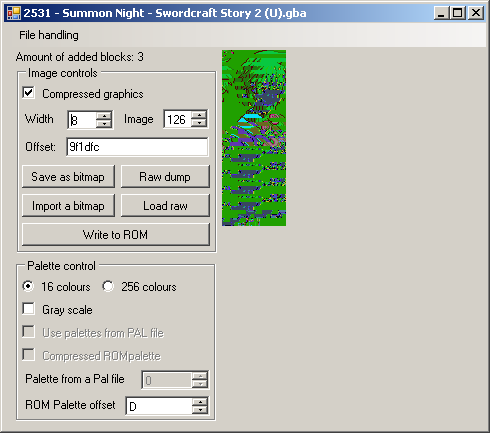
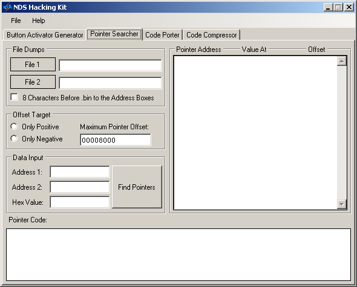

# 5 Game logic

Text, graphics and sound count for a lot and a lot can be done just editing them (indeed entirely new/different games have been made using those features alone) but eventually you are going to want to change how the game plays out or the options of the player within it and for this we turn to editing of the game logic.

## 5.1 Levels and Stats

Graphics are you have probably seen are composed of small tiles that get assembled to create a greater image. Levels are much the same although they tend to come in four broad categories, although unlike graphics there is no underlying hardware to shape things and that means anything goes. The items of interest are the level itself, the placement of static objects and the placement of interactive objects (enemies and such which also includes scripted events) and in many ways can apply to 2d, 3d, text and higher dimensions of games.

1.  All in one
2.  Layers of the items of interest
3.  Procedural generation and dynamic content. Depending upon what level you are editing at this can still manifest as one of the others.
4.  Linked lists of items (maybe with choices/branches).

First “All in one” need not be static or large, this is as you might just need to do something like define the starting/entry point of your enemies and then the game will take over from there. For all but the simplest games though it quickly gets unmanageable unless you make a complex format, to this end it is falling out of favour with the others taking over. Should you be editing older arcade style games or throwbacks to them then you might still encounter it and the GBA/DS has no shortage of throwbacks and ports of old games.

Layers of items of interest will tend to be broken down into categories (the background, the level itself, the enemies, the extras....) and stacked by the game engine (indeed this is a feature many walk through walls cheats have used and on the reverse side how many “hidden” areas are made). A game might break it down further than that and define the level using a grid system (each piece being assigned coordinates or indeed define it entirely block by block in a given pattern). It should also be noted that 3d games sometimes attempt to detect collisions by the 3d models themselves and their locations; you surely would have seen or experienced an occasion where a character in a game fell through the floor or through a wall. However some other times they define what goes by another file, usually generated at the same time the level model is exported, with the .KCL files seen in recent versions Mario Kart being a great example of this, such things can also be used to allow a finer level of control (in the Mario Kart example there is road, completely off road and off road enough to slow you down) as trying to calculate this according to where textures are mapped would be a nightmare; given games still tend not to autobreak for a new line of text then imagine how much more would be needed to calculate player/enemy locations related to textures. It should be noted that 2d games quite often use things like the OAM to help control where things are on a level.

Procedural generation was originally quite a common concept with many notable early games like Elite using it to great effect. It fell out of favour for a while with only a few notable uses like dungeons in dungeon crawling games like Diablo and Dungeon siege, it is now getting some more attention as people are learning to constrain it (you have some points a given distance apart, some extras and then you generate everything in between those points while making sure you have a route between them in game) and use it to enhance other games (the many guns of the Borderlands series being a good example). With regards to the it manifesting as the other types of levels mentioned in this section then procedural generation can just mean when the game loads up it makes the file and then stores it in memory as one of the other methods for use during that game. Dynamic is reserved for things like GTA that do not model an entire city but just the area a given distance from the player, however this does extend to things like enemies only starting to move when you are just off screen, a trick which goes back to the earliest devices.

Linked lists are usually reserved for adventure games like myst, visual novels, puzzle/quiz games and similar works but aspects of it can appear in anything at points like games where later events depend on your choices earlier in the game (a branching story) or you have a conversation with choices in a game the underlying system might look a bit like this.

It should be mentioned at this point that linked lists is actually a programming term; each event is called a node and it contains the data used in the event and the location of the next node which can be anywhere and can be changed at runtime quite easily. Linked lists and their variants (doubly linked lists and trees to name two of the common ones) certainly do exist as game levels and storage a game might use to remember choices, however a lot of levels that use these sorts of techniques are in practice closer to arrays (items decoded one after the other) or scripting similar to the Wizard of Oz and SSEQ audio.

On top of all this is scripted events which are very common and only getting more so. Here events will happen when certain conditions are met (certain conditions and locations/areas in a level).

Compared to a lot of other areas of hacking the practice of level hacking does not get as much attention until a game has tools made to parse/view levels, at this point the amount of edits available for a game often explodes. Naturally platform games, RPGs with platform elements, strategy games and racing games are prime targets for this sort of thing (Pokemon, Zelda, Metroid, various versions of Mario platformers, Mario racing titles, Advance Wars, Fire Emblem and Sonic platformers being prime targets over the years) with all sorts of hacks being made (remaking old games, making boss rush modes, tweaking levels, hard modes right up to total conversions where the original game is mostly gutted save for the engine and a new game made on top of that). Most of these have examples of things you can study in depth and it should be noted that plain swapping of files can have interesting effects; indeed swapping levels can make reverse engineering easier as will be seen in the example reverse engineering of a level.

An interesting technique which has taken off on the PC but has been around for a while is watch the game memory as levels can be streamed or might need to be manipulated at play time and fog of war is especially good for this. It plays right into it as well but much like changing the width of your hex editor to see patterns in pointers, text and more you can line up memory dumps (again they can change which brings in cheat making type arrangements) and if you colour them it can make things even more apparent.

### 5.1.1 Example tools

The following is a list of a few more well developed tools for the DS and some source code/format explanations with a worked example in the next section.

There are plenty of other editors you can find for various games if you go searching.

New Super Mario Brothers [Treeki’s New Super Mario Bros Documentation](http://treeki.rustedlogic.net/romhacking/docs.html)

New Super Mario Brothers was Nintendo’s throwback to some of the original 2d Mario games but as already covered it instead opted to use the 3d hardware. This did not stop the levels from being hacked fairly shortly after launch although it would be a while before more fully featured programs and listings appeared.

Advance Wars [Wars World News](http://www.warsworldnews.com/index.php?page=mapsindex.html) which is probably the foremost advance wars hacking related website has a lot of information on the various games in the advance wars franchise.

Mario 64 The DS got an enhanced port of the N64 version of Mario 64 and level editors eventually appeared for it.

[Homepage](http://kuribo64.cjb.net/downloads.php) [Google code page](http://sm64dse.googlecode.com/svn/trunk/)

[Filetrip download](http://filetrip.net/nds-downloads/rom-hacks/download-sm64ds-editor-mario-64-ds-20-beta-3-f29354.html) (XML version of the object database also available there).

The image below shows a nice test map which are always good to search for as they will often be quite simple and contain most, if not all, the items available for a game.

Mario kart [MKDS course modifier](http://gbatemp.net/topic/299444-mkds-course-modifier/)

Mario kart had filesystem level swaps fairly early on (indeed it was probably one of the first games to see DS level hacks) and eventually the actual formats were reverse engineered and level editors started to be made.

### 5.1.2 Level editing techniques

With some basic theory covered it is time for some practical stuff. A selection of methods exist to reverse engineer levels and reverse engineering shares a lot of concepts between ideas but levels have a few slightly more likely to be useful. Techniques include but are not limited to

* Memory viewing (preferably realtime but savestates can help with this)
* Byte analysis
* Comparing reverse/slightly tweaked levels
* Corruption and alteration
* In game or other level editors (on the PC the offerings for level editors are usually skewed towards usability and away from actual ability for good reason but they can still edit things)
* Comparing levels in game
* Size analysis
* File replacement/swapping
* Assembly analysis (as always)

### Worked example

N+ (N plus) is a DS port/remake of a popular flash game and features a lot of levels of a fairly simple nature making it a fairly good candidate to see some of the techniques at work. Unlike the text hacking section things here are probably not going to be broken down by example and what is here is going to be more of a showcase of techniques than following the technique that will lead to level format being fully reverse engineered; most of the techniques here would be able to reverse the level format in a reasonable timeframe by themselves and there is usually not a great deal of benefit to swapping methods as often as will be done.

Screenshots of levels 0 and 1 (episode 0 in the game).

Rather nicely the game provides files named nds000.lvl and nds001.lvl in the level directory.

Both start with something similar, have a lot of 0,4 and 1 nibbles (no idea if it is a 4 bit system) and then end on something else entirely which is actually shorter in the case of nds001.lvl although the level is somewhat simpler. The big difference between the levels though is the addition of the moving hazard (the level editor calls it a floor drone). This might be the E that is not present in the original level.

Still a bit of corruption to see if the levels are indeed what they claim to be. Guided corruption for this one rather than simply replacing things with random data so a bunch of what were mainly 0 at 10 hex though 1F hex were replaced with 4 hex. Giving

That would be the entire bottom row and another one at the bottom left of the level. Going back to the main menu though gives

That it is a copy of the next level and there is no gold, trap information, hazard information, door or switch locations in the images there it would appear to indicate a layered level design (parsing and removing data is doable but not ideal for low powered systems) but more on that later.

Replacing the 20 hex to 2F hex this time with a run of 2 hex changed the next row and appears to indicate a bottom upwards level design (first rows first) and something of a bitmap approach rather than coordinates. The somewhat static editing is OK and would reveal a lot if it were to be pursued, however memory viewing proved too much to stay away from.

One full dump and a search for the new 44444422222222 hex (not assured to work by any means but not compressed in game means probably not compressed in ram either) netted a single location at 37CFD0 or in the DS memory 0237CFD0.

Before the ram editing could commence though the memory/level was seen to be refreshed from the ROM itself between that view and the level itself and the level was not regenerated in real time. However the level overview/layout was regenerated from ram if a refresh was forced[15](romhacking202016.html#fn15x0) and the level was not fetched from the ROM itself between those, a refresh could be forced by changing the map preview (L and R buttons) or allowing it to scroll round.

Some experimentation said each “line” in the level was about 18 hex long although it could vary between levels. 00 appeared to be the blank/default state and zeroing out everything to what would be 188 hex in the original level (where the E0 is located) left a blank screen. Further experimentation said 4 bits was not the way forward (playing with the level editor provides an 8 by 8 grid so 64 potential options, although a few of those looked to be duplicates and maybe rotations) and maybe even 8 bits was not it, or at least the level might change depending upon what is next to it or with alignment.

Before going on with the items now that we armed with the knowledge that things might be 18 hex long. Looking at nds001.lvl in a hex editor, deleting the presumed objects list, the header section and colouring some of the non 0 pixels before flipping the resulting image.

It is well worth a try to look for such things/patterns in memory if you can.

Items The level editor also made mention of the potential for items and the above work would seem to confirm that they were elsewhere but checking anyway the fully zeroed out level section (here presumed to be where the 0,4 and 1 stuff stopped being the norm) still had items and continuing to zero things out after the end of the level broke it and removed some of the items.

As everything that survived was still in place but location shifted it says things

The change in colour is odd but not entirely unexpected as the level editor allows for a change in background colour, however as there is garbage at the top of the screen and no timer bar is is more likely the game detected a “time out” which might be another reason for the change in colour.

The lack of the ninja can be explained by the starting position probably being axed along with the lower levels of gold pieces.

The shift of everything could probably be explained if the origin of a coordinate system was changed and most interestingly of all the gold diagonal from the bottom left now shifted to the right hand side of the level has become one gold and a horizontal platform (called a Thwump in the editor).

Another more precise edit caused a crash (odd as the corrupt state on the right hand image above could be exited via normal in game commands and return you to the menu) and another edit leaving the initial bytes of the items section intact made for a working level but with a few changes (3 bytes at 1D4 changed from 4947 1C to 0000 00 or about 4C into the items location section) messed up everything after the door switch shifting things and creating new items. Suspecting an alignment issue the lone 00 of the three bytes was changed back creating the right hand image.

Even if corruption had not revealed the item layout location then with the pre level stuff not being anywhere near enough to store the relevant amount like the locations of the gold that leaves the end of the level file and the somewhat different data there. Equally the next level (nds001) has few items and it is smaller.

84 pieces (in 24 clusters) were counted as was a door and a switch, although it is noted that the door in the level editor appears to have a switch as part of the deal so it might not be two items. Somewhere along the lines that set the time for each level, if indeed there are some, might also be necessary to find.

The minimum required information is probably the item itself, the x coordinate and the y coordinate. Additionally in the level editor the behaviours of the drones can be specified (4 drones and 4 behaviours each) but an additional field across an entire array/matrix likely to contain hundreds of items versus just defining another item tends to mean the just defining another item option wins unless by adding an entry to the matrix/array the code will be aligned to a given value in which case that often wins. Of course just because it is a good idea does not mean the programmer actually did it (again more than a bit of ROM hacking is about fixing bugs and errors the original developers made).

Gold is the most common item so the logical step would be to do a distribution of the file, however nothing much turned up here at first glance and considering the gold clusters might be different items you might have to consider that.

With two bytes there is only room for 66 items from the first level and this probably means clusters were chosen if that was the case (odd because the level editor allows for defining single pieces as does elsewhere).

Corruption, minor alteration and pondering how someone should do it is rapidly getting troublesome but episode 0 level 4 (nds004.lvl) has a simple repeating pattern

The level in question (highlighted section being the item data)

14 instances of mines of each arrangement

12 instance of gold

A switch

A door

A starting point

Changing a couple of the 53 hex values to 54 hex netted a minor change (the blue timed mines on the bottom level; concepts first seen in relative search can apply here as well) but other changes of the same values did everything from break the level to completely crash the game (either instantly or runs for a second and then stops). This probably then points to format done with bits at a time rather than bytes or maybe rather than coordinates it was a distant relative to the linked list where the previous entry defines the next one.

53 hex = 0101 0011 binary

54 hex = 0101 0100 binary

Changing the start from C0 to E0 (1100 0000 to 1110 0000), ignore the timer.

Editing the start makes for odd changes to the end of the items section and was looked at.

The final FC was changed to FD to produce the leftmost image and then FB which produced the rightmost image

That it changes a single piece does not do well for the grouping theory, although it is technically the rightmost top piece that has been changed (there is no item that is both higher and further right). A single value (note not binary) change changes location by 25 pixels with right on the level being positive. This speaks more to items being defined bottom up, line by line (but with the ability to “skip” lines unlike the obstacles) and left to right. FE however stuck it above the rightmost gold pieces (a change of 57 pixels) but changing to F simply moved 25 more pixels from there to the right so maybe a different type of grouping. This pattern held until 7 was picked, at which point the following happened

It should be noted 7 does not have the upper bit as a 1 where the others did and looking at what happened to the image the upper piece of gold does appear to be on the rightmost part of the level again (7 hex = 0111 binary, F= 1111 binary).

Changing the F part did all sorts of crazy things similar to above including adding invisible items, things to the map that were not on the level but it is desirable to find the previous piece of gold as that would give a clue as to the length of values. It is also not completely certain that items are grouped by themselves (could be gold in one section, mines in another, other items in another).

Things were not immediately apparent here so returning to the level editor.

Cheat search was used to see what changed when things were added or removed from a location (a basic difference search in this case)

020DFB00 seemed to be a counter/pointer limit (changing it to a lower value would remove items added later)

020E0840 appeared to be the selection box location

\[to finish\]

The beginning of the levels 3 hex through 9 hex always seemed to be ??306945EA1004 where ?? could be 00,01,02,03,05,07,08 and 09 with 03 being the most common by far and 09 only seen in nds194, nds175 and nds165 and 08 once in nds182

00 through 02 hex appeared to be **$$ where ** was usually 84 or 04 and but was changed to 7C in nds052, nds026 and nds160

$$ was often 7F or 80.

Also as the items stayed in place it would appear there was something to possibly indicate the item section which is usually where the header steps in. No apparent pointers but it could well be a calculated value.

\[to finish\]

Timers Timers in levels were of interest so an item section was transplanted wholesale from another level and the difference being zero padded. It created not a perfect replica of the items but a close one as there were additional items, the timer however was the same as the what the original level would have been thus implying that it was not stored in the level file. As a further test a level was outright replaced with another yet the timer for the level remained the same as the original level’s; it was different when that donor level rolled around but do make sure of this when you change things as there are few worse feelings than realising you wasted a lot of time over a coincidence.

### 5.1.3 Stats

Although games can be built without using this concept it is surely fairly easy to see how item, enemy and player statistics/characteristics can be used to make for a better gameplay experience, if it can be used in a game, or added into one, then they may want to be edited. ROM hackers are then concerned with the storage methods and limitations of these statistics.

The limitations are usually fairly obvious things like if you find your stat is defined as an 8 bit value you have 256 possible combinations at most, unless you change how it all works which can be quite difficult. Indeed the only times it really gets attempted is for converting games from 16 bit encodings to 8 bit encodings, or if the game uses a more conventional database format and access technique for the information in question which allows for such a level of manipulation.

How the statistics themselves are stored is as many and varied as anything else you have seen in this document; these things can be basic binary tables (extremely common in older games, ports of them and not uncommon in newer titles), something resembling a CSV file (rows of information separated by commas), pages of XML esque languages or indeed XML itself, proper databases (not so much on the handhelds but home consoles and PC games can and do use SQLite type arrangements all day long), or in the less fun scenarios buried in with the game code itself (it might not have been that way in the source code but compilers are wonderful things and will sometimes optimise code for you).

The databases can be self contained, they can be linked tables of values, they can use pointers, they can assume aligned values (similar to how you probably lined up the names and pointers when pulling apart a container/archive format), can be scattered across a file, can be calculated (8 bit means 256 combinations but nothing stopping you having a range of 1000 to 1255 or more commonly for things like health where you will multiply a constitution value by a given amount and add a bit go get a health value) and much more.

In short they are usually a database of sorts so database programming comes into effect, this is not going to be covered here as it is very long and probably not that useful as games tend to be fairly simple (they tend to be small and static meaning no benefit and potentially even downsides for using high level database concepts), fairly logical (although do not count on plain values being there) and unlikely to be truly obfuscated or encrypted.

Before turning to assembly hacking though do give the thought exercise type method a try; you can get quite far just by working through what you would do (240 enemies with a name, 5 stats a piece that do not go beyond 255, each of those enemies is linked to another, of the five elements in the game it is weak to how many of them?). What you would do and what a programmer will have ended up doing might not be that different, or at least they would have enough in common that you can start figuring out the rest in a similar manner to how you would fill in the missing parts of a text encoding.

It should be noted many in game encyclopedias/bestiaries will have been made from the database before the game is put together so do not expect things to change there if you change the game, or indeed the reverse and expecting changing things there to change the game.

On another note in game AI may well be finely tuned to the original game stats and changing them can render the stock AI far worse than it is in the stock game, however we will cover that more in the AI section and if you just want it for multiplayer with humans then carry on.

[pipian.com ierukana](http://www.pipian.com/ierukana/hacking/ds_evos.html) has a nice example of pokemon stats.

### 5.1.4 RPG randomiser

The concept has been around for some time but in recent years it really seems to have taken off. Games like Pokemon, Medabots RPG as well as more conventional “RPGs” often have defined zones for enemies or predefined battles, or in the case of medabots you will only be fighting medabots made of the same parts. You then get to figure out a way to alter this. Do note a lot of games might provide you with something to look at to influence this. Classic examples would be a “conservation” area where you visit old enemies, a bug like pokemon sea tiles, an arena of some form or even certain kinds of mulitplayer. Similarly a game might change the monsters in an area for a sequence or something and that can be very valuable. Alternatively it can be very simple and you only have to influence the outcome of the random number generator; if a game has a bestiary then if the enemies from a similar area have similar numbers it could well be a contained random number generator (generate me a random number between 4 and 6, or more likely generate me one a normal random number and add or multiply to get me to the number for this map). It is up to you to see whether you wish to try to stop end game bosses potentially appearing in a start area, though such things can be fun.

## 5.2 Compression

Compression is seen in all areas of ROM hacking and will continue to be seen as developers brush up against limits of bandwidth and storage space all while having more CPU cycles at their disposal. There are countless permutations and implementations but broadly speaking the two basic types will be lossless and lossy. Both types are named for their dominant characteristic; lossless able to compress and reconstruct an exact copy of the original file and lossy taking an original and losing some hopefully irrelevant or less noticeable information in an attempt to make the data smaller (in sound for instance the human ear will certainly not be able to hear above 30KHz so if you had captured everything up to 50KHz and then lose all the sound above 30KHz[16](romhacking202017.html#fn16x0) you will save some space at the cost of lost data). There are things aimed at real time compression (real time communications of data generated on the spot such as a voice call) and things aimed at compression for storage and later transfer and the latter is what ROM hacking tends to deal with the most.

Compression is not perfect so if you find yourself reverse engineering compression do not be surprised to see a compressed section that is the same length as the piece it compresses (although this can also be a technique to allow a bigger range by means of a double reference) and equally do not be surprised if you see a way the compression could be further improved both within and outside the limits of the format.

### 5.2.1 Lossy

Various DS games have been seen to use lossy methods to encode audio, graphics and sometimes video. For the most part these will be known methods like JPEG for images, various audio formats and game related video formats (although a complete description of the VX and mods video formats aka act imagine/mobiclip is still pending) with the most complex part of it being if the existing format is wrapped in something. This is probably for the best as lossy compression draws from a whole host of fields including things as far afield as psychology and biology and tends to make for complex formats.

### 5.2.2 Lossless

Lossless compression will manifest in one of four basic ways, although the first three will be the most common.

Dictionary

(sometimes called referencing) - here the compression will reference an earlier part of the file (be it the whole file or a “sliding window”). LZ compression and the special case of it known as run length encoding (RLE), which was popular back on earlier systems, are the two main types. Here the file will reference a premade dictionary of terms (rare in modern implementations) or use the file itself to generate a dictionary which, depending upon the method, will either be the file itself or shipped with the file.

Statistical

Huffman is the main type of compression to use this sort of technique. The idea is the compression uses reference values of various lengths to refer to sections of original file with the most common types getting shorter values and the less common types getting longer values.

Filtering

depending upon how you look at it this is not really a compression and more of an encoding but the GBA and DS hardware treat a version of it much like compression (BIOS functions to handle it) so it is here. The graphics format known as NDS 1bpp (1 bit per pixel) uses the idea that even if it eventually gets turned to 4bpp if you have a two colour image (usually a font) you can be assured that each pixel be one of two values and as such can be turned into a simple 1 or 0.

Predictive

Technically another statistical method but it relies on the idea that certain parts of the file might be predictable and is usually very application specific.

[Christina Zeeh’s introduction to compression](https://ece.uwaterloo.ca/~ece611/LempelZiv.pdf) has a fair amount of background information on the history and background of the LZ compression family and others.

Additionally, and as has hopefully be made clear by this point, game developers and coders in general are encouraged to reuse existing concepts and values so tiles may get used repeatedly (half a body might have twenty versions of the top half for various animations), 3d in general is well suited to it, pointer level text compression was mentioned, dual tile encoding does have uses, fonts have been seen to reuse parts, the whole notion of the palette/texture/material swap... so although these general use compression methods are a key concept in hacking, especially of modern handheld games, be prepared to encounter methods more useful to games in general.

### 5.2.3 Basic theory of the actual implementations

This section will detail the basics behind the most common compression methods seen on the GBA and DS and some techniques that can be used to handle them. Actual programming level discussion is reserved for the next section. Note that custom compression has been seen several times in the wild but it is usually not that different to regular compression (it is hard to define a useful type of compression that is truly new), this means that even though most existing tools will fail if they are set upon custom compression that as most are open source it should not be that hard to get them running again once you figure out the minor differences between the methods.

GBA compression More so than the earlier consoles, which tended to have the occasion bit of RLE and later on some LZ, the GBA took to compression in a big way and it became a fixture of the system. Various things were made to handle it in the hardware side of things and from the hacker perspective. [headspin’s guide](http://members.iinet.net.au/~freeaxs/gbacomp/) details a lot about compression and how it can be used on the GBA and that feeds quite a bit into the DS as well.

SWI calls (BIOS supported compression) The GBA (and DS for that matter) feature some basic decompression algorithms as part of the readily accessible BIOS, this means anything can call the BIOS functions to decompress the files into memory. Naturally the debugging grade (and for that matter some more general use) emulators can watch and list any BIOS calls and allow you to get a rough idea of where files are, how they are compressed and even when in the game they are reached for, many tools compression tools can then use these lists to extract files.

VRAM and WRAM safe The VRAM is the video ram and the WRAM is otherwise known as the main memory or work ram. With the GBA cart being memory mapped on the GBA things could be copied right into the VRAM by various methods but the VRAM carried a restriction that all destination addresses had to be aligned to 16 bit aligned (WRAM could do 8 bit). This also meant that any writing, say from decompression, had to occur 16 bits at a time and necessitated VRAM safe compression methods be devised and implemented.

Searching and dealing with compression There are three methods of dealing with compression on the GBA

1.  SWI logs
2.  Assembly/known locations
3.  Compression searching

The GBA has several decompression algorithms built into the BIOS and by watching when they are called (logging of SWI calls is available in VBA among other things) the locations in the ROM will tend to included. Not all compression is BIOS compatible and not all BIOS compatible compression uses the BIOS functions to decompress it (being housed in the BIOS they are something of a tradeoff between size and speed so developers sometimes wrote their own functions). Should SWI logs be available then several of the tools mentioned in the compression tools section will be able to parse them and extract things accordingly (GBA Multi DeCompressor being one of the main ones), or you can hand parse them and direct a tool to do it.

Known locations is fairly obvious and the idea runs if someone before you has found the locations it is fairly simple to direct a tool at them (or in the case of some games the tool may have already been made). Assembly may well have been used to get to know locations though and it is usually a minor tweak on the standard tracing technique (tracing is covered in a little while) of finding something in ram and working backwards from there to see what put it in there and if it had a stop for or did decompression along the way. This way if a custom decompression method is used then the basic idea will be apparent to person doing the tracing (custom usually means a slightly different flag, flag meanings and number of bits over which it operates rather than a whole new method of compression).

Compression searching will probably become more obvious after the worked example and relies on the idea that the compressed file will usually start with 10 hex in the case of GBA/DS BIOS compatible LZ and after that there will be flags and similar mechanisms the compression method uses to function/allow decompression. Various tools have been made but as far as most people working in GBA are concerned

NLZ-GBA Advance (which doubles up as a graphics editor)

unLZ-GBA

Crystaltile2

Crystaltile2 also features compression searching support and can do it for custom flags of various forms as well. It is available on the tools pulldown menu of the hex editor window but be warned that mass decompression has a tendency to make the program crash if it encounters too many false hits for compression.

Lz77Restructor 2

A relatively new tool but a nice one; you may want to play with the filters option as it can restrict by pointers, widths, sizes and as well as deal with text (using custom tables if necessary).

GBACrusher Decompression tools were fairly common and they did a fair bit of compression as well but for most the dominant tool for generated compressed files was known as GBA Crusher. It should be able to do all the BIOS compatible methods.

DS compression Compression took off on the DS but owing to it being reasonably well implemented few companies ever made their own custom compression formats in the traditional sense and just used ones from the SDK or other known formats so it went from being the bane of ROM hackers to just a minor irritation.

SWI aka BIOS calls The DS BIOS has support for various forms of compression and new to the DS compared to the GBA was the idea of callback which helped work around the DS ROM not being mapped to memory (gbatek calls it slow but it allows larger files to be decompressed without the developer having to provide a checking function to see when parts have been decompressed and the next one can be fed into it).

DS firmware compression Not really relevant to ROM hacking but the DS firmware has all sorts of compression stacked together in it and the source code makes for nice reading.

[Download from Chishm’s website](http://chishm.drunkencoders.com/NDS_Projects/fwunpack.zip)

Types You will often see mention of types of compression in DS ROM hacking discussion and this refers mainly to various implementations of LZ compression seen on the DS. They are so named because the files using the type of compression usually start with the number (in hexadecimal) but it is also worth noting compression will often also be indicated by the file name (typically LZ in the name or the name/extension ending with an underscore).

* LZSS - more or less what the GBA/DS BIOS use and other common compression methods seen on both the GBA and DS use.
* Type 10 - this is the classic GBA WRAM safe LZSS based BIOS compression and only one supported by SWI calls.
* Type 11 - another LZSS based compression which appeared a few years into the DS lifetime and is capable of achieving better compression than type 10 at the cost of some speed.
* Type 40 - probably the newest type of LZSS compression seen on the DS. The first notable use was in Golden Sun Dark Dawn although 11 is still used extensively.
* Type 30 - this tends to indicate RLE
* LZE- mainly seen in a couple of games in the Luminous Arc series.
* LZ77 - not seen so much any more (the 77 referring to the year in which it was cooked up) but some people erroneously refer to all LZ or LZSS compression as LZ77, it is very similar to LZSS though and nobody really gets confused if you conflate the two.
* Binary/backwards/bottom compression (sometimes dubbed BLZ and not to be confused with LZB)- DS binaries (mainly just the ARM9 and ARM9 overlays unless it is a download play component) use a file end first compression that is still LZ but done in reverse for various reasons. Decompression is widely supported nowadays and compression can be done too. This compression is file wide but there have been instances of compressed files included within the DS binaries.
* Huffman - (tends to be 20 to start) where LZ and most others are concerned with the immediate value in front of them and if it is related to an earlier section this considers the file as a whole and assigns the more common sections a shorter reference value and the less common ones a longer reference value.
* RLE. A special/simple case of LZ that works on a given string or section and just compresses repeated values for as long as they run. Not as effective as LZ and others but very fast and so quite common on older systems.
* Yaz0. Named for the ASCII magic stamp it starts with and one not tending to be seen on the DS. It is in many ways a slightly enhanced version of RLE (not quite enough to be called proper LZ) but it is seen quite a lot on the gamecube, wii and later Nintendo handhelds. Quite often used with the u8 archive format that u8tool can parse. There is a related format for the BIOS called Yay0.
* Packing and filtering. As mentioned in graphics the GBA and DS BIOS allows for filtering of data to make 1BPP and runs where there is a single value increase each length a run of the same value which compresses far more with conventional compression methods.

Various tools have been made to handle compression with two of the big ones as far as the DS is concerned being DSDecmp and Cues GBA/DS compressors although there are multiple methods to effect decompression on files.

### 5.2.4 Compression at hexadecimal level

This section will focus mainly on LZ compression as that is the most common and decoding it is fairly illustrative of the techniques and concepts involved. Compression often radically alters the file at hexadecimal level but it will usually be implemented in a given manner.

* Magic stamp. Mainly on the DS formats or home consoles rather than the older consoles. Can be hexadecimal or ASCII/unicode.
* Flags. Mainly seen in LZSS these are little flags inserted at compression time to tell the decompression tool if a section is compressed or not.
* Compression instruction (usually where is the file/what is it called in the dictionary and how long to read the previous reference for).

Some implementations stick flags here and there in the file for various reasons although usually as a message to the decoder to skip this section or note it for later.

The instruction component is usually a two part operation merged into one. One part will be the length of the previously seen string and the next will be the location of it (either as an address or reference). Common deviations from the method discussed above include the order of length and location can be swapped, how many bits will be used for each can be changed, what sort of alignment is used and how things are addressed. Remember LZ is often dubbed a sliding window compression so when operating on a big file (or when limited to a compression instruction with few bits for the location component) the start address can vary throughout decompression and will not always be at the start of the file.

Worked example The following is the text output from simply running the gbacrusher program from WRAM LZ.

The first part is not strictly necessary for manual decompression but it is nice to have and quite useful when programming a decompression function.

The 10 hex part is a flag which indicates compression and the 4702 part is a flipped version of the length of the original file (247 as you can see from the top window).

A search was done for every 00 value as in LZSS they (usually) correspond to the flags to tell the decompression tool if it needs to do something or not (not for 00). They are every 8 bytes in this instance although some implementations can use 16 bytes or something else entirely. Doing this could well make the file longer but once more compression is far from flawless and the tradeoff is useful for speed and ease of use.

Back on topic the first four sections have no repeats (this is quite common and gives rise to the files getting less readable as time goes on). When decoding delete every 00 flag as you copy it.

The fifth one (highlighted) though has “ersion” from Version repeated. LZSS differs from some other implementations of LZ by having the first non compressed value (in this case a byte) encoded as usual. The 40 is just a flag.

3009 - the first 4 bits of that are how much to decompress less 3

Making the number 3 less means it could theoretically have 3 more bytes one day and as the number will not be less than 3 (2 bytes for the compression flag means a minimum of 3 bytes to be worthwhile) it make sense to start counting from 3.

The second 4 bits are 0, technically these are the most significant bits but as the file is small they are not present yet.

The next 8 bits are one less than the distance to count backwards (in this case 9 meaning A hex) which starts from the compression instruction value (or if you prefer the exact value back from the “next non decoded” symbol.

The next few blocks are uncompressed but another compressed chunk soon appears

A020

A bytes + 3 = D hex long

20 = 21h back.

Repeat as appropriate until file is decoded.

An aside on editing and viewing compressed files Editing a compressed file at hexadecimal level is possible and some find it tempting to do however you never know if a fragment will be used later in the file unless you check (which usually means you decompress the whole file anyway) and although it is fairly obvious with text if you are dealing with graphics or a function that operates on an unaligned bit level it is worse so it is usually best to decompress, edit and recompress.

Equally compression when done to text usually means most of it is still fairly readable (especially as it tends to be aligned to bytes or higher) and to a slightly lesser extent so are some levels and early parts of headers (give or take flags) meaning although it renders a lot of graphics near unreadable a lot can be seen and guessed at without having to deal with compression.

Working around compression Just because a file was compressed in the original game does not mean it has to be compressed in the end hack you make. It is not always as simple as just turning up with an uncompressed file, though this can work for proper functions that attempt to detect compression and act accordingly. Sometimes it can be as simple as changing a flag somewhere (recall the example from El Tigre) but it can also be a fairly basic assembly hack, speaking of assembly and binaries the DS binary compression tends to be noted with a flag in the overlay table, to this end you can clear this flag (1 = compressed, 0 = uncompressed http://gbatemp.net/threads/recompressing-an-overlay-file.329576/#post-4387691). In the case of an assembly hack the general idea is compression has a source and a destination with operations beyond straight copying in between but if you replace it with regular copying all will work as it was. The slightly more crude workaround is figure out the uncompressed flags (harder but not impossible with RLE and Huffman) and insert them throughout the file and another take on it can be seen in some of Labmaster’s work in dealing with compression in the GBA game [Golden Sun](http://www.romhacking.net/documents/253/).

Equally if you are dealing with a custom compression the data will usually be uncompressed to run so you can often snatch things from the ram and work around the compression later or use it to help work around the compression for if it is just a slight tweak on an existing method which you already know this can practically give the game away.

## 5.3 Cheating

This is not using any “hidden” button combinations/activation conditions to allow for a different mode of operation to normal play but actually editing how the game works. Of all the areas most likely to sit slightly aside from ROM hacking it is cheating but an appreciation for how cheats work is very desirable when first learning about some of the game logic side of hacking and certainly as a lead in for assembly.

Classically there were two types in RAM codes (often called action replay or gameshark depending where you are in the world) and ROM codes (often called game genie).

RAM codes acted upon the game memory where ROM codes adapted read requests for the ROM image to whatever the code wanted.

RAM codes were often considered simpler in nature, this is not really a fair assessment but due to the overwhelmingly large amount of simple codes it kind of stuck. Equally ROM codes were often able to do some very far reaching changes, changes that would have been extremely hard to do via RAM editing, and were slightly harder to make, and are also not as common.

As ROM/game genie codes operate on the ROM they can be patched in very simply to the ROM itself, RAM codes need a device/emulator with support for them or a program to edit the cheat in or hook the game code to add a small cheat engine. Having code run on top of the existing code is something which is not really viable for older systems, especially not in a somewhat generic/automated tool type manner. The GBA and DS do feature such things though with GBAATM and DSATM being the main two programs for the GBA and DS respectively, the GBA does feature other tools like GABsharky but most of the earlier efforts have been overshadowed/supplanted by GBAATM. The classical lines were blurred in recent years as the game genies turned to action replay style codes and action replay devices also took up save editing and save injection for various consoles, on top of that DS ROM images store their game binary in the RAM (they have to as the DS game cards are not accessible in ram) so some of the better cheat makers used action replay codes to edit the binary in ram to great effect.

There are many types of cheat code and devices with different implementations, this guide will probably shy away from going into depth but in general it is broken down to three components (and usually encoded in the following order)

1) the type of code (constant writes, conditional writes, boolean operation and some more exotic types).

2) the memory address

3) the payload if any is necessary

The main reason for covering this is understanding how cheats work and how they work with the system often leads to a deeper understanding of how the system works in general and provides a nice in for those wanting to start to learn how to code in assembly (the type of operation, location and payload concept will return there).

Useful links [Enhacklopedia](http://bsfree.org/hack/)

### 5.3.1 General cheat making

There are many ways you can make cheats but the first port of call is usually a memory scanner of some form. These allow you to scan the memory before dropping back into the game, changing something and scanning again until you either get it down to the exact value or a small enough list that you can try them all by hand.

You have several scanning options available to you including

* Value search (equal or not equal) - if you know the value of your health or something you can search for it. Does not always work but worth a go as a first pass.
* Greater than/less than search. Here you can search for something greater or less than a value or find all results different to a given value.
* Fuzzy search. Here you can note everything with an eye to coming back later to see what has changed. Can be combined with greater or less than most of the time as well. This is quite useful when you have a health or timer bar without a direct display of the value to be searched for.
* Range search. Not always available and doable if you think about it with greater than and less than this quite literally searches for values within a given range.

Exotic codes and terms Various cheat devices allow for some quite custom and far reaching codes to be made over devices from competitors. Some of these are to change the internal handling of the cheats but many more can have quite far reaching effects. First though some terms that often come up

* Slide codes. A technique used to generate codes to do the same change to multiple locations at once, usually used if you have something like 30 troops, each with their own health value and ammo value and you do not want to use 30 codes.
* Master code. More associated with game genies where they usually bypass protection and for cheat devices that needed to be set up to work on certain ROM images.
* Slowdown. Covered later but some cheat devices allow you to slow a game down by flooding the CPU.
* Joker code. Codes used when using buttons to activate cheats.

### 5.3.2 GBA cheat making

VBA has a basic cheat option which should be available in nearly all versions (notably the VBA-SDL-H version does not although if you really wanted you could use its debugging abilities to do something instead) and the brand new window of the basic VBA cheat options looks like.

VBA-H has some slightly expanded options in cheats and elsewhere.

Regardless of the version most of it is fairly obvious if you have a basic understanding of the basic ideas of cheats and value representation with hexadecimal.

Still

* Search type - Specific value allows you to enter a number in the old value section. Old value will search the previous results.
* Data size - 8 bits, 16 bits and 32 bits values will be looked at. Note that quite often things that appear as 8 or 16 bits at the start of the game (if you are only losing a few health at a time that might appear as an 8 bit value) the value might well use the full 32 bits by the time all is said and done.
* Compare type - pretty self explanatory. Not equal is useful if you are searching for something that might of changed but you are not sure how and for timers that might reset.
* Signed/Unsigned - does exactly what it says and allows you to search for signed or unsigned values.
* Enter value - only available when you have Specific value search selected.
* Update values - this updates original searches to their new values each search.
* Flag compare - (VBA H only)
* Differ By - (VBA H only) does exactly what it says and allows you do select a range of values to limit your results by (if you have only lost 7 health the change will probably not be a full value only capable of being represented by 32 bits)
* Range - (VBA H only) again does more or less what it implies and allows you to restrict a search to only include or not to include a range of values.

About the only thing it is lacking is a floating point search but those are tricky and float values are rarely used on the GBA (not to mention would probably come up on a not equal search). Also lacking are things like bitwise, Boolean and mathematical functions but if you need those VBA-SDL-H is where you would look.

### 5.3.3 DS cheat making

This varies a bit depending upon the person doing the cheat making. Desmume has some cheat/memory manipulation abilities but many will use tools like HasteDS and renegade64 or more general purpose tools to hook into emulators and provide similar abilities. Many more will use tools like Datel’s trainer toolkit which has fairly extensive debugging abilities and even flash carts like the Supercard DSTWO and iSmart MM will have minor cheat making options although their search and functionality is somewhat less than a proper tool they can still be used for basic cheats.

Desmume Should be available in all versions of the program (no need for the dev version), for Linux you may need a given version.

\[note 2014 update\] This is a somewhat older version, the newer builds have a significantly improved cheat engine.

Main window, exact and comparative search

It is split across a few screens although for the most part it is fairly obvious once more.

Select size - selects for values spread across a given number of bytes. Note once more that low values might be using larger sizes.

Sign - unsigned or signed.

Select search type - exact value searches for a given value and comparative search allows you to search for anything (life bars and other such things without exact values).

On the comparative search > ,<, = and != have their usual means of greater than, less than, equals and does not equal.

Perhaps counter intuitively you have to close the cheat window to get the game to run again before jumping back to the search and refining it.

Emuhaste [Emuhaste project homepage](http://i486.client.jp/emuhaste/)

[Filetrip download](http://filetrip.net/nds-downloads/utilities/latest-emucr-emuhaste-f29424.html)

Realistically you will probably only use it with desmume but none the less it is a powerful cheat searching engine and includes the ability to dump memory.

Basic usage is after you set up the ini file to run the emulator, press snap process. You do not need to search for a value to begin.

Inc(rease) searches for a value that increased in size

Dec(rease) searched for a value that decreased in size

Diff(erence) searches for a value that changed in size (up or down)

Equ(als) searches for a value that remained the same.

Data length allows you to search by values of a given length. Float search is not much use on the DS but it is there and sort of works.

Set search range unlike the others is not a value limiting search but an address range.

The file dump “pulldown” menu allows you to dump the DS main ram which can be used to help find pointer codes.

In the param & string search box you can type the value to find (up to 255 long which is more than enough for most uses). This however has a series of options you can use

S in front of numbers will mean they are treated as decimal

R at the start of the entry will swap endianness

$ will allow you to search for a string.

< will allow you to restrict a search to less than the value you put on the other side (<S40 will mean only values under 40 decimal will be considered).

\> will allow you to restrict a search to values greater than the value (>S40 will mean 39 decimal and down will not appear)

Innnnnnnn-nnnnnnnn will restrict to an address range.

Basic difference searching is available by using plus and minus signs to specify the change.

As of 4.00 an autotrigger search is available. Here it will trigger search if a certain memory value is changed according to the command

Format is address:hex you are searching for:command with multiple commands being available if you separate with a comma. Commands as follows

EQ - equal to

NE - not equal to

GT - greater than

LE - less than

MS - multi-search

There was a previous version of the tool known as hasteDS that stuck around for a while as the rewrite to emuhaste was missing some features but that should now be a thing of the past.

no$gba As the developer version of no$gba features a full memory editor it too can be used for cheat making. However it lacks the more in depth cheat making features seen elsewhere, this is fine though as various versions are widely supported by other programs which also support the standard version.

Others Most of the cheating tools are more or less a specialised class of memory viewer of which there are many (several of the suggested hex editors have the ability to read process memory)

Artmoney [Artmoney homepage](http://www.artmoney.ru/)

A more general editor but one that found a fair audience in game hacking circles owing to some more cheat making specific features.

RenegadeEX [Filetrip download](http://filetrip.net/pc-downloads/applications/download-renegadeex-105-f29011.html)

A general program also geared towards editing with support for several emulators but only no$gba for the DS (although it does support several GBA emulators). The previous incarnation known as Renegade64 was also a no$gba specific program but for a long time far more stable than HasteDS and emuhaste.

Emucheat [Emucheat homepage](http://www.emucheat.com/)

Another no$gba oriented program and for a while somewhat more advanced than the other options so it became fairly popular among those seeking to make more advanced cheats or cut down on the unnecessary

Crystaltile2 Not so much for cheats but can interface with no$gba to retrieve VRAM and WRAM data. Available under the “DS emulator” option in the file pulldown menu.

Datel’s Trainer Toolkit This one is actually something more than a memory viewer, here you have to use a trainer toolkit to connect to a live DS via a GBA slot at which point you can tap into the memory and edit from there.

### 5.3.4 Basic making of a cheat

Regardless of the tools or system it is intended for cheat making uses the same methods. To then end making an infinite life cheat for Summon Night Swordcraft Story 2 on the GBA

A couple of health was lost and the search button was pressed

A few more points of health was lost which made things better but still not there

The process was repeated a few more times

30608 decimal = 7790 hex so 8 bit was probably a bad choice but as the health was only going down by 1 it worked today.

This led to 0300060C so selecting that address and pressing add cheat

Adding a value of FFFF and a description so as not to forget when other cheats were made gives the end result as

### 5.3.5 Cheat prevention methods and frustrations

Such things often trouble ROM hackers as well owing to the way they work but either because of the way they are coded or because the developers wanted to lessen cheats some games work in such a way that the basic cheat creation method falls short. Additionally some games can be broken by the use of cheats on a less technical level; quite often in a RPG type game you will encounter a fight you are supposed to lose or you can unlock options that might be viable as far as the game code is concerned but the game itself was scripted in such a way that the rest of the story can no longer play out. On a more technical level timers can be used by many parts of the games to do things so holding them is not always feasible.

Probably the most basic version of this always on cheat problem is if a cheat is always on but for a time in the initial boot sequence the game will use the memory for something else (this is more troubling on the DS if you are doing something in the overlays that are designed to be swapped out of memory many times during the game) but that is usually solved either by hooking the game to use a button activator or similar, changing the nature of a cheat (especially when dealing with timers that the game might use elsewhere) or having a cheat engine that can turn cheats on at a given time. The rest of this section has some examples of techniques seen over the years and there is nothing stopping games from hybridising methods either.

Mirrored, encrypted, checked and calculated values Although all four are different techniques they work along similar principles

* Mirror values tend to mean the value is written in multiple locations (see also pointers below) and if one does not match up you can use the others or crash or something.
* Encrypted do as they say and turn a plain number into meaningless gibberish unless you can decrypt it (usually this is a very simple method of encryption like a plain XOR or a shift or something).
* Checked values. If you have four characters their total health might be 614 and you can store that which means if the sum total of character health is different something has gone wrong.
* Calculated values are arguably a subset of encrypted values but rather than say storing a health of 145 you instead take it from the maximum health of 255 and store 110. This can also be for helping with calculations.

Most of these are easy to work around as if you are searching for infinite health it does not matter if you have an infinite health of 7 or the maximum value for the most part[17](romhacking202018.html#fn17x0) so if you have a working set of values just force the game to use them always. If you do want to figure something out you tend to have to watch values that change at all rather than higher or lower and figure out the method used which is usually quite easily managed or dive into assembly probably guided or initially aimed by a basic cheat search.

Pointers In a DS game the pointers in the header which every DS can read points to the filesystem which points to a file which points to parts of the file which may point for further parts of the file and possibly further (rare but quite possible). There is nothing stopping ROMs from using similar methods and indeed several games have been seen to use these over the years which has several effects including cheats that only work some of the time, cheats that do not work at all (usually thanks to a combination of the previously mentioned methods), cheats that are impossible to find by basic methods (most cheating methods assume the value remains in the same location).

Workarounds include finding all the locations that can be pointed at (even with pointers many games will do it in a round robin fashion) and controlling the lot (a bit brute force but quite acceptable), you can try reading the pointer at a given point and reacting accordingly if your cheat engine is powerful enough and you can instead force the pointer to stick at one location and make sure that now fixed location gets edited.

Pointers within pointers are not only possible but seen on several occasions and there are occasionally games with proper memory management/allocation so holding “old” values is not always the best idea.

There are a few tools to handle pointers for cheats with the most notable one on the DS being Kenobi’s pointer tool which you feed memory dumps and the basic codes into to get the full codes out of (pointers and the initial cheats used to fix yours).

Another nice tool is available in [Demonic722’s hacking toolkit](http://filetrip.net/nds-downloads/applications/latest-nds-hacking-kit-f29363.html).

The idea behind it should you have to go manual is in each game there will be an instruction or memory value addressing the location you are looking at for your cheats, find this place referencing the varying location and it is fairly easy going from there. It is easier to and indeed most tools want to use a couple of dumps from plays of the game that use the different locations (they are for the most part generated at runtime/boot/launch so it should just be a matter of reloading the game save but it is easy enough to test) for similar reasons that to doing multiple rounds of tests to narrow down the possibilities is when making basic cheats. Most of the time the pointer location is fixed so finding the thing that points at the would be cheat location will usually solve the problem although again pointers pointing to other pointers has been seen several times in the wild. Equally there is nothing stopping a game from calculating a pointer by adding a simple number to an address as per C style pointer arithmetic; technically this is pointer in a pointer but if the base value is used in several other places you might not be able to change it so easily.

Dual values Although this probably is covered by the basic cheat making methods and in the other things that make life harder it should be noted that some games can maintain a couple of values for what ostensibly should be a single piece of data. RPGs make good examples and a similar thing can be seen in some of the GBA Final Fantasy ports where values can be held say one for the life bar, one for the on screen value and another for the actual value used as a basis to form all the others. This gets especially fun when the values are not just display only and may effect what happens in the game for if you have maximum health according to the numbers you may not be able to use a potion but the internal health value means you will eventually die as you are losing health. Those which try to hold timers quite often get tripped up by this.

Stack/register values The ideas behind the terms are covered in later sections but alongside conventional memory there are two other areas known as the stack (which might well be part of memory but should not be considered as such) and registers which sit inside the CPU and in the case of the GBA/DS is the only thing the CPU can read directly within an instruction (naturally you can use the CPU to manipulate memory but it takes a separate instruction).

Here values can be put into a register and/or the stack as appropriate and referred to/operated upon repeatedly before being written back to the memory when all is said and done. There is the related idea of a function specific pointer where all the health, stats and such will be passed into a function for a given period (say a battle) and operated on there but this does not tend to happen on the GBA/DS but on more conventional systems (and especially with “safer” programming langauges) it happens all the time.

To this end if you want to edit things to do with it you have to find the resulting actions or actions that edit it and edit those instead as more than general memory registers and the stack rarely stay constant for long. As that is quite wordy and hard to visualise consider say the health of a character in a basic RPG: In the main overworld the character’s health matters relatively little or not at all (assume a game with no poison mechanic for the sake of this example) but in battle the health might be changing all the time so rather than write things to and from memory (a relatively slow process compared to the CPU itself) it will keep the health value inside the CPU memory and edit it all the time there instead making your manipulations of the regular memory all but pointless if you wanted infinite health in battle. Here instead you would find instructions that took from the health value and change them to nothing (or even add health) or find the instruction that triggers the death event if you run out of health and negate that there instead.

Similarly it was for slightly different reason (certain actions would only happen when patient health was low) the trainers and cheats for the DS game “Trauma Center” changed it so if you “missed” with your scalpel or similar the health would reset to full and you can do similar things to work around values held in registers. This also works for parts of memory that can change location and for things like overlays (small sections of code you can drop into a game to be replaced with another but keeping the bulk of the game code) that might not always be present at runtime.

### 5.3.6 Instruction editing cheating

Although assembly hacking discussion does not start in earnest until next section this is directly related to cheating and so quite useful to know about not to mention providing a direct link to more conventional assembly hacking. Some of the very first “trainers”[18](romhacking202019.html#fn18x0) for the DS that were not scene trainers attempted to hard patch action replay codes in various ways. This sort of editing is a useful skill to have and it generally revolves around editing the instruction(s) that ultimately serve change the value and slightly further down the line it covers how to do hook a binary to enable a similar effect but one that is more directly useful to a lot of assembly hacking which might need to change something but requires a larger instruction. It should be noted that for infinite lives type cheats there are many ways to die (think even on a basic platformer like NES mario you can run out of time, fall down a pit, get hit by an enemy and who knows if hazards and enemies are two different things) and games have long been seen to have many functions that will change the same value. Of course it can cut the other way and allow you to have infinite time in a level but the end of level time remaining to score function can still remove the time value that a basic hold this memory location would mess up.

Still going back to Summon Night 2

0300060C held the location for the life counter.

There are two options here

Disassemble the ROM and search for any instructions that look to deal with the value.

Run the game in a debugging emulator and wait for an instruction to deal with the value.

The former is a lot easier to deal with (it amounting to running a program and pressing search in the plain text that results) but it does not always work for various reasons like pointers (here we know it is not a pointer that governs it but the if pointers were there it could break it), calculated values/locations and more. The latter is not so difficult for a basic hack but it does require use of a debugging emulator which can take some thought compared to some of the techniques elsewhere in the document.

The latter option was chosen for this. Shortly before the first battle F11 (the VBA-SDL-h jump to debugging command) was pressed

A scary looking window if you do not know what is covered in the following sections but most of it means very little to this process, and even if it did it is not so bad if you try to work through what each section means. 0300060C is the cheat location and it is 32 bits or 4 bytes so to this end when 0300060C or any of the subsequent 4 bytes are written it needs to be known about or indeed a breakpoint on a write needs to be set.

bpw {address} {count}

bpw 0300060C 4

Typing c continues the program after it “breaks” and it took a few goes to get to the battle. Once in battle letting a few hits be landed and continuing each time

Here it is possible to observe the game logic

The first two numbers are where the instruction is running from and the next 4 hex characters are what the instruction is encoded as; if you noticed that the second were only 16 bits despite the GBA is a 32 bit console it is because the GBA (and DS) do have a 16 bit mode which it often uses called THUMB.

str r0, r4, #0x54

This means load the contents of at the location in r4 plus 54 hex (300060C is what it comes out as) into r0

cmp r1, #0x0

This means compare R1 to 0 and a set flags accordingly (it will be covered later but on the GBA and DS compares are not all in one instruction per se)

ble $08036c5a

This means if the compare was less than or equal to then branch (jump) to $08036c5a and carry on running.

Clearly the read the memory value is what wants to be edited although more advanced cheats might do all sorts of things such as prevent the death check from working (as with everything in hacking there are lots of options at any one time).

08036c4e is the location of the instruction that deals with the memory value. If it were to inject a value instead all would be good. 08000000 is also the location of the GBA ROM in memory so 00036c4e in the ROM is where the instruction will be found. Thumb is a somewhat limited mode but it does allow for 8 bits to be put into a register. “mov r0 , #0xFF” is what the instruction wants to be (you will also probably want to force thumb mode for the assembler which is done by sticking .thumb at the start)

FF20 is what it comes out as.

One edit later

It can go an awful lot further than this. Also as mentioned elsewhere if you especially want then in the case of the DS the binary itself is usually found uncompressed in RAM so you can actually do a binary hack via a conventional cheat, as indeed several of the more in depth cheats have done in the case of the DS, and effectively turning an action replay on the DS into a game genie.

## 5.4 Programming concepts

In preparation for assembly it is worth knowing about a couple of programming concepts and techniques. When learning programming a lot of guides and schools will try to teach some of these on the sly or have them gradually introduced, this works well for many but here they will be introduced straight up and explained as such. It is certainly not intended to be a programming tutorial (various guides are linked elsewhere for that) but more of enough information to be dangerous and hopefully not impede your endeavours in learning programming.

### 5.4.1 Functions and procedural programming. Also return oriented programming/ROP

You can try to program a program so it runs from beginning to end but for anything more than a very trivial program or something without any real user input (pretty much the opposite of a game) it helps to be able to make small routines you can feed input into and get a result back from (a function if you will). Most programs then have a core component that runs and defers/branches to others as appropriate. Procedural programming (which most types of assembly programming follow as well as languages like C) and functional programming (a slight tweak on procedural programming) then are both so called programming paradigms.

Now there are hundreds of paradigms and more being made every year, being so many the concept has become something of a running joke in various programming circles.

There are two others of true note as far as hacking is concerned. The first is the other big “normal” programming paradigm which is called “Object oriented programming” (it was probably the main difference between C and C++, both of which were and still are heavily used in game programming, device programming and the low level sides of operating systems) which changes things by making it so that rather than leave things to functions, and even when making functions, you can then merge the data being manipulated and the function you want done on it into one line, this usually makes the code somewhat smaller and a bit easier to manage. This is all mentioned as it influences the resulting assembly language as C and C++ are converted into assembly the compiler.

The second is one that has risen in prominence in recent years and is called return oriented programming (often shortened to ROP), it is very popular with people hacking the PC and other highly secured systems, indeed the 3ds saw several ROP based exploits. The best explanation I have heard ran something like a ransom note is composed of letters that the original author probably had no intention of being used as such, here various fragments of code do appear to be certain otherwise quite valid instructions if you jump (or indeed “return”) to them. Return oriented programming (ab)uses this fact by changing where things return to and in the process constructing a valid program from the nice data that the device expects to be in memory. It gets a lot more in depth, fortunately with it being a new (ish) and exciting technique that does not need fancy hardware it sees many hacker conference presentations and other writeups you can go looking for.

### 5.4.2 IF ELSE

In many programming languages, although typically seen in C and C influenced ones, the IF ELSE construction is all important. The general idea is you can tell the computer to do something IF a given set of conditions is met but should they not be then do something ELSE with the two main forms it takes being a run of IF statements and a final ELSE (potentially slower but has uses) or more commonly a sequence of IF followed by ELSE and another IF followed again by another ELSE until the final ELSE. Either construction allows you check if one of a series of conditions has happened and act accordingly before either ending or returning to where it first started. In assembly this is a bit more complex and uses the branch instructions (usually conditional ones) instead but as the C family is quite close to assembly this is but a fairly minor abstraction.

### 5.4.3 Recursion

A prime example of the use of recursion is finding the factorial, this is so much so that it is usually the example used when teaching the concept and will probably be done here as well. If you are struggling to recall it then the factorial of a number is the number multiplied by each number before it until you hit 1 and is typically represented by having an exclamation mark after the number.

Here you have a starting value, do an operation and check to see if you need to do another before doing the operation again and checking once more and again and again[19](romhacking202020.html#fn19x0) until you get to the value you need.

If you recall back to OAM methods for moving a sprite (although it works almost as well for level data and positioning) you might want to move a sprite 4 pixels at a time until the amount of pixels moved totals 20 so as to create an illusion of movement (as opposed to a teleport) so here you would probably see the sprite OAM value(s) incremented by 4 either that used for an interrupt or a second function acting as a counter.

### 5.4.4 Iteration

Related to recursion is iteration. Here you might want to solve a problem and pick a “random” number before tweaking your initial value trying again until you get to the answer (or close enough). This is usually used where you have a fairly unknown problem or lack a simple method to do the job.

### 5.4.5 Loops

Picking which type of looping method you want to use is sometimes obvious and sometimes tricky. Now, as mentioned several times, C is very close to assembly so the game programmers are quite free to have not picked the most optimal method and indeed might well have picked a sub par one. Not so many hackers “fix” this but you can if you want as excessive use of the wrong type of loop can see a game crashing under certain conditions, or can see things like the battery drained faster than it should be.

You might have to pick your own if you have to do something like implement a variable width font. In a VFW hack because you no longer have a fixed distance to keep the glyphs apart you have to figure out the width and act accordingly until you get to the end of the line. Hopefully the text engine has at least provided the ability to wrap the lines but maybe not or maybe it did but having characters with a fixed width might have skipped over the “exact” value it was expecting (a multiple of 8 for instance) and it instead does not know what to do (say you had multiples of 7 which will not line up with multiples of 8 for some time).

### 5.4.6 Turing complete

Alan Turing is in many ways considered the father of modern computing and this is for good reason as he figured out a lot of the core concepts of computing; one of these core concepts his name was lent to is the ability to categorise computer languages as Turing complete which in short refers to a language/machine able to find the result to any computing problem given enough time and space. It is mentioned mainly as some games feature a measure of scripting and computation done at runtime which may have fair abilities but might lack features required to be classified as Turing complete, or if they do it is a kind of esoteric completion where certain features are abused to generate others (a variation on this might be how you can use logarithms for find the results of a multiplication or division using nothing but lookup and addition/subtraction). To this end it is usually best to avoid trying to do calculations in scripting languages that might be present in a game unless they are a recognised one like Python or Lua, languages which some games do use.

### 5.4.7 Fundamentals of Assembly

Assembly gets a full writeup wherein the GBA and DS are covered in great depth but to prevent that section from becoming bogged down with minutia some of the fundamental concepts are being covered here. Assembly language is usually characterised by the use of small usually three or four letter mnemonics to represent instructions as opposed to the more elaborate instructions and functions higher level languages afford. It gets to be quite different as you change architectures and systems but knowing the following will mean you know much of what underpins it all with many of the big differences coming in the fact that several instructions have various implementations on the processors covered here.

Timing Even on ARM, which shies away from the lengthy instructions (it is one of the core concepts of a “Reduced Instruction” Set Computing which Advanced Risc Machines specialise in), some instructions take multiple clock cycles to do so you have to account for this. Unlike the X86 stuff from PCs there is not much need to consider multithreading, instruction prediction and other such things which make timing calculations and coding to get the best speed that much more complex when dealing with X86/X64 processors (such features are why you are discouraged from simply comparing CPU speeds to determine the better processor).

[GBAtek](http://problemkaputt.de/gbatek.htm#cpuinstructioncycletimes) has more on the timings for instructions and if you recall the graphics section a lot of things on the DS operate in Vblank time in which there is just shy of 80000 cycles to get things done in before the next screen draw starts. To time things to such an occasion interrupts are used and vblank interrupt is one of the main ones used.

Interrupts It was mentioned a little while back but the general idea is you do not always want to be checking to see if something has happened so instead you use interrupts. There are various types with various priorities (the big ones being Vblank (for screen refresh), timer based, DMA (memory transfer), keypad press and further down the list and coming from an instruction is SWI (BIOS functions for things like decompression and division in the case of the GBA) and you can enable and set them at will.

DMA Direct Memory Access is a technique available to all modern systems that allows a transfer from one part of the memory to the other to be conducted independent of the CPU. It is essential as the CPU is very bandwidth limited even if you could afford to tie up the CPU with simple data transfer (the CPU is halted for the GBA and DS during this but it avoids having to lose or save and restore state information stored in the CPU). That said [DS DMA and other memory transfer benchmarks for the curious](http://drunkencoders.com/2013/03/some-memory-benchmarks/).

Registers The fastest pieces of memory in any computer is almost always the registers. The trouble is they are limited in number, limited in size and quite often come with a list of provisos which will not be covered right now (ARM is fairly rational but X86 is less so at first glance and probably second glance as well). In the case of the GBA and DS the ARM7 ARM mode has 13 general purpose ones you can use for anything called R0 through R12 where THUMB mode is even more restricted and each mode has a selection of specific purpose ones too that are very useful and as the ARM7 is a 32 bit processor so each register is 32 bits although it does not always follow like that across computing.

However as no mainstream processor at time of writing is 128 bit in most senses of the definition and few have even an order of magnitude more registers than the lowly ARM7[20](romhacking202021.html#fn20x0) it is fairly obvious you can do a great deal with said small registers and the relative handful of them you have to work with.

The term registers is also used to the specific parts of the GBA and DS memory that control various functions in the hardware and are not part of the CPU.

Types of instruction and how they work The following details various good things to know about instructions in general. A note at this stage is that the idea of an instruction is just that and things can be arranged in any order; generally it will be something like “instruction, destination register, source register, immediate value” give or take the source register as appropriate but this can change depending upon your assembler (certain assemblers aimed at a given family of processors as a whole do have favoured orders for things but again it is not set in silicon so to speak).

ARM The “main” mode of the DS and GBA processors, has the most access to everything of modes and the most powerful instructions for the most part.

Thumb The 16bit mode (although it can still access and process 32 bit registers and data) but has access to fewer registers and has several restrictions. Allows for smaller code and smaller access time penalties on things like the GBA 16 bit cart read bus and games frequently spend large portions of their runtime in THUMB mode.

Immediate values Instructions can carry values to use within the operation as part of themselves (MOV R1, #0x1F would store the value 1F in register R1)

Register values As seen above instructions can read from and to registers so it can be used to store values and use them as the basis for further instructions.

Memory values You will eventually want to write something to memory or read it from it into a register. On ARM processors this requires an additional instruction but some processors will allow memory locations to be read directly from the instruction.

SPSR and CPSR Program Status Registers are used to hold things relating to whether a value is signed, any carry values and other such things as well as being able to disable interrupts. CPSR is the current one where SPSR holds values in the case of an exception.

[GBAtek](http://problemkaputt.de/gbatek.htm#cpuflags) has more as per usual.

PC, LR and SP Depending upon your assembly tools they will otherwise be known as R13, R14 and R15.

PC is the program counter and stores where the code is presently running from.

LR (link register) is used to hold where to jump back to if you branch away; make sure you note this if you branch and branch again which is a technique otherwise known as nesting functions.

SP is an optional (but quite advised to use) register to store where the stack (a section of memory used for the CPU to hold stuff when registers run out) is held and there is one for each CPU mode.

NOP Short for No-OPeration. It is not that useful in general operations although it would be missed if it went but ROM hackers find it immensely useful as it quite literally does nothing and replacing another instruction with it can be done in place without having to worry about some other code jumping from somewhere else and getting confused as you effectively just messed up the pointers. For instance if you had say a branch IF ELSE arrangement and you did not care for the IF part you could make it so it defaults to the ELSE instruction. There is no official NOP on the ARM processors so most read from a register back into the same register.

Push and Pop Although you can get stuff done with the 13 general registers you will run out and PUSH simply puts the contents into a portion of general memory (or sometimes cache depending upon the processor) called the stack and notes where it is whereas POP restores it. Quite often if you have to write your own new function you will PUSH everything out of the current registers, do what needs to be done and POP it all back in before jumping back to where it was before.

MOV There are a few variations in the ARM instruction set but in general it either copies the value from one register to another or sets a value in a register. One should note that unlike what MOV implies the original register is not cleared or anything and this applies to most processors.

Add Does what it is named for and either adds two registers together, adds a value to a register or in some cases/processors adds a value held in memory to the value in the register.

Subtract Much like add except it subtracts. It uses the Current Program Status Register (CPSR) to help with signed values and such.

Multiply Another instruction with an obvious use although there are several variations that allow you to do things like add value and then multiply and slightly more complex functions as well. Floating point multiplication if done on the CPU will require some thought and fixed point is not much better. It should be noted the ARM processors used lack a divide instruction although the DS and GBA provide abilities to do so in other parts of the hardware and there are other ways like log tables.

Branch The usage is twofold on the GBA and DS. The BX instruction by itself switches between ARM and THUMB modes but in general the branch instruction is used to trigger a jump to another piece of code (usually another function) to do something and then jump back after it has done what it needs to. The more useful branching instructions are be and bne which are branch if equal and branch if not equal.

Memory Load/Store Something of an ARM specific thing for processors like those in the x86 family can directly access memory in almost any instruction but the ARM processors need to manually load and store things using separate instructions. Generally they are referred to as LDR and STR with a few variations depending upon what you want to do. [21](romhacking202022.html#fn21x0)

## 5.5 Assembly

Assembler, assembly, ASM and binary hacking are some of the synonyms for this and although technically they have slightly different meanings for the most part if you say one and you have enough context nobody will really say anything although binary hacking is perhaps accurate but not really advisable.

Although all the other techniques mentioned in this guide have examples of highly specialised knowledge at the heart of them in many ways ASM hacking has the highest barrier to entry and similarly is the most far reaching for much like using a hex editor to edit everything it might not be advisable but anything can be edited using ASM techniques. So as not to beat around the bush learning ASM will mean you are learning one of the hardest, most specific (write something in Java on one system and it will take minimal or no real work to have it running on something else that has Java but write something in ASM for the GBA and you will probably have a very hard time getting it to run even on the DS) and most involved types of coding and if you ignore some of the [Esoteric programming languages](http://esolangs.org/wiki/Esoteric_programming_language) probably the hardest. This however is not to say that is not worth learning at least some of the basics as it will help with other areas (as is a common theme in this document knowing how the hardware works will allow you to push things to the limit without going over or being able to crawl back if you do) and more importantly some of the techniques can be done without much appreciation for what they are actually doing behind the scenes; you might not have a deep appreciation for the nuances of the memory and memory reading systems for a console but anybody can set a breakpoint and wait for the given instruction to write to a given area and see where it reads from.

It should also be said although assembly programming is extremely powerful it is still a programming language so merely knowing it will not turn you into a computer scientist even if it does often make them easier to learn at first so continue to learn other concepts; if it looks like those that know assembly know the rest they probably do but they almost certainly learned it along the way.

The obvious question of the reason we care to do all this is everything is eventually rendered in assembly (even if it is at runtime as is the case with some the higher level languages) and if everything is rendered in it everything is understandable through the filter of it and everything is editable with it.

Although this section aims to be a reasonably complete introduction to assembly you are also encouraged to have a full hardware specification like gbatek available as it will contain things this omits and be more useful as a reference.

### 5.5.1 ARM

The GBA uses an ARM7TDMI processor where the DS has an ARM9 processor (specifically a ARM946E-S) and an ARM7 which in practice is a higher clocked version of the GBA processor[22](romhacking202023.html#fn22x0) . The instruction set they run is rather confusingly known as ARMv5 but not so many people refer to this with ARM9 and ARM7 being the usual things people referred to.

They both have two modes of operation with the main one being ARM and the secondary one being THUMB; although the term secondary is used and it is in many ways the weaker of the two modes games can and quite frequently do spend large periods or even most of their runtime in THUMB mode.

It is no bad thing if you are used to the likes of the X86 with nested registers and the many many quirks let alone having to optimise things for it but the processors themselves are fairly basic as you would expect from a RISC architecture with the only real omission being a lack of a divide instruction. On the subject of dividing the BIOS will be covered later in more depth but it does provide a divide instruction although it could be faster and some games will still implement log tables and similar methods (the GBA BIOS goes a step further and provides square root and arc tangent) and the DS ARM9 also has a coprocessor of sorts for maths that uses IO to function and supports divide and square root there.

A selection of links dealing with the various processors

[ARM7 official specifications](http://infocenter.arm.com/help/topic/com.arm.doc.ddi0210c/index.html)

[ARM9 offical specifications](http://infocenter.arm.com/help/topic/com.arm.doc.ddi0201d/)

[Arm architecture (general concepts)](http://www.scss.tcd.ie/~waldroj/3d1/arm_arm.pdf)

[Quirky’s things you never wanted to know about assembly](http://quirkygba.blogspot.com/2008/12/things-you-never-wanted-to-know-about.html)

[imrannazar.com ARM7 and 9 opcode map](http://imrannazar.com/ARM-Opcode-Map)

[Smallest ds file](http://imrannazar.com/The-Smallest-NDS-File) (not so much assembly but worth reading)

[GBAtek CPU reference](http://problemkaputt.de/gbatek.htm#cpuoverview)

[crackerscrap.com (click documentation)](https://web.archive.org/web/20100606044629/http://crackerscrap.com/docs.php) (covers several example assembly techniques).

[microcross.com GNU ARM assembly quick reference](http://microcross.com/GNU-ARM-Assy-Quick-Ref.pdf) A small reference document to some of the directives supported.

Silicon errata Programs can have bugs, chips can have bugs and as processors are increasingly a combination of the two they can definitely have bugs to say nothing of the architecture as a whole; as various points in this document have spent time covering the GBA and DS augment their processors with fixed onboard hardware also capable of processing at some level. Now where there are certainly undocumented features at time of writing there is not much known about any silicon errata for the GBA or DS compared to the likes of x86 processors although GBAtek covers several errors and odd design choices (remember ARM stuff tends to be custom/application specific where the likes of the x86/x64 processors are largely standard and almost certainly are until you get to very high levels of science, industry or enterprise). This is further abstracted away from programmers by most compilers, in some cases assemblers and toolchains being updated to work around them which could trouble ROM hackers as it will not tend to filter down to them. In practice it is more likely to be the hacker that is at fault or the emulator that does not handle a specific condition (remember in practice emulation is usually an attempt to make an approximation of a system in code that runs at a reasonable speed) and maybe an assembler issue; games consoles are often said to use off the shelf CPUs but they do occasionally have some tweaks as indeed was seen on the “Z80” the GB/GBC used.

On a slightly higher level if you read hardware documents for the GBA and DS you will probably come across prohibited modes and a few mentions of hardware bugs which usually are related to each other and are about as close as you will get to seeing something like silicon errata.

### 5.5.2 GBA Assembly specifics

The following section has details on the GBA hardware itself and key things to know and some basic techniques to employ that make assembly hacking easier.

GBA memory The GBA has several memory sections although most are usually concerned with the VRAM, the OAM, the WRAM, some IO and the cart itself.

The cart itself is usually read from the 08000000-09FFFFFF region (a full 32 megabytes) hence most pointers on the GBA being assumed to be either to the WRAM or the 08XXXXXX region (most ROM images are 16 megabytes or less so the 09 section and equivalents are rarely seen[23](romhacking202024.html#fn23x0) ). There are however two other waitstate locations also running for 1FFFFFF known as WS1 and WS2 at 0A000000 and 0C000000 and by default they are slower/have lower priority than the WS0 location. By default was the key word in the previous sentence as 4000204 hex otherwise known as the WAITCNT register can change this.

|     |     |     |
| --- | --- | --- |
| Location | Size | Description |
| 00000000 | 3FFF | BIOS |
| 02000000 | 3FFFF | WRAM |
| 03000000 | 7FFF | WRAM (on chip) |
| 04000000 | 3FE | I/O locations/registers |
| 05000000 | 3FF | Palette RAM |
| 06000000 | 17FFF | VRAM |
| 07000000 | 3FF | OAM section |
| 08000000 | 1FFFFFF | Cartridge location |
| 0A and 0C | 1FFFFFF | Cartridge location WS1 and WS2 |
| 0E000000 | Varies | SRAM location |

Basic overview At boot the binary is loaded and run (covered below) and runs from the cart itself with everything usually[24](romhacking202025.html#fn24x0) being streamed to the memory as necessary via a combination of DMA and SWI calls that effect a memory transfer by the way they work. Owing to the somewhat low resources things are fairly tightly managed on the GBA and things in memory tend to be there for a reason.

DMA [GBAtek](http://problemkaputt.de/gbatek.htm#gbadmatransfers) covers them is great detail but there are four channels numbered 0 to 3 and have an ascending priority (the others are paused until the higher priority channels are done). Each has an independent control register (which can disable the channel it is responsible for) and three write only registers to control source (DMA0 can do only internal memory and will not read higher than 7FFFFFF but the others can do for carts as well), length of read (word count) and destination. The control register does more than just control it and can be set to start immediately, at a vblank, at a hblank (this is aimed at DMA0) and special cases which depend on the channel.

GBA Binary The GBA protocol known as multiboot is not really going to be covered here as most hackers do not tend to deal with it mainly as most commercial ROM images do not fit in it, not to mention it is covered in hardware documents.

The GBA binary (as in actual executable code) is mixed in with the ROM image itself but it is easily found for the vast majority of games. Trainers for ROM images (be they the ones Scene groups put on games or ones used for trainers) will tend to subvert this to run before the game.

After the BIOS loads and the Nintendo logo is checked the first thing the game looks at is the very first address in the ROM (08000000) which is the start of the header and typically contains a jump instruction.

This jump usually jumps to the end of the header where things start getting set up, very useful for the program to come but not really what you are really looking for. This part is found a few lines down when the resulting read is next pointed at a value in the 08XXXXXX range and that is the start of the GBA binary that actually makes the game does what it will.

Some games like Phantasy star collection will have multiple executables in the game (after an initial load menu) but this is rare and for these you will have to use an emulator like VBA-SDL-h or no$gba debug or manually run through the assembly in long form to find it. Although technically possible no full commercial game, homebrew is a different matter, at time of writing has been observed to copy executable code to WRAM and operate there like the DS does with its binaries. This is presumably owing to the GBA cart being reasonably fast, low latency, having a prefetch command, the WRAM not being that large (288 kilobytes or 256 if you only use the system WRAM) and the GBA cart being mapped to memory. Indeed this is expected by many ROMs which will crash if you use slower memory which is why the simpler (and usually better) GBA flash carts use PSRAM or NOR as opposed to the cheaper and easier to work with NAND flash memory. There are a couple of games that might run the odd decompressed function from WRAM though, multiboot can make use of it and GBAtek notes that many save functions need to be executed from instructions in the WRAM.

Screenshot of VBA’s dissassembler showing how to find the binary The image displayed below shows what the basic disassembly looks like with a few extras to help you out. The data bounded by the yellow box (which has been shrunk for the purposes of readability) is what the disassembler makes of the header and is a nice reminder that disassemblers, for all they might allow, are just like hex editor ASCII windows in that any good they display is luck, good standards (which do not apply so much here) or the end user guiding it to display something useful. The general process in words is the start of the ROM houses a jump, usually to the end of the header but otherwise slightly later in the ROM, which is the start of the real binary but most of what immediately follows that is basic setup so the first thing to deal with something in the GBA binary region (that is to say not the stuff setting the stack pointer) is where the meat of the binary is.

Tracing Tracing is the process of finding out where something started out at in the ROM and how it got to where it is which is usually just a read of some form but there is occasionally compression in the way meaning you will have to find where the compressed data got into memory from and then repeat the process with that.

[Locating graphics with VBA-SDL-H](http://www.romhacking.net/documents/361/)by Labmaster provides a great introduction to the subject and there are a few worked examples to come in part III.

The [VBA-SDL-h](http://labmaster.bios.net.nz/vba-sdl-h/#commands) website and help files also include a listing but a breakdown of commands and options is still useful. Some debugging tools (especially those on the DS) are less featured and some programs like IDA have more features in some cases but the standard set is

* Breakpoints
* Run until
* Read memory and registers
* Change memory and registers
* Search memory
* Maths (VBA-SDL-h supports boolean logic and conventional maths)
* Variables
* Logging

The VBA-sdl-h debugging side of things is a command line affair (press f11 when the game is running to access the debug features and when done enter a command of c and it will continue) and much of it is fairly obvious but a quick discussion of what goes is useful.

Breakpoints - these come in various types with break on read from an address and break on write to address (and a window a window of a given length afterwards if you want) being the most useful when tracking down files and doing basic reverse engineering. Break on either a thumb or arm instruction at a given address is available and quite useful too.

Run until - technically another type of breakpoint but here you can set a point in the ROM and when that address is read as part of an instruction the game will stop. This is usually one of the first commands a debugging emulator will gain (certainly the DS emulator iDeaS which lacks a few functions VBA-SDL-h has can do this).

Memory - writing to memory has been seen a handful of times already and when dealing with assembly level stuff it is even more useful.

Read memory and registers. With memory and registers tending to the core of the (note this tends to mean CPU registers rather than IO registers but those are evaluated easily enough). Likewise search options are available for both hexadecimal and ASCII

Evaluate memory with boolean/maths done. As has been seen several times values can mean a lot of things and not be immediately apparent but a simple bit of boolean logic or maths will turn it into plain text (think back to compression where three was added to the length value) and VBA-SDL-h then has the ability to do a bit of basic maths on the results of a read.

Variables/expressions are supported in VBA-sdl-h and are not really typecast (the closest it comes is anything with a $, 0x or leading 0 is evaluated as hex and anything else as decimal) so you can have a number as a variable for use in maths or you can also have the number be a memory address you need memorised or to be able to referred to with a nicer name than a bunch of numbers. Registers of the CPU also have their conventional shorthands of R0 through R15 although PC, LR and SP are available as well.

Logging has been seen in the past (SWI logs being used to assist with compressed ROM images) but the idea here is rather than stopping every few seconds (if you have ever used a whitelist program or sandboxing/confirm big changes programs it is a similar feeling after a few breakpoints have been set) everything is logged for later examination.

### 5.5.3 DS Assembly specifics

Much like the GBA section above this section contains information on the DS hardware, general modes of operation and some techniques you can use to help get the most out of assembly.

DS Binaries Types of binary

There are three main locations you will find DS binaries.

1.  The standard binaries and overlays (arm9.bin, arm7.bin and overlay_????.bin where ? is a decimal number).
2.  Binaries and overlays contained within download play files (utility.bin, especially if found in dwc directories)
3.  SRL files (usually a developer/debugging leftover).

The standard binaries are the arm9.bin and arm7.bin files you will find in every DS ROM. Overlays are not restricted to the ARM9 but in practice as the ARM7 is something of a static binary for commercial games used for basic tasks ARM9 tends to be the only processor to have them; in practice there usually less than ten but some ROM images go up to around one hundred although some go further and break the one thousand mark.

As for what overlays actually are there are occasions where you might want to extend the functionality of your code but you do not want to have to take up a chunk of valuable memory at all times despite the game only needing it every 3 hours or so. This is a common occurrence throughout computing and the way the DS chose to handle it was too look back in time to overlays which amount to having small fragments of code you can load into a given memory location and then run before releasing them and swapping in another fragment. It is quite possible to have overlays with different intended running locations and having multiple overlays run at the same time. Most header viewers like NDSTS will tell you where the ARM9 is found in the ROM, located in the RAM (it can vary between games) and has the initial point of execution and although you can read the data out yourself you might have to go to a program like Crystaltile2 to get information on the overlays.

DS memory The DS avoids mapping some things to the main memory bus with full read/write access (some parts of the firmware, the cartridge itself, the 3d RAM and some aspects of the touch screen to name a few big ones) which troubles some things but a lot of it is still mapped to the main memory bus and it is definitely still a useful concept. Equally the two processors have slightly different maps although there is a lot of overlap.

|     |     |     |
| --- | --- | --- |
| ARM9 (start-end) | size | Description |
| 00000000-0AFFFFFF | -   | Total memory mapping* |
| *Aside from ARM9 BIOS at FFFF0000 for 32 KB. |     |     |
| 00000000 | 32KB | Instruction TCM |
| 01?????? | 32KB | TCM (tightly coupled memory) |
| [GBAtek](http://problemkaputt.de/gbatek.htm#dsmemorycontrolcacheandtcm) on the TCM. |     |     |
| 02000000-2400000 | 4MB | Main ram section |
| 03000000 |     | Shared WRAM |
| 04000000 |     | ARM9 IO |
| 05000000 |     | Palettes |
| 06000000 |     | Video RAM (VRAM) |
| 06000000h | 512kb | VRAM - BG for Engine A |
| 06200000h | 128kb | VRAM - BG for Engine B |
| 06400000h | 256kb | VRAM - OBJ for Engine A |
| 06600000h | 128kb | VRAM - OBJ for Engine B |
| 07000000 |     | OAM |
| [GBAtek](http://problemkaputt.de/gbatek.htm#dsmemorycontrolvram) has more on some of the VRAM quirks (see LCDC) |     |     |
| 08000000-09FFFFFF | 32MB | GBA ROM (no mirrors in DS mode) |
| 0A000000 |     | GBA save RAM |

|     |     |     |
| --- | --- | --- |
| ARM7 | size | Description |
| 00000000h |     | ARM7-BIOS (16KB) |
| 02000000h | 4MB | Main Memory (shared with DS) |
| 03000000h | 0-32KB | Shared WRAM (0,16 or 32) |
| 03800000h |     | ARM7-WRAM (64KB) |
| 04000000h |     | ARM7 I/O |
| 06000000h | 256K max | VRAM allocated as Work RAM to ARM7 () |
| 08000000- 09FFFFFF | 32MB | GBA Slot ROM |
| 0A000000h | 64  | GBA Slot RAM |

On shared WRAM The DS allows a small section of ram to be shared/split between the ARM9 and ARM7 and it is mirrored repeatedly although in this case 37F8000 hex is the interesting one which allows for (and a couple of programs have been seen to use) a single 96 kilobyte block for the ARM7 as it has WRAM right after it. [WRAMCNT](http://problemkaputt.de/gbatek.htm#dsmemorycontrolwram) controls the allocation although only the ARM9 can do anything about it.

TCM On the face of it most people would assume the TCM is a type of CPU memory cache and although it could be used as such a feature in practice it is a small memory block that can continue to operate during DMA transfer (assuming all it needs is inside it) although DMA can not access it. [GBAtek](http://problemkaputt.de/gbatek.htm#armcp15tightlycoupledmemorytcm) has more.

DS IO section 04000000 for both the ARM9 and ARM7 house IO for the DS which includes values of controller input, DMA, screen handling, sound as well as the locations to used for the maths coprocessor/functions (a signed 32 or 64 bit division function clocking around 18 clocks for all 32 bits or 34 clocks otherwise although it has a finished flag and a 64 bit square root function lasting 13 clocks with a 32 bit output).

[GBAtek](http://problemkaputt.de/gbatek.htm#dsiomaps) naturally has a complete listing and covers their contents and usage in the relevant sections and a lot of it was already covered when graphics and sound were covered.

On DS memory usage With most DS files using file level pointers there can be the impression you are granted as much memory as the pointers will afford and indeed many games will within reason be able to manage it to the point you are more likely to run into problems with screen positioning. Some games however do load say the entire script or file into RAM and use it from there meaning you either get to limit your text (or more likely if it is a Japanese game do an 8 bit text encoding conversion), code in a streaming ability or try something more exotic like trying to store things on the GBA cart or abusing the file level pointers to point somewhere in RAM and injecting it there somehow (remember values are probably calculated from pointers in the file to guide things once it is found in RAM so you could get something working there by using a far larger number than it expects).

VRAM on the other hand you will frequently run into problems when manipulating and developers will often have pushed it to the limit here.

On cart access The cart access is controlled through IO (usually the B7 command to 40001A8) and that is a good thing to watch as games are not necessarily restricted to a single read function (indeed the Bink video format from Rad game tools boasts the ability to handle file reads in library [in the Bink video format sales patter](http://www.radgametools.com/binksdk.htm)) so watching a single function might not net you what you want. This being said it is by no means a bad idea to watch a single read function if you find one for a while to get a handle on things and owing to the nature of the DS filesystem it quite often can boil down to a small bunch of functions attempting to figure out enough pointers to find the given section in the ROM itself (think in SDAT there might be a track within an SSEQ which is within a section which will have a point to that section as part of the SDAT file which will have a pointer in the FAT section of the DS ROM which itself will have a pointer listed in the header).

crystaltile2/no$gba ASM markup aka NEF Nintendo developed a kind of markup format for their debuggers to use which no$gba (at the time the premier debugging grade emulator for the DS) and, eventually, crystaltile2 gained support for. no$gba also supports a format it calls sym which at times almost feels like an extension of nef.

The format allows you to assign names to memory locations (be they variables, names for IO or locations of functions/loops), declare sections to be data (8,16 or 32 bits per entry for a given number of bytes), declare sections to be just THUMB or ARM mode code and write comments and such similar to a development assembly environment for although assembly is about getting right down to the bare metal it is trivial and of no concern to the resulting speed of a program to have a nice name for a memory location defined when programming, used in the programming and replaced at time of assembly.

SRL/download play SRL files are binaries output by debugging tools. For the most part if they are seen in ROM images they are usually a developer left extra, sometimes though they are there as or in download play components as the main binary. Download play ROMs can and frequently do use a regular style DS binary instead (usually called utility.bin), do note they usually use a lot of compression and just about everything in a utility.bin file will be compressed.

Binary compression It was mentioned back when compression was covered but it should be noted the DS binaries and overlays can be compressed, some Scene groups even compressed them if the original ROM had not compressed it. The standard compression method used in DS binaries is a type of LZ compression sometimes known as BLZ (backwards LZ) or more often DS binary compression. Tools like crystaltile2 handle the decompression (although with crystaltile2 you are advised to rip the file normally and decompress with one of the following tools if you plan to reinsert it, crystaltile2 has also been seen to say there is compression where there is none) as will tools like Cue’s compression tools and DSdecmp. Equally the binary has to be decompressed to run so you could always snatch it out of RAM, which was actually something many did do before the format had tools made for it.

No binary encryption has been observed, though some called the binary compression a type of encryption at times and obfuscation is seen on many occasions. Equally there are a few scripting languages available for DS programmers so there may be some amount of just in time compilation and similar things.

### 5.5.4 The GBA and DS compared

The following section will compare and contrast the GBA and DS as well as elaborate further on the functions of each.

The GBA, unlike the GB/GBC predecessor, does not have BIOS level sine tables (remember sine can be used to generate cosine and tangent values) but the DS ARM7 does, even if developers will still tend to implement tables or things at feature level, as SWI 1A.

Other than speed the differences between the processors are minimal as well with the ARM9 (ARMv5) have an instruction to count leading zeros, another branch code and the ability to set a breakpoint; the different processors do have access to a different BIOS (and so a few different commands) and different things (I/O and hardware) within the system though. This being said although the DS has two processors as mentioned a few times the ARM9 is the thing that does most of it for the purposes of commercial games (homebrew is a different matter and there are several examples of things using the ARM7 extensively) and the ARM7 can for the most part be considered a slightly higher powered IO and/or premade functions system. The speed bump has resulted in an increased use of compression but most of it is fairly standard and with a filesystem it is not hard to work with.

Regarding SWI/BIOS functions most of the GBA sound functions are gone on the DS and a few have different mappings but generally speaking they are the same.

IO is much the same save for the extra buttons, touchscreen and real time clock (which was an optional on cart feature on the GBA) but the real change is where the GBA BIOS functions for a lot of maths the DS has a maths coprocessor of sorts.

On the face of it the DS has a lot more main memory than the GBA (288 KBytes for the GBA and just over 4 megabytes by the time all is said and done for the DS) but owing to the cart not being memory mapped this is not quite as big a jump as it might seem when it comes to actually running things as the ARM9 binary has to appear in memory and most of the time files will have to be copied from the cart rather than accessed directly as it was on the GBA. DS cart access is also somewhat slower than the GBA and although a few games have come off worse for it as far as most day to day use is concerned it is more than workable.

Interrupts are largely the same save for a few extras on the DS to handle the newer hardware, they are however restricted by processor with the SPI (used for DS saves and on card bonus functions like the pokewalker for some of the later pokemon games) and wifi being taken care of by the ARM7.

DMA is much the same on the face of it although both processors can get in on it effectively doubling the DMA channels. The ARM7 is much the same as the GBA but the ARM9 one is expanded and has a few more modes to handle new sources of data and work with the 3d as well as losing some of the restrictions so it now has full memory access for all channels.

VRAM and graphics. Even with two screens taken into account the DS has quite a bit more VRAM than the GBA although it is still not enough that you can never run out/sections will be redundant however much like the general system RAM the difference is not apparent as streaming directly from other parts of the memory is quite possible; better yet other than the final rendered image from the 3d engine nothing really touches the 2d VRAM memory that is not graphics related. The different engines in the DS are not the same and can take a bit of time to figure out to say nothing of the interplay between them but for the most part they are fairly logical.

The 3d engine which was new to the DS is for the most part not memory mapped/readable in memory although the registers to control a lot of it are visible in ram in an emulator even if they are write only on original hardware; the rendering and geometry functions are effectively given separate memory areas and much like other parts of the system 3d is somewhat IO driven. It is fairly weak as far as 3d hardware goes (as a testament to that unlike most 3d engines fixed point operations are the order of the day) leading a fair few counts of precalculation and tricks on the part of the developer to get as much as possible out of it although various levels of texturing, lighting, fog and shadows are available.

### 5.5.5 On controls

There may well come a time where you wish to change the controls of a game and people typically approach this from three main directions

1.  Cheat/miss activator
2.  Memory tweaking
3.  Game editing

The activator is the favoured method of most cheat makers (although do be careful not to confuse it with some onboard button activators a cheat engine might afford you) with a great example being the Trauma Center “miss to refill health”; here certain points in the game required the patient to be at a lower health to trigger a further event so the infinite health cheat had to become a refill health when a “miss” happened.

Memory tweaking is probably the most common and works as the state of the buttons on the GBA and DS are mapped to memory and so can be accessed; in practice though many games will copy this value and operate upon that instead which has the added bonus of lessening the effects of a button suffering from bounce failure (most buttons are just switches and might display open and closes several times over the course of one press; if you have ever had a mouse start to double click after being used for a while it was probably an example of it).

The GBA and DS at 4000130 hex for 16 bits has the standard GBA buttons (no X and Y) for both consoles.

The DS has an additional 16 bits at 4000136 hex for the X,Y, screen closed, “debug”, and whether the touchscreen is being pressed (no position data for this as that is covered elsewhere).

It gets slightly more complex as there are interrupts in there) with on bit for each of the various buttons.

Game editing is what most think of when they first hear of the term and here there will be an interrupt or check set to read the control memory (be it the mapped section or the copied version) and act accordingly. Here the functionality of the game that does similar will be reworked. It should be noted that if a game has the option to remap controls, even between a small selection of premade maps, then it may be better to look at what goes with that abstraction.

DS Touch screen The DS has a touch screen in addition to the buttons. Various hacks got done but as Nintendo pushed the touch screen quite hard on developers (their first party offerings even more so) quite a few games ended up with touch screen controls even though the games themselves were arguably better suited to button controls. Step in ROM hacking and a bunch of games had their touch screen controls remapped to buttons with two of the most notable being those in the Zelda series and Starfox, [Crackerscrap.com guide to touch screen to controls hacking](https://web.archive.org/web/20110604163902/http://crackerscrap.com/docs/sfchacktut.html) has a nice worked example of various methods to this. It should also be noted that the DS touch screen had something resembling a conventional button to simply say the screen was being pressed in addition to all the options afforded by actual movement.

Looking back to the level editor in the N+ level editing section where 020E0840 was a touch screen driven location of the selection box it might have done to instead select that as the intended destination of a controller hack.

Extra peripherals The GBA and DS carts both have GPIO (general purpose IO) options built into them which have been used at various points to do various things. On the DS this was mostly the GBA slot used for rumble, the taito game pad and the guitar grip for guitar hero. Indeed the cheats made to allow buttons to be used instead of the guitar grip saw the memory section that the guitar pad button states were copied/debounced to be fiddled with.

Other hacks here included support for the the Taito paddle controller (originally intended for the Japanese version of Arkanoid) to other games like Mario Kart DS.

### 5.5.6 Hooking

Some further discussion is available in the following section (see destructive vs non destructive assembly editing). However even if you can understand the disassembled code well enough to recreate the original source code then as far as a lot of hacking is concerned that is only half the battle as you will probably also want to edit and run the code. The process of interrupting the ROM and changing what it does/running your own code requires you first to get a point where you can tear it away from the original code, or, to use the proper term, hook the code. There are three main classes of this

1.  Instruction editing
2.  Subverting functions
3.  External hooking

Instruction editing was mentioned back in cheat making where if you found the instruction that removes a life and NOPed it or changed it to an add or something this would be it. It tends to get very complex to do this for anything other than a basic hack unless you jump somewhere else, a practice which is usually reserved for subverting functions.

The classic case of subverting functions would be in the case of adding a variable width font to a game and where the game would usually calculate what it needs to do you change the games default font handling code to your function you buried somewhere else.

External hooking is probably the only method that actually warrants the term hooking and has more in common with things like cheating devices. On the DS at least there is the ARM7 which has comparatively little functionality in commercial games but more or less full access to the memory so here you can set an interrupt to run at some arbitrary time and do what needs to be done. Similar things were done for the generic soft reset and sleep mode patches on the GBA which set interrupts to run if a given button combination was pressed.

[Tutorial on how to hook DS games using the ARM7](https://web.archive.org/web/20110810025458/http://crackerscrap.com/docs/dshooking.html)

### 5.5.7 GBA cart as extra memory for DS hacks

As far as general ROM hacking is concerned this is still largely theoretical but ask any ROM hacker if they would like the system to have an extra 32 megabytes of memory that is low latency, high speed and addressable directly in memory the answer is likely to be yes but it will never happen. The DS and DS lite however feature the GBA slot which is 32 megabytes and all the above although a select few games will use the header section and maybe save section to gain extras, homebrew might use it and the web browser will also try to use it (in these last two cases case it is actually read/write though) it still leaves a very large amount of space available. Here the pointer in RAM that starts 02 could in theory be changed to start 08 (or 09 for the upper 16 megabytes) and as DMA restrictions were lifted on the DS anything that might have to go from the 02XXXXXX memory section to somewhere else should not be troubled.

## 5.6 Non specific assembly discussion.

The following section covers various things that are often of great interest to many of those working in assembly hacking but that do not necessarily fit in other areas as well as a few concepts and techniques.

### 5.6.1 Language mod example

The game Advance Wars days of ruin/dark conflict had the Japanese language locked out despite it being present in the game. This would not be so bad but it never actually saw a released in Japan on the DS (it appeared on the 3ds in downloadable form in late 2013). However it was found that by holding part of the RAM with a cheat the Japanese language files would be used. Games can use an assortment of methods here but in this case it mirrored the firmware selection method somewhat and is worth analysing further. The following is based on this [GBAtemp thread](http://gbatemp.net/topic/254868-advance-wars-days-of-ruindark-conflict-language-mod/), uses a cheat from the GBAtemp cheat database and in many ways acts as more of a tutorial in how to port a cheat than anything to do with language. This firmware mirror concept is seen a lot in games and is useful for those games which pull from firmware but either you can not change (some emulators) or you do not want to change all the time, here though it actually unlocked hidden functionality.

22168F8C 000000?? is the cheat code where the ?? part is 00 through 05 to select the language you want. In this case corresponds to the firmware order (Japanese, English, French, German, Italian and Spanish).

The 2 at the start means do an 8 bit write and 2168F8C is probably better written as 02168F8C which is to say 168F8C hex in the main ram section.

Now the cheat probably works by constantly writing the value to that point in ram, something which might well be pointless after the game bootup.

Neither section is in the binary or an overlay for this game (it is just before the overlay lowest in ram) and setting the DS to Japanese does not net Japanese as the game language (it needing this cheat to get it). This means there is something odd happening somewhere for it.

In the disassembly the location is mentioned several times around 020E31E0, said location being the the first one to mention it. Running the game in iDeaS and setting a run to option it first appears shortly after the opening title/developer screen.

Here the ARM9 instruction as obtained from ndsdis

:020E31E0 E59F0004 ldr r0,\[r15, \#+0x4\] ;r15+0x4=*(020e31ec)=\35032972(0x02168f8c)

Crystaltile2 can do it just as well though

Stripped to the more relevant parts

ldr r0, 0x02168f8c

Now there are a couple of schools of thought here

Go backwards and consider what got things to this stage (there seems to be several branches to 020E31E0)

Go forwards and see what happens.

In this case forwards is probably more interesting and likely necessary as it might well set pointers for the text sections and that there had to be a cheat to select the language in the first place means it is probably better to go forwards in this case. It turned out as expected that the value was checked very early on so the game was reset and then allowed to run for a fraction of a second before being paused. 020E31E0 was selected (the go command will get you there) and run to cursor was used to get there.

From there the trace into command (f8) was used to advance instructions one at a time

In short without a cheat it sees 01 there and more or less jumps immediately to another area (it checks for French and Spanish as well) and with a cheat 00 appears before it goes off on a massive tangent ending with it loading the Japanese language version.

The obvious thing to do is change the load of that memory section (which holds 01 in the case of English) to return 00 instead of 01. As the value is known that mean ldr can be replaced with a mov or for the full instruction as arm-eabi will want it

mov r0, #0x00

This assembles as

0000A0E3 (it will account for endianness but many emulators and disassembly readouts will make it more human readable as indeed you can see in the iDeaS debugging shot

From ndsts earlier we know this is the ARM9 and that it loads from 4000 hex in the ROM and Crystaltile2 says it is uncompressed.

0E31E0 was the location in the binary which means 0E71E0 is the location in the ROM. If it was compressed or a lot of work had to be done then it would just be a matter of extracting the file (decompressing if necessary) before injecting it back in as is done with any other file.

There are of course multiple ways by which the game could have been changed to achieve the same effect and even though it was a single instruction change in the end there may have been better methods as far as game optimisation goes.

### 5.6.2 Non code in ASM

If you want a term to search for then this usually known as incbin (include in binary). The DS binaries and overlays, especially in games without many other files, can contain code that is not executable, including graphics, text, fonts, level data and more. Extracting this code is seldom a problem, indeed if it is compressed it is almost certainly compressed with the binary specific compression, compressed as part of the whole binary/overlay or something equally obvious. However the getting it back in part may well prove more challenging. There are various reasons for this, the most important of all being that the binary has probably been assembled down to the instruction level to handle the layout as it exists in the original ROM; even if it is something basic like text your pointers for each line are probably now memory addresses as opposed to some of the simpler methods the rest of the DS enjoys.

This is not limited to any one console either and although programmers are encouraged to keep their data and executable code separate as has been covered elsewhere and should be kept in mind at all times when hacking is programmers are people too and are no stranger to the quick and easy method when “it will do”.

### 5.6.3 Destructive vs non destructive assembly editing

In the simplest sense most assembly hacks are in some way destructive as they edit the original ROM but that is not a useful distinction so it is not often made, and if it is it is usually for when dealing with secured systems that check binaries during runtime.

In an ideal world you would just be able to add your function to the end of the binary and have it work after a branch but the world is not ideal and even if it was if you are replacing a function or editing just a handful of opcodes it might make less sense to do that so to this end we have destructive assembly editing where things get replaced from the original ROM. The crude method is to overwrite and accept the consequences which many have done to test things to no ill effect and even used in “production” hacks but beyond that DS binaries might contain all sorts of potentially viable space like those in wifi and other error messages; assuming you have the uncompressed version do a string search for ASCII or unicode data and you will quite often end up with a large number of bytes given over to the error messages which remember is loaded at all times and even if you do not want to repoint the text values wifi error messages rarely come up so it can be a safe place to branch to and inject some code or otherwise use for calculations/values.

If you are not up for that though there is the “proper” route of branching, binary extension and optimisation however on the DS once you add in binary overlays and other aspects of memory mapping this can get very tricky indeed as the memory on most DS games is aggressively managed both by design and because it has to be (4 megabytes give or take a bit for TCM and extras for video and such can do some amazing things but it is not enough to sustain a slightly sloppier style of coding that cares not about memory leaks and freeing unused information).

DEADBEEF padding and finding free memory A technique which is common enough outside DS hacking, the idea is you flood the RAM (or save file in some occasions) with a series of values unlikely to come up in everyday code and DEADBEEF is quite valid hexadecimal so it is often chosen (some older computers even initialised their RAM to it and other machines use similar plays on words for various things). After you have run the ROM for as long as you need anything with DEADBEEF in the RAM is possibly fair game to put something in.

It is probably not going to be that hard to make your own (you are making something do a simple task once early in the boot sequence) but [DSATM 4.3.4](http://filetrip.net/nds-downloads/utilities/download-dsatm-434-f27609.html%20) should have the option to add it in (it was dropped from later versions of the program which you can get from the same link).

This technique is more useful for code that needs to run once and run early as there are all sorts of edge conditions that could have to be accounted for but with the general lack of run time memory management outside of what has been programmed into the game expect things to cause trouble in the long run.

There is also a [modified build of desmume](http://gbatemp.net/threads/unofficial-desmume-build-unused-memory-finder-tool.349332/) that will attempt to track memory as it is used and will report which areas have not been used by given points.

Some games have been seen to initialise/flood fill the RAM and possibly expect certain things to be as such which can be broken if the RAM now reads DEADBEEF. Related problems have been seen when trimming GBA and DS ROMs down to the last 00 which is might well have expected as an end of file token or something similar.

No GBA or DS game has ever been observed to do it but reading “uninitialised” RAM is considered a reasonably high quality way of getting random numbers to use as a seed for some encryption or something, such a thing is technically possible though. With the hardware being fixed there are probably better methods using the sound hardware not to mention most games are unlikely to need security grade random numbers so a psuedorandom algorithm or even lookup table is quite suitable.

### 5.6.4 Polymorphic and dynamic code

There are various methods available to programmers to change code and use existing code to do things using information gathered at runtime and these can trouble assembly hacking.

Polymorphic Usually a term that comes up in the discussion of modern virus programming and signature analysis it is worth being mentioned here.

The idea is that if you can read and write the binary location in memory you can change how it runs at runtime but with a few exceptions this is rarely seen in commercial games for the likes of the GBA and DS; indeed the anti piracy protection for commercial games on the DS often revolves around checking the binary has not changed which prevents this method from being that useful (any potential speedboosts and memory savings usually being negated by the checks or having to work around the checks). On the flip side though some of the interpreted languages and emulators using techniques like just in time compilation and dynamic recompilation can be said to use this although that usually devolves into a semantic debate.

A basic example of this being used in a ROM hack could be something like hardpatching a cheat to the ROM and allowing a trainer to change it before you run the ROM by use of a menu. Say you have found the location in the memory of the lives and now found the instruction that removes them and as has been seen it is possible for cheat makers quite often patch the binary or overlays in memory with the payload being a changed instructions. True polymorphic code would do this multiple times at runtime and keep adapting the code most likely according to a set group of patterns/techniques but not necessarily[25](romhacking202026.html#fn25x0) .

Some hackers have in the past swapped out portions of the actual game code, jumped to it and had it run before swapping out the changed portion back for the original code and jumping to wherever things need to be and others have compressed the code that comes after their code and expanded that back after their code is done running deleting their code in the process and allowing the game to run as normal. Both of these are quite an advanced techniques though and not terribly useful if you can otherwise find some RAM or some unused part of the binary to use instead..

Although the binary itself might be protected other parts of memory are not so “lucky” and things can happen there with one of the most common examples would be the palette used in 2d imagery; 2d animation was already covered but a method there comes in that the palette can be updated in real time to create the impression of changing colours. A great example of this is the rainbow blocks in Mr Driller 2 on the GBA and you can see the palette being changed in just about every version of VBA as long as you are in a level and if you prefer a DS example there is a nightmare sequence very early in the second game that does a similar thing to a background.

Heading into the future although it is a valuable technique some of the protection systems do a lot to prevent it from working with consoles like the 360 even gaining encrypted memory thus preventing simple manipulation (some of the hacks actually added an area of unencrypted memory to allow emulators that use related techniques to work) and home computers often now a memory protection technique known on Windows as ASLR (address space layout randomisation) that randomises the memory layout in an attempt to avoid having data at a given location; just quickly every windows program is compiled to run in a certain memory location but Windows itself hides and changes the commands into what they need to be which is how multiple programs work at once on Windows. On the other hand there are languages that get classed as reflective languages that do have such abilities as something of a core function but this again risks returning to the semantic debate.

Dynamic (calculated values) It could be said most pointers on the DS are a variation on this and although it is not strictly a type of polymorphic code it is related to it and a lot more common than by virtue of it being used in calculated pointers and similar code; it is quite common in C type languages but if you recall back to the cheat to assembly ports and the instructions that would add things to values later used as memory locations. Such things are also the reason it is not often advised to even try changing locations of things in RAM or in ROM for things like the GBA even if you are willing to undertake the near Herculean task of repointing everything. It is quite often seen in games programmed largely in assembly or plain C which is to say just about everything older than a PS1.

Here if you know the memory location of something the next thing might well be a known/fixed distance away so rather than fetching a new pointer from memory or worse the cart and incurring a speed penalty you could just add this fixed distance to a value already in memory and then direct it to a new location with this new value. Related to this is the idea of dodging having to call a function and spend several cycles setting up for it (even if it is as simple function everything will have to be pushed, new values written, the function jumped to and done, values returned and everything popped back before returning (although the last few things can be swapped around a bit).

Cheat makers quite often face a similar problem with pointer codes where a game will store a value in memory but instead of just having a plain value somewhere written directly it instead has a pointer to it which can change and the game calculates where to write the value at a given point based on this pointer which may or may not be static throughout a given run of the game. If it is not static this prevents the basic alter and check cheat finding method as well as always write unless the pointer is accounted for and such things have been seen in areas not generally covered exclusively by cheats as well.

### 5.6.5 Slowdown and speedup

Occasionally it is useful to slow a game down or speed it up and there are several ways to do this but if you are on an emulator just use the inbuilt features as they will be far more stable and easy to do than these hacks.

Slowdown Slowdown can be caused in one of several ways

The way most DS flash carts and programs like DSATM use aims to interrupt and then flood the CPU with useless instructions (maybe a selectable amount of them) that mean it can not do everything it normally would and will slow down the game as a result (and might well crash a game not coded to take it).

CPU halt commands can also be used although this is often even harder.

Methods similar to those some of those seen in speeding up but made to slow things instead.

Speeding up Typically this is seen where games have elaborate movement sequences (or just movement sequences) which might not sit well with someone wanting a quick fire game with pokemon and similar titles, RPGs and “tactics” games being common targets for such hacks. Simple emulator style speed options are not that doable in hardware, though you can try. You typically employ one of three methods

1.  Animation based tweaks. If a game will wait for an animation to happen you force it towards the end state faster – if it waits for an animation to happen over ten frames you have it happen over one, either by changing the frame count or by changing it so it reaches the end state faster (the animals came on two by two but if instead it was four by four it would be faster). Works for 2d and 3d animations. Hopefully said animations are not a loading or calculation mask. You need not stop there; many years ago I played pokemon blue, it had a little experience sharing device which I took it off in the end because the thing made me press A a bunch of times at the end of battles. Should you eliminate that then you gain some more speed/less annoyance.
    
    1.  Crank it to 11. If a game has a setting for text speed and such then it might have an option to go to even faster. For instance if a game has a text speed variable it might use said variable to speed things along and might not be a simple flag. Say then if the value is 90 but you have the full 8 bits to play with you might gain some more speed. You could also figure out how it changes the speed and change that instead.
2.  Vblank loops. Probably the easiest to attack but gains the most fallout. Screen updates tend to be tied to vblanks and that also accounts for various pieces of game logic that might happen. You disable some of the vblank loops and have them happen all the time (or some more frequent event) instead and you probably get some garbage on the screen and some speed increases too. Traditionally this was all tied to the clock speed of a device which in turn went for the screen it went on, hence bad PAL conversions, different clock speeds between regions and even old dos games being crazy fast on modern machines. Newer devices often have a separate timer, hence PC games working just as fine on an old P4 as they do on an overclocked i7, assuming the P4 can output the required number of frames for the screen, or indeed the same on the PSP whether it was underclocked or clocked faster.
3.  Full blown hack. If you don’t have anything nice to abuse like in 1) and 1a) you fully analyse the game code and make it happen, first step there though is to see if you can force something like 1) or 1a) to happen if there is a bounds check or upper limit put in place for whatever reason. Actually optimising games is not really going to be covered but people do it and it does increase speed, sometimes increase stability and [increase battery life](http://www.dwedit.org/dwedit_board/viewtopic.php?id=480). As time goes on and higher level languages get used there is an increasingly large amount either actually redundant or potentially redundant code as well.

Some have attempted to disable vblank/vsync or prevent it from waiting to do things there which also speeds things up but often at the cost of corrupt graphics.

### 5.6.6 Cryptography (encryption, checksums and signatures)

Although you were already warned this document would probably ruin your ability to enjoy films, TV shows and such that try to portray computers this section carries another warning as it is more dangerous than almost any of the others for that.

For longer than there has been computers or even the maths to describe it there have been people which have wanted to verify information and/or have it only able to be read by those it is intended for. Modern consoles which have designs on being something of a single purpose device with no user interaction beyond the parameters of the game and any menu the console has then have made extensive use of it. Although with the exception of save editing which is covered in the next section this is usually taken care of by the console itself (and later on hopefully any tools you used to pull apart and rebuild the filesystem, the hacks to or emulators of the system).

Although in practice cryptography includes aspects of security as a whole and is also concerned with time taken to crack them as well as the proper/effective implementations of cryptographic systems it will have to be considered somewhat outside the scope of this document. If you do want to read further though two books by Bruce Schneier known as [Applied Cryptography](http://www.schneier.com/book-applied.html) and a more recent book [Liars and Outliers](http://www.schneier.com/book-lo.html) are starting points and reference materials for most that use the field.

Back on topic there are three main areas of interest.

1.  Checksums/Hashes - small numbers that are made using mathematical functions to describe the contents of a message/file.
2.  Encryption - using mathematical functions to prevent those without the relevant information (keys) from reading the message/file
3.  Signatures - using mathematical functions to generate a checksum but using a key so only the person possessing the key can generate the signature.

You have just seen some of the terms/jargon but more should be described before going on

Message - the term used to describe the data being checksummed, encrypted or signed

Plaintext - a synonym for the message

Ciphertext - a synonym for the encrypted message

Hash - a synonym for checksum

Plain text - the original unencrypted message

Key - simply a number used to do/as part of the encryption or signing process

Symmetric key - using the same key to encode and decode

Asymmetric key - using two or more keys to allow some groups to read and others to encrypt but one in possession of just one key should not be able to do both.

Private key - depending upon what you are doing the key you keep locked down

Public key - depending upon what you are doing the key you give to anybody that wants it

Collision - when two different messages produce a file with the same signature/checksum

Rainbow table - a list of all the hashes for every single message up to a certain length

Brute force - trying every possible key or every change to a file to get it to match the original. For a modern well implemented system this is not considered viable

Hole - the term for when an encryption or signing method has a flaw that allows people to bypass it (usually in a time shorter than brute force)

Security by obscurity - the process of trying to ensure security by using a custom encryption/hashing/signing process which is a method that frequently fails spectacularly

Checksums/Hashes There are two simple examples of this that will be covered in an attempt to explain this.

Parity - in short if you took the file as a whole or a collection of parts is each of those odd or even.

Bytesums - if you added up the contents of each byte a number would be produced that would vary if one of the bytes that made it up was changed.

Here are the requirements for checksums/hashes used for security (if you hash for searching purposes some of these change in a fairly obvious way), sometimes these are combined into more broad requirements but the ideas remain the same

* Each message must produce a unique hash, aka messages must not produce the same hash
* Each hash must be equally likely, aka each bit must have a 50/50 chance of being 1
* Each hash must be unpredictable, aka each minor change to a message must produce a big change in the resulting hash
* Each hash function must make the same hash for the same message (no randomness in the output)

Salting This is the act of introducing another piece of data to the data to be hashed. In the better cases something unique to that piece of data but in lesser cases something common to all the hashes to be made for a system. It is mainly used where password databases are kept; storing raw passwords is risky as they might be exposed in a leak and if you are given a password then a hash of said password can also be used to verify it (remember each message should produce a unique but unpredictable hash). It came about as rainbow tables, tables which list hashes for every combination of values (occasionally just dictionary words or a given character set) up to a certain length, became viable for even general use in the early 2000s as a result of increasing disc space. By changing the data being hashed to something else you stop basic rainbow tables from being useful, however as they are easily generated it is then desirable for a unique/different salt for each hash of a password.

Encryption As mentioned this is the process by which data or, to use the standard parlance, the message is made so that it can not be read by someone without the required key values. As far as the GBA and DS are concerned encryption is not in common use but other consoles have been seen to use it and on the PC games and other programs use it extensively so it is worth knowing about

There are two main classes of encryption known as

* Public/Asymmetric key - in the basic form one key is used to encrypt and another which is mathematically related is used to decrypt.
* Private/Symmetric key - in the basic form the same key is used to encode and decode.

There are ways to blur the lines and the terms do not always match up precisely and it is also possible to combine the two; commonly your bank will use public key to allow you to send a key to them to then do private key for the rest of the transaction and you can nest encryptions if you want. Private/Symmetric key is in many ways inferior but as it is less computationally expensive to do and when done right it works well it has stuck around since the invention of asymmetric encryption.

Symmetric XOR

Going back to the binary XOR example

Message

0110 1100

Key

1110 0001

XORing the two

1000 1101

Asymmetric The basis of asymmetric cryptography is the idea of one way/trapdoor functions.

Typically the functions employed for encryption are that it is hard to factor numbers (with cryptography techniques being available for prime numbers as a result) and a related problem with ellipses (leading to elliptical encryption).

Examples of implementations are usually given as part of a programming course and are quite lengthy and will do little here so it will not be covered beyond the most basic

Prime numbers

181733 - what are the factors?

The answer is 691 multiplied 263 but other than being told or trying every possible prime number (which remember there is no known pattern in) you can not do it and there is also the chance the number is not a prime number but to basic checks looks like one (only by checking every viable number can you tell but there are weak tests called primality tests that can indicate a prime number).

RSA is a popular prime number based encryption method which you can read about [Berkley’s website](http://mathcircle.berkeley.edu/BMC3/rsa/node4.html)

Basic attacks Some of the methods you will learned to find text have their roots in attacks on encryption, and indeed technically speaking text encodings are a type of substitution cipher which is a technique which has been in use for thousands of years. Being so well known by themselves these attacks are not typically of great use but as many methods derive from basic principles they are worth knowing of.

Known plaintext The simplest form of this is for XOR and was seen on the 3ds save encryption. Here the last bytes of the save chip which are typically larger than the save they contain was padded with 00 and XORing your password with 00 leaves the password as plain text.. Even if it was not 00 just knowing the original text (or enough of it) allows you to get the XOR key by simply doing the XOR.

Chosen plaintext Again if you go back to XOR if you can choose a file of all 00 (this also works on many more advanced algorithms at various levels) and get the program to encrypt it you will have valuable information about the key if not the key itself. If you use an action replay cheat to change a value in memory and then let the game make the save thus not having to work out how a game hashes the save you are doing a variation on this.

Key recovery This is more of an assembly level thing but most of the time developers will not manage the key well and leave it in memory or leave it in an obvious place at a given point in time thus allowing you to extract it. Equally if you are dealing with a PC or an emulator then much of encryption is merely designed to frustrate those basic skills or those without much patience so you can watch what happens and figure things out here if you want.

Oracle abuse The idea of an oracle is actually a specific thing within cryptography but in loose terms it can be summarised as a black box of unknown mechanism that assists in cryptography related problems and if you have/gain unfettered access to the oracle you can do some interesting things. The PSP saw a related attack with the game decryption program that allowed decrypting of game files for later firmwares (the PSP allowed for new game encryption keys to be introduced), several other late stage hacks in consoles use it as a core mechanic rather than hack things more extensively (although in some cases this may be viewed as exploiting a different bug), compression workarounds have been made where rather than figure out the compression form then if you just wait for it to appear in uncompressed form... and if you ever inject content into the ram and have the save created (and hashed) using the content you just injected that would be another example, or alternatively if you disabled the hash check on a save knowing that it would eventually redo the hash properly for you that would be another.

Example of known and chosen plaintext For an example of why using a long run of 0 with XOR is a bad idea if you want security and a further example of known plaintext

Message of all 0

0000 0000

Key

0110 1110

XOR

0110 1110

Message longer than key but padded with 0

1101 1111 0000 0000

Key

0110 1110

XOR

1011 0001 0110 1110

Known/chosen plaintext

So you have not padded with 0 but you have padded with a repeated value of 7h (0111)

Message

0111 1111 1101 0111 0111 0111

Key

0101

XOR

0010 0000 0000 0010 0010 0010

Unknown message (but with a known or suspected portion)

XXXX XXXX XXXX 0111 0111 0111

Reversing the XOR

0111 gives 0010

This means

To get 0 from 0 XOR has to be 0

To get 0 from 1 XOR has to be 1

To get 1 from 1 XOR has to be 0

To get 0 from 1 XOR has to be 1

0101 is the key.

Signatures In brief a signature is just like a hash in that it produces a number that represents the data signed but it uses cryptography (typically asymmetric but not always) to mean only someone with the keys can create and/or check the signature. Any encryption algorithm can be turned into a signature although in many cases you will want to read up and make sure it is a wise idea lest you end up like the [original xbox](http://web.archive.org/web/20090212084156/http://xbox-linux.org/wiki/17_Mistakes_Microsoft_Made_in_the_Xbox_Security_System) ([PDF version of the article](http://events.ccc.de/congress/2005/fahrplan/attachments/591-paper_xbox.pdf)).

Many times though making a signature for a large file is less than ideal for various reasons, the big two being speed and the possibility of key leakage, so the file will instead be hashed and the list of hashes (which remember should change if the file does) are then treated as a message which can be signed; changing the file changes the resulting hash which makes the signature, which is in essence a hash itself, incorrect and thus things can be treated appropriately.

A popular implementation of the signed list of hashes/checksums goes by the name HMAC.

Checks and workarounds Hashes and signatures are great but if you fail to verify them properly they are useless. Several consoles have failed to verify them properly over the years, most notably in the Wii which used a text compare function and thus could be made to only needed the first byte to match (a trivial thing to “brute force”) and early PSP which checked one folder and launched another if you put a $ in front of the name. A related failure can be seen in the xbox 360 DVD attacks (the basis for flashed DVD drives on the 360) where the disc is verified solely by the drive firmware, said drive firmware can be overwritten (no bad thing per se as it eases manufacturing) but the original console is also unable to check it properly.

Related to this are three concepts which are often used and even used in consoles, although not so much for anything ROM hacking is usually concerned with.

* Blacklist - if something is detected as being on a blacklist it will be prevented from being run or something similar.
* Whitelist - unless something is on a whitelist it will be prevented from running, or at the very least heavily restricted depending upon your setup.
* Heuristics/greylist - Here certain functionality is probed for and if it is found warnings or limits will be put in place. Greylist is more commonly used when discussing email where it refers to the technique of sending a reply to the originating email asking did you really send this.

Consoles will often blacklist earlier versions of the firmware to stop things being downgraded and the Wii saw a couple of devices/discs from Datel aimed at the Gamecube blacklisted as they allowed various things to be done to allow gamecube homebrew on the Wii.

Whitelists have been seen in consoles when signatures get broken (like the PS3) or for legacy support where there is not the option to upgrade old code (remember the term is called ROM for a reason) but the desire to run the old code is still there. The DSi and 3DS have seen this where all the old DS games were put on a whitelist but not any unofficial code and all newer DS games carried additional signatures[26](romhacking202027.html#fn26x0) .

### 5.6.7 Multiplayer and the failure of Nintendo’s online DS security.

Networking and all that goes into a modern multiplayer game is a bit outside the scope of this. However the demise of the DS (and Wii) online game services provided an interesting example of something that is technically editing a binary but in practice involved very little assembly.

As the DS at least pretended to be a partway modern computing device and sported TCP-IP it also tried its hand at security when doing online things. Part of this was a secure handshake that it did with Nintendo’s servers. Theoretically there were ways by which this could have been subverted, however in practice it was observed that by changing the web addresses hardcoded in binaries/overlays found in DS games from https:// to http:// (padding the end of the address back out to make it fit) it would happily broadcast in plaintext instead. Nintendo could have also done some server side checks for it but they had not.

With it, and in the short period before the shutdown came, the [save Nintendo wifi](http://gbatemp.net/threads/save-nintendo-wifi-a-project-to-save-online-servers-for-ds-and-wii-games.362717/) project was able to observe the protocol and reverse engineer it far enough that many games are still playable on custom servers. Most games were not as extensive as something like World of Warcraft, which has full databases and servers doing lots of computation beyond that, but if a hacker is able to replicate the functionality of your hidden servers then it is something of a failure in network security.

Earlier failures in online security usually came from people being able to run their own code on carts, and modified versions of existing games, and with it cheat to the point that games were broken. Traditional anti cheat measures might have helped but in general security you should always assume those accessing your services are compromised/hostile and do what you can within your own servers.

### 5.6.8 Save editing

Although games could just take a snapshot of their memory at the time and restore it later (indeed this is all save states are) most of the time the key values that make up the game at that point (characters, names, levels, experience, states, inventory, location, point in the story....) are stored in a writeable section of memory somewhere using some custom format. Either as a type of cheating or for hacking purposes (both ROM hacking and general hacking[27](romhacking202028.html#fn27x0) ) it can be useful to edit these files.

Figuring out how this format works usually involves a combination of a method like searching for cheats (change one small thing and see what changed in the file format), actual cheats (makes changing the resulting values much easier), simple analysis (it is certainly not sure to gain you anything but there is nothing bad about looking at the file in a hex editor and seeing if you can figure something out based upon what you expect should be in there), level/stat editing (corruption and logical analysis) and assembly (seeing how it stores and restores the data from the save file into RAM and relating that to what you know). Usually the formats are quite logical and this can work to your advantage for much like most relative text systems simply bumping the value of an item by 1 will often select the next in the list and allow you to fill out the entire list quite quickly possibly including some items, locations and such the developers did not intend to have available in general use.

On top of this games will frequently do some checks on the file both in the form of a basic checksum or maybe a signature of some sort (rarely and quite often something relatively custom/nonstandard in the case of the GBA and DS) and in a manner similar to complex cheats with values mirrored to other locations in various ways, pointers used to change locations, values manipulated before storage and such. Finding the checksum section will usually come as part of the initial editing (remember checksums should change for even the smallest change in the data they cover) although finding out the method can be troublesome so alternatively you can hack the game to ignore the checksum as it tends only to be checked once right at the start of the loading procedure or some similar opportune point.

More modern systems and especially those with online components (Microsoft is well known to ban people from Xbox live and revoke their save making keys should they manipulate their save games and the Wii has seen similar measures in some cases) and in some cases even things like pokemon will have detection based not on cryptography type methods but on impossibility; a value might well be 16 bits but if the game under the best possible circumstances can only see a value of a stat reach the low thousands (as opposed to the 65535 that a 16 bit value affords) and someone has exceeded that it can be detected.

It should be noted some consoles like the [Wii](http://wiibrew.org/wiki/Savegame_Files) and [360](http://free60.org/STFS) have developers store files in a universal container format for that console and then allow developers to stick their custom format in that.

Saves in different regions Saves are largely a custom format and although most localisation teams do not really touch much in the source code as far as games running goes it is quite nice to have saves work between different regions. In many cases you can use the saves directly with any region or version but occasionally there can be problems with the most common although not so troubling problem being where a Japanese game might have used a 16 bit encoding and the European or North American localisation will more likely use an 8 bit one or simply not include all the glyphs from the original encoding making the names of characters display oddly.

More troubling is that game saves are usually a fairly specific affair with locations hard coded so if a variable is changed in length between versions every subsequent variable will be out by a given amount and things will go sideways and if multiple variables are changed in length it can get even worse; here is might even be better to build a full save editor or collection of cheats instead of “fixing” the save.

### 5.6.9 Interpreted languages

Once exclusively the domain of homebrew a few commercial games have been seen using interpreted programming languages of which the most notable was the puzzle quest series (in this case a version of lua) and other times games have used scripting languages after a fashion for their text and general operations (recall the wii scripting example and wizard of oz game mentioned back in text editing) to say nothing of the DS sound format SSEQ being a limited type of scripting language. Trying to interpret these (that is to say the actual game code as opposed to the interpreter itself) as ASM is not going to happen easily and much like using a hex editor for everything it is not a terribly good idea but more importantly many of these interpreted languages are built in a way that allows for decompilation and/or simple editing using the language itself. Equally few games are programmed in ASM any more and most will not have any or at worst only a tiny fraction of ASM (it is a technique called inline assembly) so being able to recognise a given or standard C function in assembly can make reverse engineering that much easier.

### 5.6.10 Game AI, game logic and game theory

The mathematical discipline known as game theory is a fascinating subject and one well worth reading up on (some basic coverage will be here but it goes far more in depth) as it informs quite a bit of ROM hacking owing to it speaking to the nature of games. As one of the favourite things for people to do in ROM hacking is to twist the original concept into something quite different, or indeed remove the ability to exploit certain techniques that might be seen as game breaking, then it can pay to know the terms used to describe what has been done (“in doing this I turn the game back into a perfect information game”).

Game AI on the other hand follows on from stats and level editing but in general the idea behind game AI is to provide an opponent to a human player that, in the confines of the game at least, is relatively challenging despite no computer being able to think at the level (and more importantly in a similar manner) to humans. Games in general exist almost solely in the realms of using a limited set of rules/confines to attempt to produce a compelling experience for the player and this applies even more so for computer based games; think how much of ROM hacking and cheat making aim to change how the rules work. Layered onto this is various amounts of psychology but even small facets of this are the subject of far longer documents than this one, to this end and to keep it more applicable to ROM hacking the discussion will be limited.

Quite often would be hackers are wanting to change the stats of a collectable card game and quite often doing as such renders the in game AI almost useless. To understand why it is useful to analyse the principles of a card game. Going for one of the simplest card games known as Top Trumps where cards featuring various related items (characters, vehicles, animals, locations and much more) would be pitted against each other based on a certain stat and win accordingly (although here the standard rules will be ejected so as to create some room for examples) and comparing it loosely (a kind of proto game version for the most part) to some of the card game types popularised by the likes of Wizards of the Coast. Speaking of Wizards of the Coast then if the following section and the related ones interest you then they have a nice writeup of their AI for the Xbox Live Arcade version of their Magic the Gathering card game, you can read it [here.](http://archive.wizards.com/Magic/Magazine/Article.aspx?x=mtg/daily/feature/44)

Now the cost for playing is zero (no “mana” or monster sacrifice)

There is no option to negate a play (no “interrupts” or traps)

There is no persistence of a card (once played a trump is removed from the game vs the potential for a persistent threat.)

For the sake of this example alternating turns will happen (no skipped moves and no winner stays on)

A fairly simple game but one some thought needs to go into to make a good AI.

Questions that need answering is does the AI know all the cards in the deck and calculate from there or use a probability estimation? How does the game draw new cards (7 and new set when they are over or 20 and 20 for each to be available to play from the start?), are the cards an equal spread (being based on real life items it is not likely but it could be made to be so), how is the game played round by round (put down a card and have to beat it or refuse and lose a random card)? Is just one stat mentioned for play or are all the stats up for the chance to lose?

The win condition of a given round is probably fairly obvious but the good player will not waste a card much higher than the other and also will not want to waste a card if the other stats are good. In practice when designing a game such things might not be considered in favour of a more human approach from the programmer or indeed something very basic; if it looks like enemies in a bad FPS title just run at you and shoot it is because they probably do just that.

Comparing this to the proto card game there are far more possibilities of play (the mathematical term being known as the problem space) than even the largest supercomputer could account for[28](romhacking202029.html#fn28x0) , however there are things that can be done to approximate a good game which will boil down to two main categories.

1.  Game approximation
2.  Game restriction

Approximation says things like “most of the time casting cost is X and the necessity to do things varies with game time according to a formula, therefore try to allow for this”.

Game restriction relies upon restricting the potential amount of options available to reduce it to a more calculable level. Related to approximation a developer may also provide the game AI with a reasonably loose advantage over the player either in the actual AI or design of the opponent, such things usually being taken care of/fine tuned in playtesting. Restrictions include limited customisation of a deck and limited amounts of cards versus the real world, quite often limiting the options for certain play techniques in the process. Related to both the AI can be given a measure of superhuman ability (for instance it might know the cards you have or at least some data on them) which would break the game if a human had the ability but when properly tuned it can make the AI work.

All of this provides the option to somewhat intuitively design an AI that does the job. However with a bit of analysis using the ideas presented by game theory and mechanism design you can refine your AI and play mechanics quite considerably; techniques for certain games, most notably the likes of backgammon and draughts/checkers, have almost served to break those games as well and create AI most humans have little chance of beating.

Game theory It has been mentioned and partially covered several times now but some more depth is warranted. The basic idea is what if complex actions and strategies could be formulated, understood and predicted using fairly simple maths (it does get complex later) as a basis for it? It turns out it really can be represented as some fairly basic mathematical equations, however before that there needs to be a short discussion of some ideas and terms, many of them describe somewhat simplified concepts and what levels they apply at can vary with how you analyse things and where you start analysing things

* Perfect information - everything will be known about what has gone before
* Imperfect information - not everything that has gone before will be known about. Card games that you can fold in without having to show cards are an example, as are games that use fog of war.
* Prisoner’s dilemma - a situation where two potential opponents have the chance to gain at the cost of the other or cooperate to both win but not win as big. Important whether it is continuous with chances for more rounds or distinct. Related to this is the game of chicken which has a worst case scenario if both players attempting to win will cause the worst outcome.
* Nash equilibrium - combinations of strategies on the parts of multiple players can result in a given payoff but any one player changing strategy will cause a net loss in the ability to accrue points to both or that one player.
* Complete information - different to the perfect and imperfect above (it is possible to have a complete imperfect game and an incomplete perfect information game) it refers to the idea that the goals and strategies are able to be known by all players. Risk when hidden goals are in play is incomplete but Risk when world domination is the goal is complete (albeit imperfect if you account for the hidden cards).
* Metagame - a game within a larger game. RPG games where the objective is to move from one town to the next to continue the story will often have battles which use entirely different mechanics to town part of the game. Sticking with RPGs they have long had minigames using certain actions which are radically different to normal play and maybe even at odds with the previously established game mechanics that have to be performed to progress.
* Utility - the “points” a player seeks in a game. It is quite possible for two players to seek different utility in the same game, whether by choice (arguably this is what “griefing” is) or by design, and this follows on from complete information with regards to goals. Again mission based Risk is a good example of this.
* Symmetric - strategies available to each player are the same. Advance Wars without CO bonuses (on an equal map) is symmetric but with CO bonuses it affords a whole different set of strategies.
* Asymmetric - where different strategies are available to different players.
* Strategy - a possible move (one of many)
* Zero sum game - if a person wins the other will lose the equal amount.
* Non zero sum game - The situation where winning or losing does not mean players will win and lose equally (competitions with places being a good example). Monopoly where there is an infinite bank is not zero sum which also brings in the concept of players having resources that are infinite, finite to the player or finite to the game.
* Cooperative - a game enforces agreements between players.
* Simultaneous - players act at the same time
* Sequential - players act at taking turns and possibly have the chance to analyse and react to earlier moves.
* Stateful - previous plays of a game have an effect on the later ones. A standard RPG is stateful in many regards by virtue of experience/levelling.
* Stateless - previous games have no effect on the later ones. A standard fighting game for example is stateless.

Breaking a game or sections thereof using this concept can be used to create a good AI or good game mechanics and be used to compel certain types of play which leads into mechanism design.

Mechanism design By combining terms of game theory and creating rules you can aim to create certain play styles or indeed AI to conform to certain play styles. In Tetris for instance you have the option to do an infinite spin but when you are playing against an AI/player then you are allowing them effectively free reign for several “turns” which in turn will mean you probably end up with a screen of garbage, equally the game lessens garbage if you make lines but you might want to take some and thus allow yourself the potential to give more lines of garbage to the other side. This further feeds into AI as you can build a series of strategies for a game and turn one or more of them off to make the game easier for the human players, and going back to Tetris, in this case have a look at Tetris DS, then if you play the AI on easier modes it will stop doing things like hard drops or even soft drops, it might stop holding pieces to make for a tetris at a slightly later time and similar things.

Further to this you have things like scoring systems and experience rates which also bring on aspects of psychology in greater and greater amounts, however as a ROM hacker you might be interested in lessening or furthering the game engine. For instance in an RPG you might not wish to have to “grind” to gain experience for a couple of hours to further the story but the game more or less demands it (a trade off developers of RPGs almost invariably have to make) and you can bypass this. Equally minigames have been extracted from larger games on several occasions and in others gameplay was radically altered, albeit within the same engine, to do something like a boss rush mode in a game like Castlevania or Metroid (both titles noted for their exploration elements) or even a rush/“boss”alley in a game like pokemon via a premade save and level hack which negates the entire explore, capture and train (possibly/normally to overpowered) element the games are based on.

The main problem then of the mechanism designer is that game theory largely assumes that humans are both rational and playing for self interest, although things have been made to compensate for the lack of this.

## 5.7 Flash cart and emulator theory

Although many ROM hackers never have to worry about it sometimes it is nice to know how flash carts and emulators get things running so as to be able to work around any anti piracy (AP) protection or allow games to save on hardware other than the cart/disc they came on or use certain features to your advantage; the GBA slot is available in DS mode and who does not want an extra 32 megabytes of fast, sadly read only, memory mapped memory to play with when the base system has just about 4 megabytes, in which you do also have to stick some kind of binary for the processor.

On top of this it will probably not be such a problem in the future but historically several ROMs have been hacked to work better with some workarounds or simplifications that emulators use (on the handhelds this often meant graphics tweaks to work around display size limitations or layering issues but it can be more in depth than that). ROMs can also be hacked to work on the emulator if it lacks a feature (say emulation of an extra chip or in the case of the NES a different mapper), although the former is often one of the hardest hacks to do. Another one might be to allow flash cart features to work better; much like you may fix a bug in a game the limited scope of flash cart extras might be very simply sorted by allowing a game to more gracefully handle an error case or not do something that troubles the feature.

If in the following you notice a pattern of the Pokemon franchise frequently causing troubles for flash cart owners/makers, ROM hackers and emulator users you would not be the first. Indeed as a result once tools get made (they have for every mainline Pokemon game to date) Pokemon has a fairly nice engine that allows for some people to make some nice hacks without much employing much technical skill but unless you are actually wishing to learn some of the more advanced techniques in ROM hacking as a result of a lot of these extras then pokemon makes for a fairly poor game to to learn on, and this regardless of what you are trying to do short of perhaps using an emulator to grab graphics and musical assets.

Emulator theory, unlike emulator coding, is actually very simple so beyond this paragraph it will not really be covered in earnest. Emulator theory then reads “whatever the original hardware/runtime did (up to and including undocumented features) make your emulator do as well with the same timings”. You might be able take shortcuts and cut corners and indeed half of emulator programming is about figuring out what and when you can[29](romhacking202030.html#fn29x0) skip something over without ill effect, without much ill effect (for the greater good and all that) or indeed what you can skip over/change/work around to good effect; no sense emulating 20 minutes of loading a tape when all it does is copy to the contents of it to the memory, and if the original console had a cheap and nasty graphics preprocessor/modulator[30](romhacking202031.html#fn30x0) , as many old consoles did to get so as to get it to work on RF inputs for TVs, and you have glorious RGB from your emulator’s internal rendering then you can forget the RF side of things. However if the ROM/ISO does not work properly your emulation is not complete or accurate enough.

A related discipline to emulator theory is in-hardware extras. Flash carts and mod chips are often sold on their abilities to enhance play but seen as they run in hardware they are bound by the restrictions of it unlike an emulator where everything is visible and able to be manipulated (providing you have development options in the emulator or go to the trouble of attaching a development/debugging tool to your emulator as many cheat makers do with tools like emuhaste). The three big things as far as most ROM hackers reading this document are concerned are

1.  DS save states. A save state is simply the contents of every piece of memory, register and related concept bundled into a file to be restored a later date. The DS does not have full access to entire memory though in hardware (some is write only, some is not mapped and more) so savestates are in many ways incomplete which is one of the main reasons (the other being the third entry in this list) why they do not work very well. You could try providing some example data for the section or trying to hook it as it writes and note that down to use later if you wanted.
2.  RAM cheat injection. A flash cart or action replay might use some techniques here but they usually have onboard hardware to help with this so this mainly refers to tools like GABSharky, GBAATM and DSATM that often worked by adding entire cheat engines on top of the game itself and by the nature of how cheats need to work (remember one of the primary cheats is constantly write/hold a value in ram) would run always and run alongside the game code (most consoles not being made for multitasking) by some manner.
3.  Timing changes. Possibly the most important of all and has manifested in many ways over the years. Some examples are GBA linking via link cable has been seen to be troubled timing changes as a result of new interrupts for soft reset, cheats and in some cases save handling, savestates in hardware have been seen to be troubled by this for if you are too slow restoring or saving data crashes can happen and further some game crashes are related to this; Castlevania Portrait of Ruin on the DS was poorly coded and eventually fixed by flash cart teams (read AKAIO) but the result was if data was not read fast enough the game would crash which was mainly related to speed and more importantly latency of flash cart reading but it was exacerbated by having hooks in the game to do things like soft reset, Animal Crossing for the DS also had similar problems.

### 5.7.1 GBA

The following has information on the custom things and things that flash cart designers had to handle

AP and Saves What little AP that was seen was traditional save check types launched outside the standard save routine or related things and in most cases just caused the ROM to fail to launch (usually with an error screen), fail to save or possibly in the case of Samurai Deeper Kyo might have caused the game to be unbeatable past the first boss although that is unconfirmed at present. [The author of mgba has some nice analysis of the classic NES anti emulation measures.](https://mgba.io/2014/12/28/classic-nes/)

Most issues running GBA carts historically and to this day came from either new save types (long since sorted) or extra hardware (solar sensors, tilt sensors, GBA wireless adapter support and games like Plaston Gate and Legendz - Yomigaeru Shiren no Shima has a connection peripheral you had to connect a device that looked like it had some processing ability onboard) although there are undumped games like the Shrek video purportedly using bankswitching that would also need to be sorted to play on flash cards.

Saves on the GBA The GBA does not have a value in the header or anything to indicate save type but if you do an ASCII text search for EEPROM, FLASH or SRAM and one comes up (if not you probably have a ROM that uses passcodes to save or maybe some types of homebrew) you have the broad category and emulators like VBA used to and maybe still do stop here causing some problems like having to manually select the save type for things like pokemon but after that there will be some numbers to indicate sub type of which there are a few for each. This search is quite hard to do on limited hardware and with most cart software being derived from devices using NOR memory which is very hard to change things in place for or custom flashing tools to manage it is why most GBA flash carts tend to need ROMs patched before being put onto devices.

After this a handful set patches (no memory locations or relative locations to trouble things here) that vary in distance from the name are used to change the game to using different save types.

Related to this and seen again on the DS was the gamecube linkup for certain games that also needed to read from a given save type or indeed a given header (modern flash carts load a loader and then load a game making them a bit harder to have appear as simple carts in some cases). At present no game has been seen to be fixed here and it is unknown whether it is a thing that will need to be fixed in multiboot (ARM code), gamecube side (powerPC variant code) or instead it is timing related or possibly a combination of all three.

Extra hardware Extra hardware was twofold or maybe threefold depending upon how you want to look at it.

1.  Seen only in flash cards, Hong Kong/lucky lucky man/tourist trap specials (the 30 in 1 devices you commonly found (find?) in holiday resorts) and some undumped GBA video ROMs (there were some feature films like Shrek released) was bankswitching. The GBA could only address 32 megabytes of space but there is nothing stopping you from sending a signal to the card to change to a new page/bank/section to gain a bit more space to work with. It is a a technique used extensively on earlier cartridge systems and systems where cartridges were used for memory cards but not on the GBA. In laste 2015 the games were finally [dumped and analysed](https://mgba.io/2015/10/20/dumping-the-undumped/).
2.  GPIO and SRAM. The GBA cart features some extra buses or carts could just use the SRAM mapping to have the extra hardware be available to the GBA CPU and memory in general. RTC, solar sensors, tilt sensors, the e-Reader (although this gets somewhat more complex) and more used variations on this theme and it would also return for the DS in various manners. Much like the button presses much of this was copied/debounced to another area to be used and that was where hackers could come in and inject data to fix things.
3.  Stuff like the GBA FM radio and similar often just used the GBA slot power lines to power themselves as opposed to actually interacting with the device in a meaningful way.

### 5.7.2 DS

The following section contains information on the DS AP, saves and extra hardware. DS saves are not really going to be covered as they were largely the domain of flash cart makers who either patched the game or physically emulated down to a protocol level (originally in carts that used save lists to change the onboard FPGA or CPLD into a pin for pin compatible version of the original save chip and later in carts that added clean/special/ghost mode in an attempt to allow games to be played before proper fixes were made). Still if you are interested [GBAtek](http://problemkaputt.de/gbatek.htm#dscartridgebackup) has more but the general idea is the SPI bus was more or less mapped to memory and that had access features. The DSi and 3ds checks that are done to check for flash carts are a bit elsewhere. Mainly as the carts themselves pretended to be one of the games on the whitelist of older games (newer games saw further signing and were unsuitable for this) it was a fairly classic example of check to see it was like the original, counter the checks, new checks, counter...

AP Three principle types of AP have been seen on the DS although realistically more could be generated and the existing methods could be made harder to detect and remove.

1.  Save timing check. EEPROM takes a known time to save and the types of memory/emulation most flash carts use in their general operation will save in a different time (usually far quicker) which can be detected. Carts with clean mode, special mode, ghost mode..... and old savetype list cards being the main exception and most of those only have those modes to allow things to be played pending a proper fix.
2.  Binary checks - here the binary or a section thereof would be hashed and if it did not match the ROM would see a failed AP check and act accordingly. Again clean mode, special mode, ghost mode..... and old savetype list cards would often dodge this.
3.  Below 8000h reads. The standard DS card read protocol does not read below 8000h in the ROM (nor should it need to) and many flash carts would not handle these requests properly which is to say they would return the actual data as opposed to following what should happen. Most good cards have since fixed this/implemented proper below 8000h handling but you can remove the reads and none were ever observed to attempt to use the result other than the check if you want to try optimising the ROM (most AP related slowdown will be related to the binary checks though).

A detailed historical analysis of the development of DS antipiracy is outside the scope and interest of this document but there are things to be learned from it. Initially AP routines would cause the ROM to simply not function/crash very very shortly after boot but later other things would happen (one of the earliest examples would be Final Fantasy Crystal Chronicles that would act instead as a demo), others would fail to save, others would fail to allow progress, Phantasy Star changed drop rates for items and more.

On a programming front companies a first did develop their own basic methods that allowed for fairly generic patches to be added to flash carts and in some cases generic cheats made. Later on though hundreds of checks were added that launched at any point in the game, could be buried in overlays, could well sit in THUMB mode, did not appear as a standard/common type (no “simple” searches for a given set of instructions), could fail and not act upon it for several cycles, be hidden in the ARM7 binary (remember it is not really touched by the developers and exists more as a dynamic library and hardware management of sorts) and more meaning each check had to be found and patched out and this is also why simple cheat fixes for AP stopped happening.

If you are at the point where you can do something about it the solution is probably obvious but never the less it will be covered. Your three main choices are patching out the check entirely so it never happens (the proper and not really any harder way), make the check return the expected value (depending upon how it works this might be harder than stopping the check entirely) and making it so the “IF ELSE” (or in ASM more likely branch if) routine it stemmed from has the failure condition changed to jump to the “all is well” condition instead (another sub optimal method for most occasions). With the hundreds of checks that eventually became default the games did actually often see noticeable although not necessarily game breaking slowdown so preventing the check from happening is the better route.

Extras Various methods existed here to expand the abilities of the DS beyond that of the original hardware.

GBA slot extras The options were twofold here

1.  GBA cart reading. Various DS games could read the GBA port to see if an earlier version of a game in the franchise or a related one (Megaman and Boktai/Solar Boy Django are linked in many ways) was present and usually unlocking some token extras as a result. This usually amounted to just reading the header so you could indeed trick it but having a small portion there but some games and most notably Pokemon diamond and platinum that could read entire saves from earlier GBA games allowing people to trade up through the series. This troubled flash cart users as their saves would be in the SRAM and the DS game would naturally be hardcoded to use the Flash type memory used by the original GBA games. Cory1492 made [Pokepatch](http://filetrip.net/nds-downloads/rom-hacks/download-pokepatch-42-f27240.html) however that fixed it for many different GBA carts. Also the DS version of the Opera web browser has some more memory (12 megabytes that was mapped oddly making it useless for GBA ROMs) that was used for the web browser (homebrew later got support for it added thanks to a library/API and the web browser was later hacked to support some types of flash cart RAM instead).
2.  GBA slot expansions. Arkanoid had a paddle controller (which mario kart and a few other games were later hacked to support) and guitar hero had a guitar grip. These mainly worked on the buses like others mentioned here but most people that had to hack them instead used the fact that the readouts were debounced to regular memory and then attacked those areas but if you want more see the touchscreen to dpad hacks as it is much the same idea.

DS slot extras A handful of things happened here.

Pokemon Black and White came with a small device called a pokewalker that was a step counter than provided experience for the pokemon it held. It communicated via an infrared port on the back of the DS cart that used the save bus (via a selector) to activate it and this troubled traditional save grabbing techniques that had not seen this before as they did not know how to trigger the use the save option. Before software save grabbing tools were made hardware tools had the magic packet sent (kind of related to an attack called a replay attack) or people could solder the save section to be always on (or selected via a switch) and use the older software.

Homebrew devices like the [DSerial](http://natrium42.com/wiki/DSerial) and DSx lights used abilities here. More recently enhanced flash carts like the Supercard DSTwo, iPlayer (not officially made by Supercard) and iSmart MM/iSMM (an OEM iplayer from iSmart DS with the ability to play DS commercial ROMs unlike the iplayer) which have onboard processing capabilities[31](romhacking202032.html#fn31x0) that allow for serious extras (playback of most types of video up to SD/PAL resolutions and emulation of things up to and including the PS1 and Amiga in the case of the iSMM) and more classically in the likes of onboard processing for DLDI where CRC values for data written to the SD cards of flash carts would be calculated onboard.

## 5.8 ROM hacking “protection”

For various reasons some that edit ROM images have not wanted their works to be used as a base for a further work and so have attempted to protect their work by technological means; this sort of thing tends to be seen in games that have high level tools made for them which usually means Pokemon, Fire Emblem, Mario platformers and Mario Kart games, Final Fantasy, Advance Wars (kind of), Golden Sun and similar franchises. Other protections can include protections added to a game so those trying to do repros (a term for the carts that have hacked/modified versions of games and are done up to look like originals) can not remove the “if you paid for this then you were ripped off” type screens.

As the rest of the document aims to demonstrate if you have the file in front of you on a machine you control then you can edit it. This means in addition to asking in the readme/release notes (a better method in general), putting a bit of text somewhere or otherwise “signing” (in the classical sense rather than the cryptographic sense) so as to be able to demonstrate origin, a technique used across computing and modern intellectual property fields, you do not have much choice in the matter.

Most of the time in the high levels tools world this edit is a simple flag placed somewhere in the ROM (or one of several places if it is especially advanced) that any GUI tools that want to comply with the standard will read and tell the user that the ROM has been “locked”. Occasionally things will be taken a step further and part of the ROM is broken and then fixed at runtime (usually seen in Scene groups that make intros for games but occasionally seen elsewhere) or a similar technique to the Playstation raw LBA reads approach (conventional filesystem ignored and deferred to elsewhere) was made/hinted at. This is mainly mentioned as some of these techniques can frustrate flash cart operation with several scene trainers on the DS doing as such and some GBA hacks took to changing the header (specifically the 4 bytes reserved at the offset BE hex) in a GBA ROM which most emulators and header viewers did not complain about but carts like the EZFlash 4 did not agree with (maybe as a function of needing the 00 to end a read similar to some of the potential problems discussed in DEADBEEF padding).

Those that tend to be aimed more at reproductions/repros, these tend to be made by well versed hackers and programmers so any method you can dream up is a possibility here. Typically they only care about leaving the credit/if you paid... screens in so they are unlikely to trouble your flash cart, emulator or further hacking work. In the case of the latter many translation teams that seek to protect their work will realise someone might want to change the stats, levels, music and more of the game and as such will tend not to do things like whole binary checks.

Part III  
Examples, oddities and techniques.
=============================================

Where the previous part was a bit theory heavy and example light this part will largely contain examples of common things, a few examples of less common things, some techniques and concepts that are worth knowing and being able to employ as well as act as a bit of ROM hacking/game development general knowledge dump. On the face of it this part might seem less valuable than previous one but this is aiming to be something of the equivalent to the time you spent a couple of hours messing with something back when that you use to this day as opposed to the hours and hours spent say memorising facts you do not envisage ever having to know again outside of a trivia night.