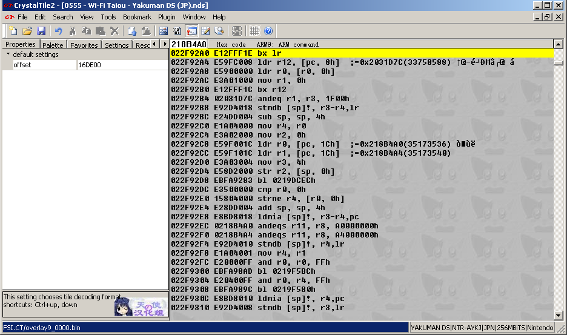

# (PART) III  Examples, oddities and techniques {-}

# Crystaltile2 general usage guide

If you have read the rest of the guide you will likely have seen several screen grabs of Crystaltile2 but might not be familiar with how works as a whole. This is what this section aims to sort.

Crystaltile2 is a fantastic general purpose ROM hacking tool but it still retains enough low level features (and indeed might even be said to revolve around them) to be useful to any low level ROM hacker, though ones working in the GBA or DS will benefit more. The original application was in Chinese but it has since been translated enough to be workable (it was always useful) for those that prefer things in English. This is a guide to the general use and a few specifics of crystaltile2.

Although a few functions exist before you do it the tool really springs to life when you open a ROM. For the DS at least the usage is twofold

1.  The main program window containing a hex editor, tile viewer, disassembly viewer (there are minor editing abilities), tile editor, text related tools and menu options for other tools (compression, text searching, NFTR font editing and more). Many of these modes have class leading features although there are still some traps for the unwary and bugs that might need working around. Also some features are only available when certain modes are selected and the locations for some of these might be a bit counter intuitive.
2.  The sub window for the filesystem viewer (DS ROM images only) which is accessed by clicking the DS icon. As a quick aside there is a minor bug of sorts where if you maximize the filesystem viewer to a second screen it will minimize when you double click a file to set the offset (a useful trait when you only have one screen) which you can get around by manually resizing the window to take up as much as you need. Double clicking sets the viewer offsets to the start of the file and right clicking brings up any extra options the program might have for the extra formats (graphics are especially useful here as you can tell the game to load the graphics, the layout/format and the colours necessary all with a few clicks) as well as providing you the option to export a file from the ROM, import one, extract (as in compression) if it detects it and compress a file and import it as well as export all files or rebuild them when it is done. On top of this it should have some information on the binaries and is one of the few general use tools most people will have that displays parsed information on the overlays like where they will eventually be loaded into the ram.

The combination of the two allows you to dart around the ROM setting the viewers to given points and parsing any data you can (quite useful for 2d image formats) and sending out files for further analysis.

Some screenshots of the program

Main hex editor view

Basic file system viewer and pulldown menus

Basic file system viewer with a right click

When compressed files are detected decompression and compression (import compressing as you do) become available.

Image viewer using custom view size

Each “frame” has a separate palette for some reason so ignore the broken colours in this one.

Assembly viewer set to view an overlay

Tile editor

Memory viewer/emulator hookup

Crystaltile2 can interface with no$gba debug version to grab main ram and VRAM data.

You can access the options by pressing file and then DS emulator before selecting the emulator after which you get you a window like

You will probably have to click the >> to get the list of options and you can define a few of your own.

From there click whichever you wish for and most of the time it will produce a new file containing all the data. Remember though you can dump memory from the debug version, desmume and use many of the cheat tools which are a lot more stable.

Script editor

Crystaltile2 features a basic but well featured quick script dumping tool which has several options. Typically the file is loaded, any tables selected in the tbl pulldown menu (and made to use it in the same). After this ambassador search is pressed and it returns a list of what it thinks are viable sections of text. From here the special search methods pulldown menu will allow selections to be made. The final option of special search methods allows an export of the selected findings to a text file containing the location, length and decoded text in whatever codepage you deem necessary. Double clicking on a result takes you to the hex editor. Basic pointer options are available but they pale compared to the more traditional text extraction programs.

